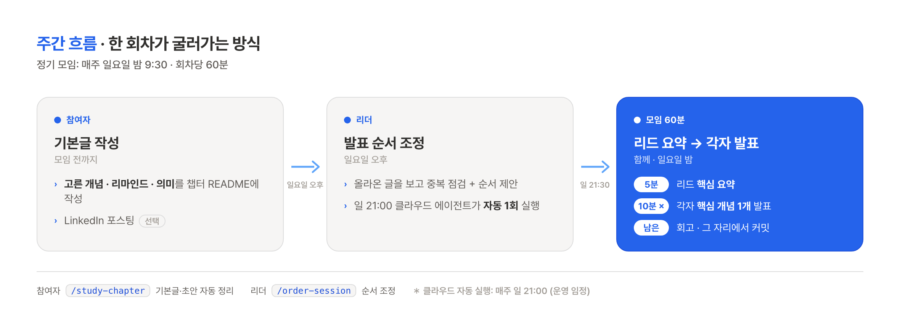

# claude-agentic-study

📘 **〈클로드 코드로 시작하는 실전 에이전틱 코딩〉** (Goos Kim, 더 타이즈, 2026) 스터디 아카이브

- 각 챕터를 읽고 **자기에게 필요한 걸 하나씩 직접 만들어 본 뒤**, 무엇을 만들었는지·시행착오를 함께 기록·공유

---

## 운영 방식 (회차당 60분)

- 정기 모임: **매주 일요일 밤 9:30 (21:30)** · 회차당 60분
- LinkedIn 포스팅은 **선택** (쓰고 싶으면 모임 전후 자유 발행)

| 시간 | 내용 |
|------|------|
| 0–5분 | **챕터 리드** 핵심 요약 (개념 압축·질문) |
| 5–55분 | **각자 "핵심 개념 1개" 발표** (1인 10분) |
| 55–60분 | 그 자리에서 **회고 · 커밋** |

**규칙**
- 각자 **서로 다른 개념** 선택 (회차 시작 때 리드 30초 교통정리 → 합치면 챕터 전체 커버)
- "의미"는 책 요약 X, **내 작업/프로젝트 적용**으로 작성 (본인 인사이트가 콘텐츠)
- 마지막 5분 그 자리에서 `chapters/chNN/README.md` 기록·커밋 (따로 정리 X)
- 리드는 챕터마다 로테이션, 부담은 가볍게(핵심 요약 5분)·비중은 각자 10분 발표

### 주간 흐름

- **참여자**: 모임 전까지 챕터 README에 기본글(고른 개념·리마인드·의미) 작성 → `/study-chapter <챕터번호>` (개념정리+적용예시+초안 자동 생성, 원본은 `_drafts/` 로컬) · 스킬 [study-chapter](.claude/skills/study-chapter/SKILL.md)
- **리더**: 일요일 오후 발표 순서 조정 → `/order-session <챕터번호>` (중복 점검+순서 제안+README 기록) · 스킬 [order-session](.claude/skills/order-session/SKILL.md)
- 🤖 **자동화**: 매주 일 21:00 클라우드 에이전트가 진행중 챕터 순서를 1회 자동 조정·push (참여자 본문 보존, 운영 임정)

### LinkedIn 포스팅 톤 (선택)
- 대괄호 제목 X, 정제된 존댓말
- 번호 리스트 구조화, 해시태그 X
- 개념 설명 + 본인 경험/적용을 한 덩어리로

---

## 진행 현황

> 왼쪽 5칸은 챕터 진행 상황(리드·제목·상태·기록), 오른쪽 5칸은 **개인 정리본 제출 현황**. 본인 정리본(`chapters/chNN/<이름>/README.md`) 커밋 시 자기 칸을 `☐ → ☑`(**본인 칸만**). ☑ 제출 / ☐ 미제출.

| 챕터 | 리드 | 제목 | 상태 | 기록 | 문종운 | 남서아 | 이정연 | 임정 | 최지환 |
|------|------|------|------|------|:--:|:--:|:--:|:--:|:--:|
| 01 | 문종운 | 소개 | 완료 | [ch01](chapters/ch01/README.md) | ☑ | ☐ | ☐ | ☐ | ☐ |
| 02 | 남서아 | 워크플로와 설정 | 진행중 | [ch02](chapters/ch02/README.md) | ☑ | ☑ | ☑ | ☑ | ☑ |
| 03 | 이정연 | 에이전트 스킬 | 완료 | [ch03](chapters/ch03/README.md) | ☑ | ☐ | ☑ | ☑ | ☑ |
| 04 | 임정 | 서브에이전트 | 완료 | [ch04](chapters/ch04/임정/README.md) | ☐ | ☐ | ☐ | ☑ | ☐ |
| 05 | 최지환 | (확정 예정) | 예정 | — | ☐ | ☐ | ☐ | ☐ | ☐ |
| 06 | 문종운 | (확정 예정) | 예정 | — | ☐ | ☐ | ☐ | ☐ | ☐ |
| 07 | 남서아 | (확정 예정) | 예정 | — | ☐ | ☐ | ☐ | ☐ | ☐ |
| 08 | 이정연 | (확정 예정) | 예정 | — | ☐ | ☐ | ☐ | ☐ | ☐ |
| 09 | 임정 | (확정 예정) | 예정 | — | ☐ | ☐ | ☐ | ☐ | ☐ |
| 10 | 최지환 | (확정 예정) | 예정 | — | ☐ | ☐ | ☐ | ☐ | ☐ |

> 챕터 제목은 그 챕터 도달 시 실물 책 목차로 채움 (임의 생성 X). 폴더도 도달 시 추가.

---

## 참여 방법

- 챕터 README에 본인 섹션(고른 개념·리마인드·의미·LinkedIn 링크) 작성 (양식: [`chapters/_TEMPLATE.md`](chapters/_TEMPLATE.md))
- 결과물 있으면 본인 레포·Gist 링크 또는 `chapters/chNN/<이름>/` 폴더로
- PR 또는 직접 push (작은 스터디라 흐름은 가볍게 · [CONTRIBUTING.md](CONTRIBUTING.md))

---

## 책 정보

- 제목: 클로드 코드로 시작하는 실전 에이전틱 코딩
- 부제: 완벽한 통제를 위한 AI 개발팀 구축 가이드 — 하네스 엔지니어링, 에이전트 오케스트레이션, MoAI-ADK
- 저자: Goos Kim / 출판: 더 타이즈 (2026-05-21)
- 구성: PART 1 (클로드 코드·하네스 엔지니어링·에이전트 오케스트레이션) / PART 2 (MoAI-ADK 실전, SPEC→build→sync) / APPENDIX A
