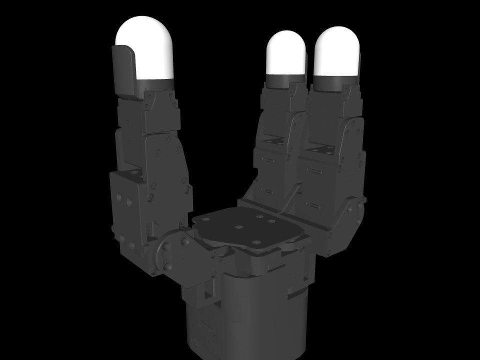
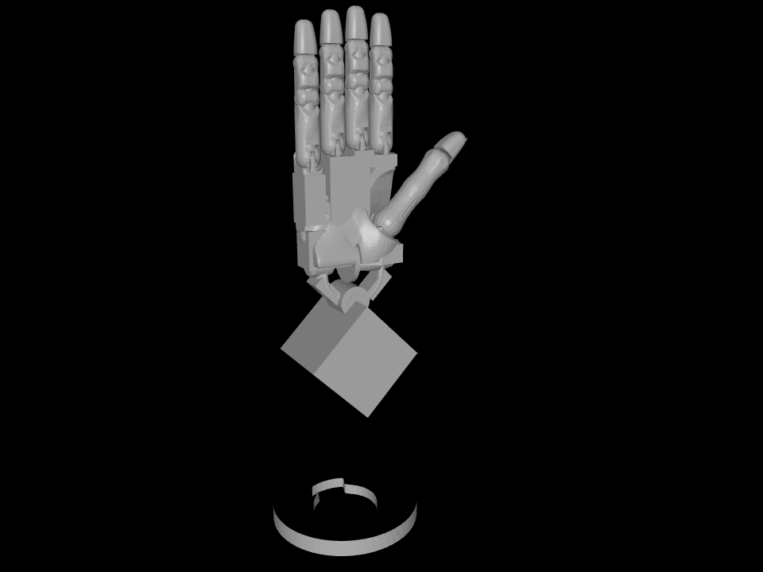
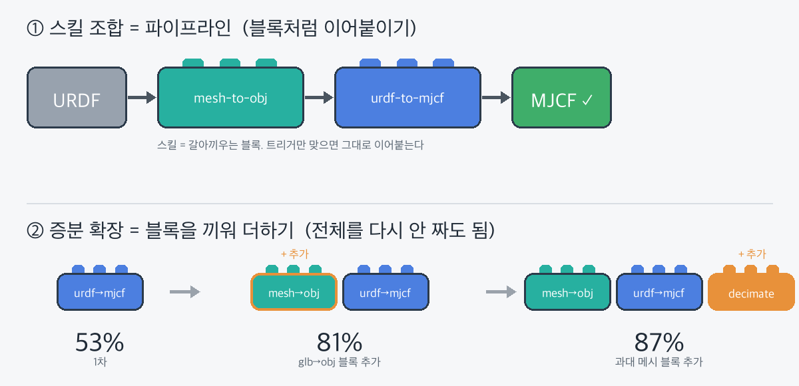

# 3장 스킬 연습 프로젝트 계획 — `urdf-to-mjcf`

> ch2 기획서([../../ch02/이정연/ITEM.md](../../ch02/이정연/ITEM.md))는 Isaac Sim의 URDF→USD였지만, **지금 맥북에서는 MuJoCo만 돌아가므로 URDF→MJCF로 바꾼다.** 변환 과정에서 배운 3장 스킬 개념을 전부 한 번씩 적용해보는 연습.
>
> ch2가 "플러그인(스킬+서브에이전트+MCP+훅)"이었다면, ch3 연습은 **잘 만든 스킬 한 개**가 목표다. 훅·MCP는 범위에서 뺀다.

> ✅ **구현 완료 (2026-06-21)**: 아래 계획을 실제 프로젝트(`isaacgym_allegro_hand`)에 만들어 동작 검증까지 끝냈다. 결과 요약은 맨 아래 "구현 결과" 절 참고.

---

## 1. 목적 정의 (스킬 개발 1단계)

- **무엇**: URDF를 MuJoCo MJCF로 변환하되, 변환 전후에 점검을 붙여 **컴파일은 "성공"이지만 거동이 조용히 틀어지는** 케이스를 잡는 스킬.
- **왜 스킬인가**: MuJoCo는 컴파일러가 URDF를 직접 읽어 MJCF로 만들 수 있다(변환 자체는 내장). 그래서 변환기를 새로 짜는 게 아니라 **반복되는 변환 규약·점검 절차를 박제**하는 게 핵심 — 정확히 스킬의 역할이다.
- **MuJoCo로 바꾼 이유**: 맥북(Apple Silicon)에서 Isaac Sim은 안 돌고 MuJoCo는 잘 돈다. 도메인(로보틱스 sim)·테마(조용한 변환 실패 잡기)는 그대로 두고 백엔드만 교체.

## 2. URDF→MJCF에서 잡을 "조용한 실패" (MuJoCo 특유)

> 근거는 MuJoCo XML Reference / Modeling 문서 기준. 정확한 문서 앵커·동작은 빌드 시 실제 컴파일로 재확인(아래 9절 검증에 포함).

| 함정 | 증상 | 처리 |
|------|------|------|
| `<mujoco>` 확장 태그 누락 | URDF에 `<mujoco><compiler meshdir=.../></mujoco>`가 없으면 메시 경로·옵션을 못 잡아 컴파일 실패/경고 | 사전 린트로 경고 + 템플릿 제안 |
| mimic 조인트 | URDF `mimic`은 MJCF에 직접 대응 없음 → 그냥 빠져 종속 관절이 안 따라옴 | `<equality><joint>` 제약으로 변환 안내 |
| 관성·질량 0/비물리 | inertia가 0이거나 삼각부등식 위반이면 불안정·발산 | `balanceinertia`/`inertiafromgeom` 적용 여부를 명시적으로 결정 |
| 콜라이더 = 볼록 껍질 | MuJoCo는 메시를 convex hull로 처리 → 오목 형상이 조용히 부풀어 접촉이 틀림 | 오목 메시는 분해(decomp) 필요 경고 |
| 액추에이터 부재 | URDF엔 액추에이터가 없어 변환된 MJCF는 제어 불가 상태 | 변환 후 액추에이터 추가가 필요함을 리포트 |
| `package://` 미해결 | 메시 경로가 안 풀려 로드 실패 | 사전 린트로 경로 해석 점검 |
| 단위·스케일 | `angle`(rad/deg)·mesh scale 가정 차이로 조용한 왜곡 | compiler 옵션 명시 강제 |
| floating base | URDF 루트 링크 처리에 따라 free joint 유무가 달라짐 | 의도(고정/플로팅)를 입력으로 받아 확정 |

## 3. 스킬 디렉터리 구조 (점진적 작동 3단계에 맞춤)

```
urdf-to-mjcf/
├── SKILL.md          # L1 메타데이터 + L2 절차(500줄 이내, 체크리스트만)
├── reference.md      # L3 — 위 "조용한 실패" 카탈로그(증상·근거)
├── EXAMPLES.md       # L3 — 입출력 예시(정상 1 + 문제 1)
└── scripts/
    ├── lint_urdf.py        # 변환 전 결정론적 URDF 검사기
    ├── convert.py          # mujoco 컴파일러로 URDF→MJCF + 경고 캡처
    └── requirements.txt    # mujoco 등 종속성
```

- **L1 메타데이터**: `name` + `description`만 세션 시작 시 로딩.
- **L2 SKILL.md 본문**: 호출될 때만 로딩. 변환 절차와 스크립트 사용법만 짧게.
- **L3 지원 파일**: `reference.md`·`EXAMPLES.md`·`scripts/`는 필요할 때만 Read. 본문에 다 넣지 않는다.
- 주의: 지원 파일이 다른 지원 파일을 불러오지 않게 한다(부분 읽기 위험).

## 4. SKILL.md 프론트매터 설계

| 필드 | 값(안) | 이유 |
|------|--------|------|
| `name` | `urdf-to-mjcf` | 스킬이 하는 행위 |
| `description` | "URDF를 MuJoCo MJCF로 변환한다. 변환 전 mimic·관성 0·package:// 미해결·`<mujoco>` 태그 누락을 린트하고, 변환 후 거동 함정을 점검한다. URDF를 MuJoCo로 옮기거나 mjcf 변환 요청 시 발동." | **언제 발동하는지 구체적 트리거로**. "MuJoCo/mjcf 변환"을 명시해 다른 sim 스킬과 충돌 회피 |
| `allowed-tools` | `Read, Bash` | 린트·변환 스크립트 실행만 사전 승인. 권한 범위 축소 |

## 5. 스크립트 우선 전략

- URDF 파싱·규칙 검사와 MuJoCo 컴파일은 **결정론적 작업** → `scripts/`로 빼고 SKILL.md엔 **사용법만**.
  - `lint_urdf.py <urdf>` → 변환 전 경고 JSON.
  - `convert.py <urdf> <out.xml>` → `mujoco.MjModel.from_xml_path`로 컴파일, **컴파일러 경고/에러를 캡처**해 JSON으로.
- 오류 상황은 클로드에 넘기지 않고 스크립트가 직접 처리: 실행 권한 / `mujoco` 설치 여부(없으면 requirements 안내) / 경로가 유닉스 슬래시인지.
- 모델은 스크립트 **결과(JSON)만** 받아 판단 → 토큰 비용 최소화. (MuJoCo 컴파일러 경고를 사람 대신 읽어주는 게 핵심 가치)

## 6. 환각 방지 지침 (SKILL.md 본문에 명시)

- **불확실성 표현 허용**: 규칙으로 단정 못 하는 항목은 "확인 필요"로 표기.
- **지식 범위 제한**: 판단 근거는 MuJoCo 공식 문서와 `reference.md`로 한정. 추측으로 새 규칙을 만들지 않는다.
- **출처 명시**: 각 경고에 근거(MuJoCo 문서 섹션·컴파일러 메시지)를 함께 출력.

## 7. 입출력 예시 (EXAMPLES.md로 분리)

대표 예시 2개만(나머지 엣지 케이스는 reference로):
1. **정상 URDF** → 경고 0, MJCF 생성, "로드 가능".
2. **mimic 조인트 + `<mujoco>` 태그 없음** → 경고 2건 + 근거 + 자동수정 제안(equality 제약 변환 / compiler 태그 템플릿).

## 8. context: fork 적용 — 발표 핵심의 실전

- 변환 **후** 점검(MJCF 트리 감사, 컴파일러 경고 대량, 접촉/관성 점검)은 로그가 커서 메인 대화를 오염시킨다.
- 그래서 감사 단계는 **별도 스킬 `mjcf-audit`로 분리하고 `context: fork`** 를 건다.
  - `context: fork` → 부모 대화와 분리된 서브에이전트 컨텍스트에서 실행, **결과(감사 리포트)만 반환**.
  - `agent: Explore` → MJCF 트리·로그 탐색에 맞는 모드.
  - `allowed-tools: Read, Bash` → 격리 + 도구 권한 제한 동시 달성.
- 구분: 본문에서 Task로 일꾼을 부르는 것과 다르다. **스킬 자체가 포크**되어 부모 히스토리에 접근하지 못한다.

## 9. 재사용 패턴 / 버전 관리

- **패턴 분류**: 로보틱스(MuJoCo) **도메인 특화 패턴**. description에 트리거를 충분히 담아 다른 URDF→MuJoCo 작업에서도 자동 발동.
- **Version History**: MuJoCo 버전에 따라 컴파일러 옵션·경고가 바뀐다 → SKILL.md에 Version History 섹션을 두고 규칙·검증 대상 MuJoCo 버전을 기록.

## 10. 테스트와 검증

1. `description`이 구체적인지(MuJoCo/mjcf 변환 트리거가 명확한지) 확인.
2. 스킬 디렉터리 경로 확인.
3. YAML 프론트매터 유효성 검사.
4. `claude --debug`로 스킬 로딩 과정 확인.
5. **실물 검증**: 샘플 URDF를 실제로 `convert.py`로 돌려 MJCF가 MuJoCo에서 로드되는지(2절 함정 카탈로그를 실제 컴파일 경고와 대조) 확인.

## 11. 단계 로드맵 (솔로 완결 기준)

1. **1단계**: `lint_urdf.py` + `convert.py`(mujoco 컴파일) + SKILL.md + reference.md. 변환 + 사전 린트만으로 즉시 체감.
2. **2단계**: EXAMPLES.md 보강 + `mjcf-audit` 스킬에 `context: fork` 적용(변환 후 감사).
3. **3단계**: Version History 정착, 다른 URDF에서 자동 발동되는지 트리거 점검.

## 12. 성공 기준

- MuJoCo에 직접 로드해보고서야 거동 문제를 찾는 횟수 감소(반복 점검이 스킬로 자동화됨).
- mimic 누락·`<mujoco>` 태그 누락·비물리 관성 같은 조용한 실패가 변환 결과로 새는 일 감소.
- 스킬 토큰 비용이 본문에 몰리지 않고 L1/L2/L3로 잘 분산됐는지(점진적 작동이 실제로 작동하는지) 확인.

---

## 13. 구현 결과 — 손 URDF 68개 변환율 87% (2026-06-21)

계획을 내 로보틱스 프로젝트 `isaacgym_allegro_hand`(`robots/hands/`의 URDF **68개**)에 적용했다. 한 번에 끝낸 게 아니라 **스킬을 단위로 점진적으로 쌓아** 변환율을 끌어올린 게 핵심이다.

### 성공률 추이

| 단계 | 한 일 | 성공 | 비율 |
|------|-------|------|------|
| 1차 | `urdf-to-mjcf` 스킬로 일괄 변환 | 36/68 | 53% |
| 2차 | `mesh-to-obj` 스킬 추가 → glb 손 19개 obj 변환·재시도 | 55/68 | 81% |
| 3차 | 과대 메시 단순화(face>200000인 base_link 3개 decimation) | **59/68** | **87%** |

- 모든 성공 케이스는 MuJoCo에 **실제 로드 + 200스텝 시뮬레이션**까지 확인했다.
- 남은 9개는 변환 범위 밖: 메시 파일 실제 누락 7 · URDF 구조 오류 1(`meta_y`) · dae 누락 1(`bimanual`).
- 두 스킬은 `isaacgym_allegro_hand/.claude/skills/{urdf-to-mjcf, mesh-to-obj}`에 커밋, 변환 결과(obj·`.obj.urdf`·단순화 STL)도 레포에 영구화했다.
- 못 한 9개의 사유는 레포에 기록(`robots/hands/MJCF_CONVERSION.md`): 메시 파일 실제 누락 7 · `package://` 미해결 1 · URDF 구조 오류 1.

### 변환한 MJCF를 MuJoCo로 띄운 화면

대표적으로 변환한 손을 MuJoCo 렌더러로 띄워 확인한 스크린샷이다(변환 → 로드 → 렌더가 실제로 된다는 증거). collision geom이 아니라 **visual 메시(contype==0)만** 골라 렌더했다.

| Allegro Hand v5.3 (대표, bodies=10) | Shadow Hand (메시 풍부, bodies=25) |
|---|---|
|  |  |

### 스킬로 만들어 진행해서 얻은 이점 (이번 장 핵심 회고)

1. **한 손이 아니라 68개에 일관 적용** — 절차를 스킬(스크립트)로 박제하니 "한 번 만들면 전부에 동일하게" 돌아간다. 손마다 손으로 했으면 불가능했을 규모.
2. **스킬 조합이 곧 파이프라인** — `mesh-to-obj`(포맷 변환) → `urdf-to-mjcf`(MJCF 변환)가 깔끔히 맞물렸다. 3-2의 "여러 스킬을 조합"이 실물로 증명됐고, 트리거를 구체적으로 나눠 둔 게 충돌을 막았다.
3. **실패를 사람 대신 원인별로 분류** — 32개 실패를 스크립트가 분류해주니 처방이 곧장 보였다: glb는 변환, 과대 메시는 단순화, 누락은 못 살림. 무엇을 고칠지가 데이터로 나왔다.
4. **증분 확장이 쉬움** — 1차 실패를 보고 두 번째 스킬(`mesh-to-obj`)을 끼워 넣어 53%→81%로 올렸다. 스킬이 모듈이라 전체를 다시 짜지 않고 한 조각만 추가하면 됐다.
5. **진단을 추측이 아니라 측정으로** — MuJoCo가 "ASCII 파일일 수도"라고 한 것을 스크립트로 헤더를 까보니 사실은 face>200000 초과였다. 스킬에 환각 방지(원문 메시지 인용)를 넣어 둔 덕에 잘못된 처방으로 새지 않았다.
6. **팀 공유·영구화** — 스킬과 결과를 git에 올리니 동료가 클론만으로 같은 변환 파이프라인을 갖는다. 3-1의 "스킬 = 공용자산"이 손에 잡혔다.

특히 2번(조합)과 4번(증분 확장)은 "스킬을 블록처럼 다룬다"는 한 그림으로 요약된다 — 트리거만 맞으면 블록을 이어붙여 파이프라인이 되고, 전체를 다시 짜지 않고 블록을 하나 끼워 53% → 81% → 87%로 키웠다.



> 계획서의 `context: fork`(격리 감사)는 보류했다. convert가 컴파일 시점에 모델을 검증해 별도 감사 스킬 없이도 실패가 드러났기 때문. 무거운 감사를 떼어낼 다음 후보로 남긴다.
