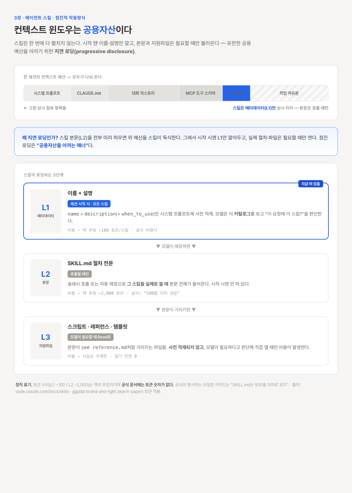
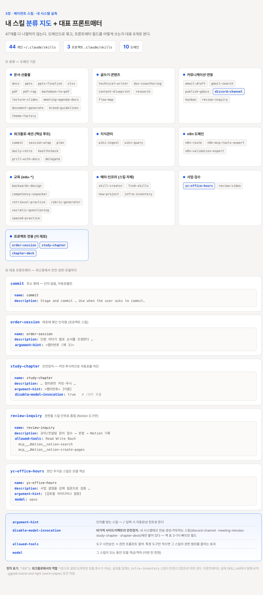

# 임정 — 3장 정리: 에이전트 스킬 (2026-06-20)

> 흐름: 읽기 → 개념정리(책 표는 공식 문서로 교차검증) → 내 클로드 시스템에서 분류·실측 → 인사이트
>
> **관통 주제(발표 핵심 1개): "컨텍스트 윈도우는 공용자산이다."** 스킬의 점진적 작동방식은 결국 이 공용자산을 아끼려는 설계다. 이 한 줄로 3장 전체를 꿴다.

> ⚠️ **책 내용 교차검증**: 표 3-1·3-2의 일부 정보가 최신 공식 문서(code.claude.com/docs/skills)와 다르다. 아래는 책 아웃라인을 차용하되 **내용은 공식 레퍼런스 기준으로 교정**했다. 교정 지점은 그때그때 표시했다.

---

## 1. 스킬이란 — SKILL.md 한 장으로 절차를 파일화

- 스킬 = `<스킬이름>/SKILL.md` 디렉터리. SKILL.md는 **YAML 프론트매터(메타) + 마크다운 본문(절차)** 으로 구성된다.
- 같은 디렉터리에 스크립트·템플릿·레퍼런스 문서 같은 **지원 파일**을 함께 둘 수 있다.
- 트리거 2종: 사용자가 `/이름`으로 **명시 호출**하거나, 프론트매터의 `description`이 요청과 매칭되면 모델이 **자동 호출**한다.
- 그래서 `description`은 기능 설명이 아니라 **"언제 불러야 하는가"를 적는 트리거 조건문**으로 쓴다. (2장에서 정리한 결론의 연장선)

## 2. 프론트매터 필드 (표 3-1 — 공식 교정본)

> 책 표 3-1은 outdated 지점이 있다. 공식 문서 기준으로 바로잡으면:

**❗ 책이 틀린 곳**
- 책: `name` **선택** / `description` **필수** → **공식: 둘 다 선택.** `description`만 *권장*(자동호출 판단 근거라서). `name` 생략 시 디렉터리 이름을 스킬 이름으로 쓴다.
- 토큰 수치(표 3-2의 100/2,000)는 **공식 문서에 없는 추정치**다 (3절 참고).

**✅ 책이 맞은 곳**: `allowed-tools`, `model`, `context`(=`fork`), `agent` — 모두 실존 필드.

**⚠️ 책이 빠뜨린 현행 필드** (실무에서 자주 쓰는 것 위주):

| 필드 | 하는 일 |
|------|---------|
| `disable-model-invocation: true` | 자동 호출 차단 → 슬래시 호출만. **비가역 사이드이펙트(전송·생성·커밋) 스킬의 안전장치** |
| `argument-hint` | 인자 자동완성 힌트 (예 `<챕터번호> [이름]`) |
| `when_to_use` | 트리거 문구·예시 추가. `description`에 합산되어 **합쳐서 1,536자 상한** |
| `user-invocable: false` | `/` 메뉴에서 숨김 (배경지식 전용 스킬) |
| `disallowed-tools` / `effort` / `hooks` / `paths` | 도구 제외 / 작업 강도 / 스킬 전용 훅 / 자동활성 경로 제한 |

> 핵심 교훈: **필수 필드는 사실상 없다(전부 선택).** 다만 `description`을 비우면 자동호출이 안 먹으므로, 자동호출을 원하면 `description`은 사실상 필수처럼 쓴다.

## 3. 점진적 작동방식 = 컨텍스트 절약 메커니즘 (표 3-2 + Artifact)

> 📊 **Artifact ① — 점진적 작동방식: "컨텍스트 윈도우는 공용자산"**

> 🔗 인터랙티브 버전(사이트 iframe 렌더): [progressive-disclosure.html](progressive-disclosure.html)

스킬은 3단계로 **지연 로딩(progressive disclosure)** 된다:

| 레벨 | 무엇이 | 언제 로딩 | 비용(책 추정 / 공식) |
|------|--------|-----------|----------------------|
| **L1 메타데이터** | `name`+`description`(+`when_to_use`) | **세션 시작 시 모든 스킬** | 책: ~100토큰 / *공식 비명시* |
| **L2 SKILL.md 본문** | 절차 전문 | **호출될 때만** | 책: ~2,000토큰(500줄) / 공식: **"500줄 이하 권장"** |
| **L3 지원 파일** | 스크립트·레퍼런스·템플릿 | **모델이 필요할 때 Read로** | 사실상 무제한, **사전적재 안 함** |

**왜 이렇게 설계됐나 — 컨텍스트 윈도우는 공용자산이라서.**
시스템 프롬프트·CLAUDE.md·대화 히스토리·MCP 도구 스키마·스킬 메타데이터가 **하나의 유한한 예산을 나눠 쓴다.** 스킬 본문(L2)을 전부 미리 띄우면 그 공용 예산을 스킬이 독식한다. 그래서 시작 시엔 **L1(이름+설명)만** 깔아두고, 실제 본문·지원파일은 필요할 때만 불러온다. 점진 로딩은 "공용자산을 아끼는 매너"인 셈이다.

> 정직 표기: 책의 토큰 수치(100/2,000)는 합리적 추정이지만 **공식 문서엔 토큰 숫자가 없다.** 공식이 명시하는 건 "SKILL.md는 500줄 이하로 유지" 한 가지뿐.

## 4. 내 궁금증 3개 (공식 문서로 검증한 답)

### Q1. 세션이 시작될 때 모든 스킬의 frontmatter가 로딩되는가?

**그렇다 — 단, 본문이 아니라 메타데이터만.** 세션 시작 시 **모든 스킬의 `name`+`description`(+`when_to_use`)이 시스템 프롬프트에 사전 적재**된다. 그래서 프롬프트가 들어올 때마다 디스크를 다시 뒤지는 게 아니라, **이미 떠 있는 스킬 목록**에서 모델이 "이 요청에 이 스킬을 쓸까"를 매칭 판단한다. 전체 본문(L2)은 그중 하나를 실제로 호출할 때만 로딩된다. → 내 질문의 직관("그래야 매번 확인할 수 있으니까")이 맞다. 단 적재되는 건 *트리거 판단용 카탈로그*지 절차 전문이 아니다.
- 예외: `disable-model-invocation: true`면 그 스킬의 description은 카탈로그에 안 올라가고, 오직 `/이름` 수동 호출로만 본문이 로딩된다.

### Q2. 개인 스킬과 프로젝트 스킬을 꼭 나눠야 하나? 어떤 기준으로?

**위치가 곧 범위다.** 개인 = `~/.claude/skills/`(모든 프로젝트), 프로젝트 = `<레포>/.claude/skills/`(그 레포에서만). 그 외 플러그인·엔터프라이즈 범위도 있다.
- **나누는 기준 한 줄**: *"이 절차가 나 개인의 작업 습관이냐(개인) vs 이 레포/팀에 묶여 의미가 있느냐(프로젝트)냐."*
- **우선순위**: Enterprise > Personal > Project > Plugin. 같은 이름이 여러 곳에 있으면 상위가 이긴다.
- **내 실측 대입**:
  - 개인(`~/.claude/skills/`) 44개 — `commit`·`session-wrap`·`publish-gdocs`처럼 **어느 프로젝트에서나** 쓰는 범용 워크플로.
  - 프로젝트(이 레포 `.claude/skills/`) 3개 — `order-session`·`study-chapter`·`chapter-deck`. **이 스터디 레포의 README 양식·발표순서 규칙에 묶여** 다른 데선 의미가 없다. 그래서 개인이 아니라 프로젝트 스킬로 둔 게 자연스럽다.

### Q3. 스킬도 버전관리가 필요한가? 왜?

**필요하다.** 공식 권장은 **프로젝트 스킬을 `.claude/skills/`째 git에 커밋**하는 것. 이유 3가지:
1. **SKILL.md + 번들 스크립트는 곧 코드다** → 재현성. 누가 언제 절차를 바꿨는지 추적돼야 한다.
2. **팀 공유** → 동료가 레포를 클론하면 스킬이 바로 작동한다(이 스터디 레포가 실증 — 멤버 모두 `study-chapter`를 쓴다).
3. **트리거가 진화한다** → `description`/`argument-hint`는 계속 다듬어진다. 변경 이력이 없으면 "왜 자동호출이 갑자기 다르게 먹지?"를 못 쫓는다.
- 반대로 **개인 스킬(`~/.claude/skills/`)은 기본적으로 로컬 전용**(git 미포함). 공유가 목적이면 프로젝트로 내리거나 플러그인으로 묶어 배포한다.

## 5. 내 클로드 시스템 실측 — 스킬 분류 + 대표 프론트매터

> 🗺️ **Artifact ② — 내 스킬 분류 지도 + 대표 프론트매터** (47개를 도메인으로 묶고, 프론트매터 패턴을 한눈에)

> 🔗 인터랙티브 버전(사이트 iframe 렌더): [my-skills-map.html](my-skills-map.html)

모든 스킬을 나열하는 대신 **분류와 대표 패턴**만 정리했다.

**분류(도메인 기준)** — 개인 44 + 프로젝트 3:
- **문서·산출물**: docx, pptx, pptx-finalize, xlsx, pdf, pdf-rag, markdown-to-pdf, lecture-slides, meeting-agenda-docx, document-generate, brand-guidelines, theme-factory
- **글쓰기·콘텐츠**: technical-writer, doc-coauthoring, content-blueprint, research, flow-map
- **커뮤니케이션·연동**: email-draft, gmail-search, publish-gdocs, discord-channel, kanban, review-inquiry
- **워크플로·세션(핵심 루프)**: commit, session-wrap, plan, daily-retro, healthcheck, grill-with-docs, delegate
- **지식관리**: wiki-ingest, wiki-query
- **n8n 도메인**: n8n-route, n8n-mcp-tools-expert, n8n-validation-expert
- **교육(edu-\*)**: backwards-design, competency-unpacker, retrieval-practice, rubric-generator, socratic-questioning, spaced-practice
- **메타·인프라(스킬 자체)**: skill-creator, find-skills, new-project, infra-inventory
- **사업·검수**: yc-office-hours, review-video
- **프로젝트 전용(이 레포)**: order-session, study-chapter, chapter-deck

**대표 스킬 프론트매터 패턴** — 필드를 어떻게 쓰는지 6개로:

| 스킬 | 쓰는 필드 | 무엇을 말하나 |
|------|-----------|---------------|
| `commit` | name + description | **최소 형태.** 인자 없고 자동호출만 |
| `order-session` | + argument-hint, 프로젝트 범위 | **레포에 묶인** 인자형 스킬 |
| `study-chapter` | + `disable-model-invocation: true` | **안전장치** — 커밋·푸시하므로 자동호출 차단 |
| `discord-channel` | + `allowed-tools: "Bash"` | 도구 사전승인(권한 프롬프트 절약) |
| `review-inquiry` | + `allowed-tools:` 특정 MCP 도구들 | **권한을 스킬 단위로 좁힘**(Notion 도구만) |
| `yc-office-hours` | + `model: opus` | 판단 무거운 스킬은 **모델 격상** |

- 관찰: 내 시스템에서 `disable-model-invocation: true`는 전부 **사이드이펙트 있는 스킬**(`discord-channel`·`meeting-minutes`·`study-chapter`·`chapter-deck`)에 붙어 있다. 책이 빠뜨린 이 필드가 실무에선 안전의 핵심이다.

> 정직 표기: "대표"는 **워크플로에서의 역할** 기준으로 골랐다(측정된 호출 횟수가 아님). 실호출 집계는 `infra-inventory` 스킬이 트랜스크립트로 따로 낸다.

---

**이번 주 발표용 핵심 개념 1개**: **"컨텍스트 윈도우는 공용자산"**. 점진적 작동방식(3절)·세션 시작 로딩(Q1)·왜 스킬을 본문째 안 띄우나가 전부 이 한 비유로 설명된다. 내 47개 스킬도 결국 "이 공용자산을 어떻게 아끼며 절차를 부를까"의 답이다.
