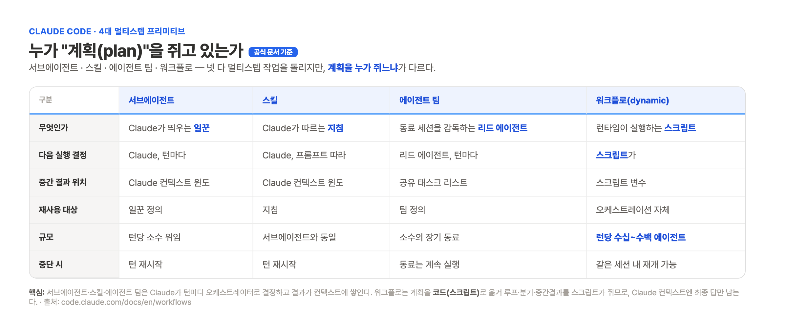
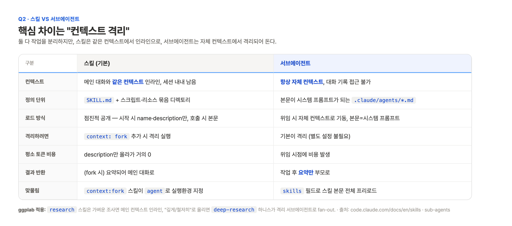
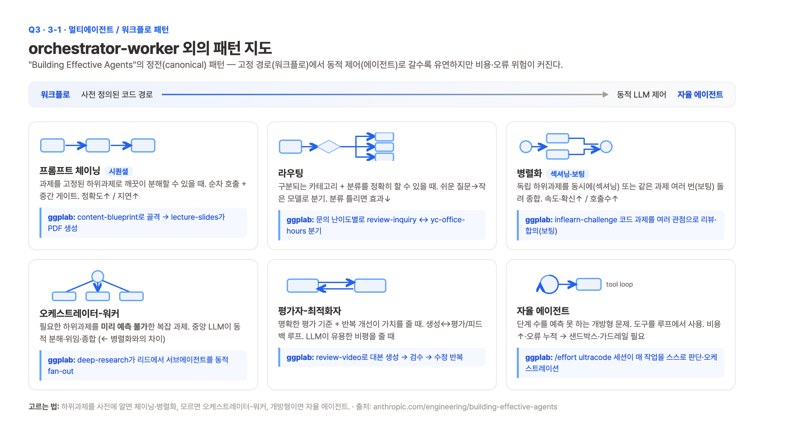
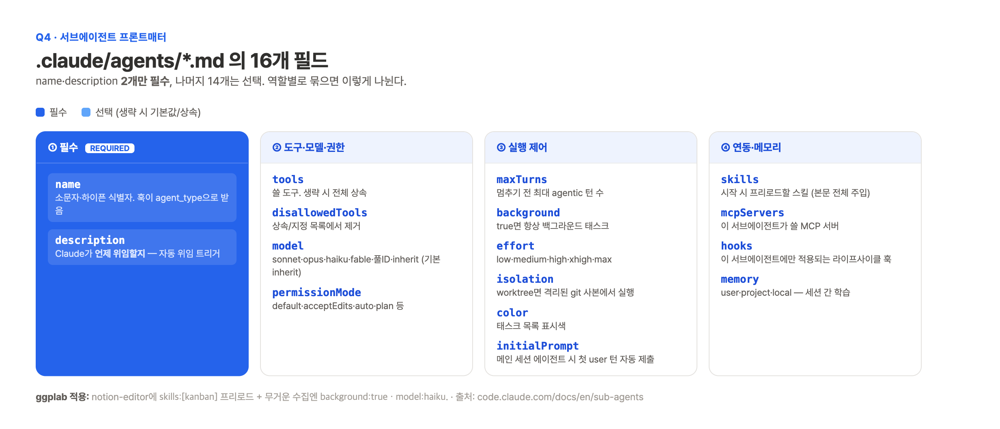
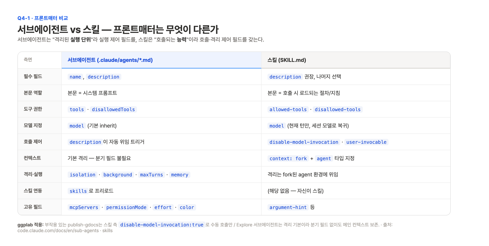
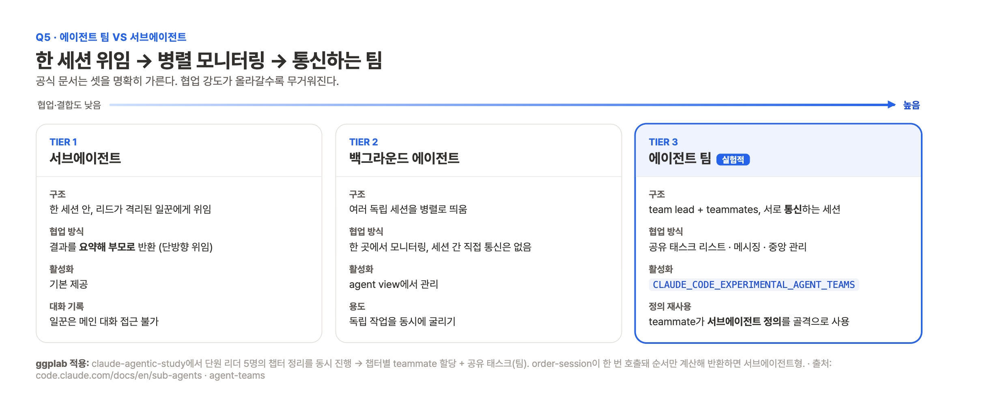
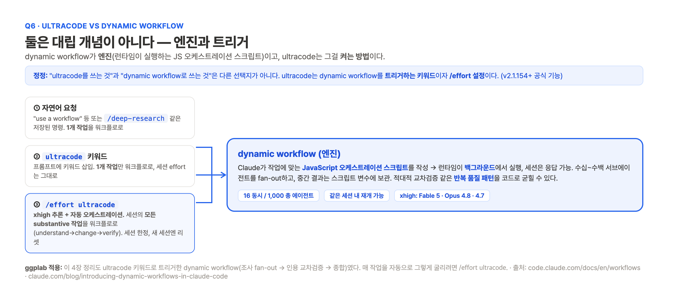

# 임정 · 4장 정리: 서브에이전트 (2026-06-26)

> 흐름: 읽기 → 6개 질문으로 분해 → 공식 문서로 교차검증 → ggplab 업무 적용 예시 → ggplab 디자인 아티팩트(2x PNG)로 시각화
>
> **관통 주제(발표 핵심 1개): "서브에이전트·스킬·에이전트 팀·워크플로는 *계획을 누가 쥐느냐*로 갈린다."** 이 한 축으로 4장 전체를 꿴다.
>
> ⚠️ **이번 조사의 가장 큰 교정점:** `ultracode`는 막연한 키워드가 아니라 **v2.1.154+ 공식 기능**이다(dynamic workflows). 초기 추정("ultracode=결정적 vs dynamic=자기페이싱")은 폐기했다. → Q6.

---

## 핵심 질문 요약 (TL;DR)

| # | 질문 | 한 줄 답 |
|---|------|----------|
| Q1 | 서브에이전트는 언제 쓰나 | **컨텍스트 격리**가 핵심. 곁가지 작업이 메인 대화를 오염시킬 때, 같은 일꾼을 반복 호출할 때. 효용 5가지(보존·제약·재사용·특화·비용) |
| Q2 | 스킬 vs 서브에이전트 | 스킬은 같은 컨텍스트 인라인(점진적 공개), 서브에이전트는 자체 컨텍스트 격리·요약만 반환. `context:fork`↔`skills`로 맞물림 |
| Q3·3-1 | 다른 멀티에이전트 패턴 | 체이닝(시퀀셜)·라우팅·병렬화(섹셔닝/보팅)·오케스트레이터-워커·평가자-최적화자·자율 에이전트. 고정 경로에서 동적 제어로 가는 스펙트럼 |
| Q4 | 서브에이전트 프론트매터 | **`name`·`description` 2개만 필수**, 나머지 14개 선택. 도구·모델·권한 / 실행 제어 / 연동·메모리로 묶임 |
| Q4-1 | 프론트매터 비교 | 서브에이전트는 실행 단위(`isolation`·`background`·`maxTurns`), 스킬은 호출 능력(`disable-model-invocation`·`context:fork`) |
| Q5 | 에이전트 팀 vs 서브에이전트 | 서브에이전트(한 세션 위임) → 백그라운드(독립 세션 병렬) → 에이전트 팀(통신·공유 태스크, **실험적**) |
| Q6 | ultracode vs dynamic workflow | 대립 개념이 아님. **dynamic workflow는 엔진**, **ultracode는 트리거 키워드이자 `/effort` 설정**(xhigh + 자동 오케스트레이션) |

---

## Q1. 서브에이전트는 언제 사용하나

핵심은 **컨텍스트 격리**다. 각 서브에이전트는 자체 컨텍스트 윈도·커스텀 시스템 프롬프트·독립 권한으로 돌고, 메인 대화 기록에는 접근하지 못한다[6]. 공식 문서가 드는 다섯 가지 효용[6]은 ① 컨텍스트 보존 ② 제약 강제(도구 제한) ③ 설정 재사용 ④ 행동 특화 ⑤ 비용 통제(Haiku 라우팅)다.

**정의해두는 시점**은 *같은 종류의 일꾼을 같은 지침으로 반복 호출*하게 될 때다[6]. 멀티에이전트 리서치 관점에선 단일 컨텍스트 윈도를 초과하는 정보나 무거운 병렬화가 필요한 고가치 과제에 맞고, 반대로 모든 에이전트가 같은 컨텍스트를 공유해야 하거나 의존성이 큰 작업에는 부적합하다[4].

> **ggplab 적용:** 사람인·잡코리아·원티드 채용공고 수집은 `web-crawling-specialist` 서브에이전트로 분리한다. 크롤링 HTML 덤프가 메인 컨텍스트에 쌓이지 않고 핵심 공고만 압축 반환되어 `tech-research-hub` 흐름이 깨끗하게 유지된다. `tools` 제한과 `model: haiku`를 더하면 수집 전용 저렴한 일꾼이 된다.

---

## Q2. 스킬 vs 서브에이전트

가장 큰 차이는 **컨텍스트 격리 여부**다. 스킬은 같은 컨텍스트에서 인라인으로, 서브에이전트는 자체 컨텍스트에서 격리되어 돈다[1][6]. 둘은 양방향으로 맞물린다(`context:fork` 스킬 ↔ `skills` 프리로드).

> **ggplab 적용:** `research` 스킬은 가벼운 조사면 메인 컨텍스트에서 인라인으로 돌지만, "깊게/철저히"로 올리면 `deep-research` 하니스가 격리 서브에이전트로 fan-out한다.

---

## Q3 · 3-1. orchestrator-worker 외 멀티에이전트/워크플로 패턴

"Building Effective Agents"는 **워크플로**(미리 정의된 코드 경로)와 **에이전트**(LLM이 동적 제어)를 구분하고 정전(canonical) 패턴을 둔다[3]. 고정 경로에서 동적 제어로 갈수록 유연하지만 비용·오류 위험이 커진다. 각 패턴의 "언제 쓰나"를 흐름 그림으로 정리했다.

**고르는 법:** 하위과제를 사전에 알면 체이닝·병렬화, 모르면 오케스트레이터-워커, 개방형이면 자율 에이전트다[3].

---

## Q4. 서브에이전트 프론트매터 구성요소

`.claude/agents/*.md`는 YAML 프론트매터와 마크다운 본문(시스템 프롬프트)으로 이루어진다. **`name`·`description` 2개만 필수**, 나머지 14개는 선택이다[6]. 역할별로 ① 필수 ② 도구·모델·권한 ③ 실행 제어 ④ 연동·메모리로 나뉜다.

> **ggplab 적용:** `notion-editor`에 `skills: [kanban]`을 프리로드하면 위임 즉시 절차 본문이 통째 주입되어 노션 편집이 일관된다. 무거운 수집은 `background: true`와 `model: haiku`로 돌린다.

---

## Q4-1. 서브에이전트 vs 스킬 프론트매터 비교

서브에이전트는 격리된 **실행 단위**라 `isolation`·`background`·`maxTurns`·`memory` 같은 실행 제어 필드를, 스킬은 호출되는 **능력**이라 `disable-model-invocation`·`context:fork` 같은 호출·격리 제어 필드를 갖는다. 공통은 `model`과 도구 허용/거부다[1][6].

> **ggplab 적용:** 부작용 있는 `publish-gdocs`는 스킬 측 `disable-model-invocation:true`로 수동 호출만 허용하고, `Explore` 서브에이전트는 격리가 기본이라 분기 필드 없이도 메인 컨텍스트를 보존한다.

---

## Q5. 에이전트 팀 vs 서브에이전트

공식 문서는 셋을 명확히 가른다. **서브에이전트**(한 세션 내 격리 위임)에서 **백그라운드 에이전트**(독립 세션 병렬 모니터링)를 거쳐 **에이전트 팀**(서로 통신하는 세션)으로 갈수록 협업 강도가 올라가고 무거워진다. 에이전트 팀은 환경변수로 켜는 **실험적** 기능이다[5][6].

> **ggplab 적용:** `claude-agentic-study`에서 단원 리더 5명의 챕터 정리를 동시에 진행한다면 챕터별 teammate 할당과 공유 태스크(에이전트 팀)에 가깝고, `order-session`이 한 번 호출되어 순서만 계산해 반환하는 건 서브에이전트형이다. 에이전트 팀은 서브에이전트 정의를 teammate 골격으로 재사용한다[6].

---

## Q6. ultracode vs dynamic workflow

> **⚠️ 정정:** "ultracode를 쓰는 것"과 "dynamic workflow로 쓰는 것"은 대립 선택지가 아니다. **dynamic workflow는 v2.1.154+ 공식 기능(엔진)**이고, **ultracode는 그걸 켜는 트리거 키워드이자 `/effort` 설정**이다[7][8].

`dynamic workflow`는 Claude가 작성하고 런타임이 백그라운드에서 실행하는 **JavaScript 오케스트레이션 스크립트**로, 수십~수백 서브에이전트를 fan-out한다. 이걸 켜는 길은 세 가지이며, ultracode는 그중 둘이다.

| 트리거 | 적용 범위 | 효어트 |
|---|---|---|
| 자연어 요청 / 저장된 명령(`/deep-research`) | 1개 작업 | 세션 그대로 |
| `ultracode` 키워드 | 1개 작업 | 세션 그대로 |
| `/effort ultracode` 설정 | **세션 전체** substantive 작업 자동 | **xhigh 추론** + 자동 오케스트레이션 |

`xhigh`는 Fable 5 · Opus 4.8 · Opus 4.7에서만 지원되고(Opus 4.6 · Sonnet 4.6 불가), 그래서 ultracode도 그 모델에서만 뜬다[7]. 한도는 동시 16 / 런당 1,000 에이전트이며 같은 세션 내 재개가 가능하다[7].

> **ggplab 적용:** 이 4장 정리도 `ultracode` 키워드로 트리거한 dynamic workflow(조사 fan-out → 인용 교차검증 → 종합)였다. 매 작업을 자동으로 그렇게 굴리려면 `/effort ultracode`, 일상 작업으로 돌아오면 `/effort high`로 내린다.

---

## 출처

1. [code.claude.com/docs/en/skills](https://code.claude.com/docs/en/skills) · Agent Skills (공식)
2. [Anthropic Engineering · Agent Skills](https://www.anthropic.com/engineering/equipping-agents-for-the-real-world-with-agent-skills) · 점진적 공개 (공식)
3. [code.claude.com/docs/en/... building-effective-agents](https://www.anthropic.com/engineering/building-effective-agents) · 워크플로 패턴 vs 자율 에이전트 (공식)
4. [Anthropic Engineering · multi-agent-research-system](https://www.anthropic.com/engineering/multi-agent-research-system) · 오케스트레이터-워커·토큰 비용 (공식)
5. [code.claude.com/docs/en/agent-teams](https://code.claude.com/docs/en/agent-teams) · Agent teams, 실험적 (공식)
6. [code.claude.com/docs/en/sub-agents](https://code.claude.com/docs/en/sub-agents) · 서브에이전트 프론트매터 전체 필드 (공식)
7. [code.claude.com/docs/en/workflows](https://code.claude.com/docs/en/workflows) · dynamic workflows·ultracode·트리거·한도 (공식)
8. [Anthropic 블로그 · Introducing dynamic workflows in Claude Code](https://claude.com/blog/introducing-dynamic-workflows-in-claude-code) (공식)

## 검증 메모

1. **High confidence (전 항목):** Q1부터 Q6까지 모두 검증된 공식 출처(1·3·4·5·6·7·8)가 직접 뒷받침한다. Q4 16개 필드는 출처6 표 그대로, Q6 트리거·xhigh·한도는 출처7 그대로다.
2. **이번 턴 핵심 정정:** ultracode는 공식 기능이었다(v2.1.154+). 이전 추정(Q6의 `/loop` 대립)을 폐기했다.
3. **시각 자산:** 7종 PNG는 2x(2465px) ggplab 디자인 시스템(브랜드 블루 `#2563EB`·Pretendard) 아티팩트다. 원본 메모·HTML 원본은 `_drafts/`(gitignore)에 보존한다.
