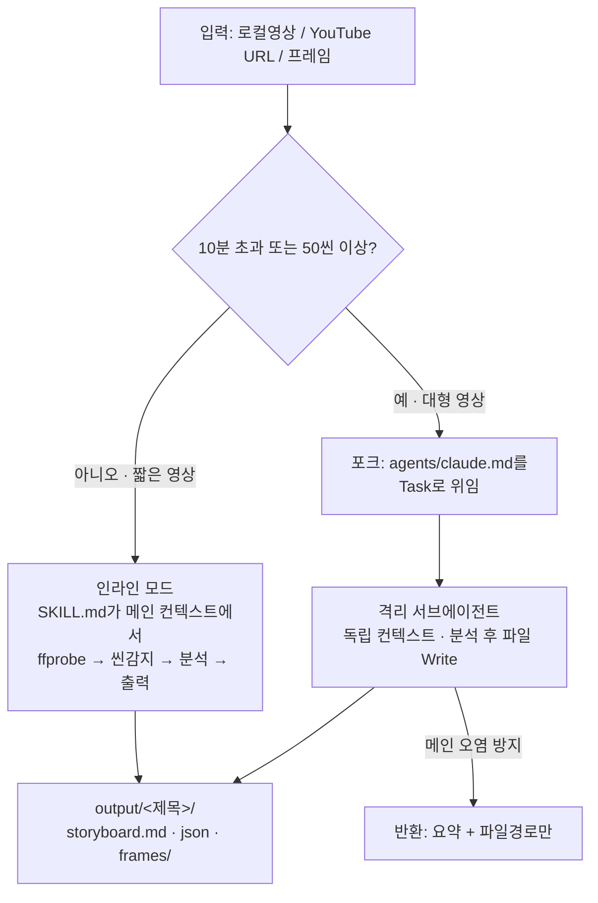

대표개념 · 프론트매터 (Frontmatter) \
— 2026-06-28
============

> **프론트매터 = 정의 파일(.md) 맨 위** **`---`** **사이 YAML 블록.** \
> \
> 본문(시스템 프롬프트/절차)이 "무엇을 어떻게"라면, 프론트매터는 **"언제 불리고, 무슨 권한으로 도느냐"를 정하는 계약**이다. (hanes: "값이 아니라 *약속*을 저장")

***

1. 서브에이전트 프론트매터 \
   (공식 16필드, 필수는 `name`·`description` 2개)

***

| 필드                | 필수 | 설명                                                                  |
| :---------------- | :- | :------------------------------------------------------------------ |
| `name`            | ✅  | 고유 식별자(소문자+하이픈). 정체성은 이 값에서만 나옴(파일명과 꼭 같을 필요는 없음)                   |
| `description`     | ✅  | **언제 이 에이전트에 위임할지**. 자동 위임의 근거                                      |
| `tools`           | —  | 허용 도구(allowlist). 생략 시 전체 상속. (스킬 프리로드는 `skills`로)                  |
| `disallowedTools` | —  | 거부 도구(denylist). 상속 목록에서 제거. `tools`와 **택일**                        |
| `model`           | —  | `sonnet`·`opus`·`haiku`·`fable`·모델ID·`inherit`(기본)                  |
| `permissionMode`  | —  | `default`·`acceptEdits`·`auto`·`dontAsk`·`bypassPermissions`·`plan` |
| `maxTurns`        | —  | 멈추기 전 최대 에이전트 턴 수                                                   |
| `skills`          | —  | 시작 시 컨텍스트에 **주입**할 스킬(전체 내용 주입)                                     |
| `mcpServers`      | —  | 이 서브에이전트용 MCP 서버                                                    |
| `hooks`           | —  | 이 에이전트 생애주기에 한정된 훅                                                  |
| `memory`          | —  | 세션 간 지속 메모리 범위: `user`·`project`·`local`                            |
| `background`      | —  | `true`면 항상 백그라운드 실행                                                 |
| `effort`          | —  | `low`\~`max` 추론 노력                                                  |
| `isolation`       | —  | `worktree`면 임시 git worktree에서 격리 실행                                 |
| `color`           | —  | 태스크 목록/트랜스크립트 표시 색                                                  |
| `initialPrompt`   | —  | `--agent`로 메인 세션 실행 시 첫 유저 턴으로 자동 제출                                |

> 📌 책(hanes)에 자주 보이던 `type: general-purpose`는 **공식 16필드에 없는 문서화용 키** — 파서가 무시함. 굳이 넣을 필요 없음.

2. 스킬 프론트매터 \
   (공식 16필드, 전부 선택 · `description` 권장)

***

| 필드                         | 권장 | 설명                                                 |
| :------------------------- | :- | :------------------------------------------------- |
| `name`                     | —  | 목록 표시 이름. 생략 시 디렉터리명                               |
| `description`              | ⭐  | 무엇을/**언제** 쓰는지. `when_to_use`와 합쳐 1,536자에서 잘림      |
| `when_to_use`              | —  | 호출 트리거 문구·예시 요청 (description에 덧붙음)                 |
| `argument-hint`            | —  | 자동완성 때 보일 인자 힌트 `[issue-number]`                   |
| `arguments`                | —  | `$name` 치환용 이름 인자                                  |
| `disable-model-invocation` | —  | `true`면 **자동 호출 차단**, `/name` 수동만. 서브에이전트 프리로드도 막음 |
| `user-invocable`           | —  | `false`면 `/` 메뉴에서 숨김(배경지식용)                        |
| `allowed-tools`            | —  | 이 스킬 활성 동안 승인 없이 쓸 도구                              |
| `disallowed-tools`         | —  | 이 스킬 활성 동안 제거할 도구                                  |
| `model`                    | —  | 이 스킬 활성 동안 모델 오버라이드(턴 한정)                          |
| `effort`                   | —  | 이 스킬 활성 동안 effort 오버라이드                            |
| `context`                  | —  | `fork`면 **포크된 서브에이전트 컨텍스트**에서 실행                   |
| `agent`                    | —  | `context: fork`일 때 쓸 서브에이전트 타입                     |
| `hooks`                    | —  | 이 스킬 생애주기 훅                                        |
| `paths`                    | —  | 이 글롭 패턴 파일 작업 시에만 자동 활성                            |
| `shell`                    | —  | `!command` 블록 셸: `bash`(기본)·`powershell`           |

## 3. 서브에이전트 vs 스킬 — 핵심 대조

| 축       | 서브에이전트                              | 스킬                                                          |
| :------ | :---------------------------------- | :---------------------------------------------------------- |
| 파일      | `.claude/agents/{name}.md`          | `.claude/skills/{name}/SKILL.md`                            |
| 본문 의미   | **시스템 프롬프트**(격리된 일꾼의 인격)            | 인라인 **절차/지식<br data-mark-preserve="true">**(같은 컨텍스트에 점진 주입) |
| 컨텍스트    | 자체 격리(독립 20만 토큰)                    | 기본은 메인 컨텍스트 인라인                                             |
| 필수 필드   | `name` + `description`              | 없음(`description` 권장)                                        |
| 도구 허용   | `tools` (allowlist)                 | `allowed-tools`                                             |
| 도구 표기   | 쉼표 `Read, Grep`                     | **공백·쉼표·YAML 리스트 모두 허용**                                    |
| 자동호출 끄기 | (해당 없음)                             | `disable-model-invocation: true`                            |
| 격리 실행   | `isolation: worktree`, `background` | `context: fork` (+ `agent`)                                 |
| 맞물림     | `skills`로 스킬 프리로드                   | `context: fork` → 서브에이전트로 위임                                |

> ⚠️ **표기 주의 교차검증**: hanes 책은 "서브는 쉼표(`tools`), 스킬은 공백(`allowed-tools`)"로 구분하라고 했지만, 공식 문서상 **스킬** **`allowed-tools`는 공백·쉼표·YAML 리스트 다 허용**한다. 책 규칙은 *틀린 게 아니라 안전한 경험칙*. 필드명이 다르다는 것(`tools` vs `allowed-tools`)은 분명한 사실이니 그게 핵심.

## 4. 잘 만든 프론트매터의 3원칙

1. **`description`** **= 호출 트리거, 이름표 아님** 

   * 2축 구성: **무엇을** + **어떤 기준/언제**. \
     모호하면 오케스트레이터가 엉뚱한 걸 부르거나 아무도 안 부름.

   * 더 적극 위임 원하면 `use proactively` / `MUST BE USED` 키워드.
2. **`tools`** **= 최소 권한 가드레일** (hanes: 자연어 약속을 *파일 수준에서 강제*)

   * 본문에 "수정 금지"라 써도 프롬프트일 뿐. \
     `tools`에서 Write를 빼면 도구 자체가 안 보임. 제거(denylist)가 허용보다 우선.
3. **`name`** **= 파일명과 정확히 일치** (한 글자만 틀려도 "에이전트 못 찾음")

## 5. 잘 만든 예시 모음

**읽기전용 가드레일** — `security-analyst` \
(hanes): `tools`에서 Write·Edit를 *의도적으로* 빼서 "읽고 분석만, 수정은 권고만"을 강제.

```yaml
name: security-analyst
description: "코드베이스의 보안 취약점을 식별한다. 인증·인가 문제, 주입 공격, 민감 데이터 노출 등을 탐지."
model: sonnet
tools: Read, Grep, Glob, Bash      # Write/Edit 없음 = 파일 수준 읽기전용
```

## 🎬 6. 유튜브 실전 예시 — `youtube-to-storyboard`

같은 도구가 **서브에이전트**와 **스킬** 두 형태로 동시에 존재한다(로컬 `~/.claude/`). 1\~3절의 대조가 실물로 보이는 케이스.

**서브에이전트** `~/.claude/agents/youtube-to-storyboard.md`

```yaml
name: youtube-to-storyboard
description: >-
  Convert an authorized ... YouTube URL into a sequence→scene→shot storyboard (콘티) ...
  Use proactively when the user asks for a video storyboard, shot list, 씬 분석·컷 분석 ...
  This subagent is the Claude-native realization of the skill's "context: fork" step.
tools: Read, Bash, Write          # ← 쉼표 표기, allowlist
```

**스킬** `~/.claude/skills/youtube-to-storyboard/SKILL.md`

```yaml
name: youtube-to-storyboard
description: Convert ... storyboard (콘티). Use when ... Triggers — "콘티","storyboard","shot list","컷 분석","장면 분석","씬 분석" with a video reference.
allowed-tools:                    # ← YAML 리스트 표기, 필드명도 다름
  - Read
  - Bash
```


