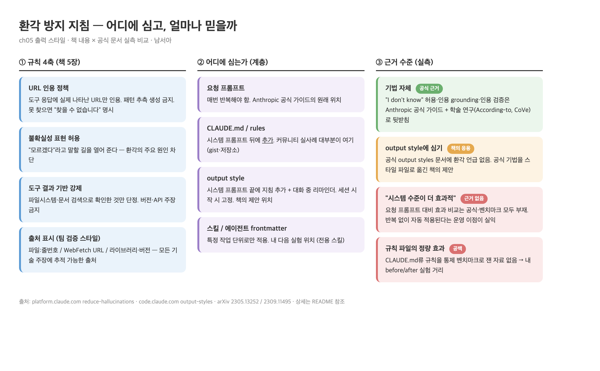

# 남서아 · 5장 정리: 출력 스타일에 심는 환각 방지 지침 (2026-07-05)

- **관통 질문**: 출력 스타일의 환각 방지 지침은 정확히 어떤 원리로 작동하고, 얼마나 믿어도 되나?
- 조사 방식: 책 5장 해당 절 정리 → 공식 문서 검증 · 실사례 조사 서브에이전트 2개 병렬 fan-out → 종합
- ⚠️ **핵심 발견**: "출력 스타일로 환각 방지"는 공식 기능이 아니라 **공식 기법을 스타일 파일에 옮겨 담은 책의 응용 제안**이다. 기법 자체는 공식·학술 근거가 있지만, "시스템 수준이 요청 프롬프트보다 효과적"이라는 비교 근거는 어디에도 없다

- 도식 원본: [hallucination-map.html](hallucination-map.html)

---

## 1. 책 내용 정리 (5장 "출력 스타일에서 환각 방지 지침")

- 전제: 출력 스타일은 응답 특성을 시스템 수준에서 바꾼다 → 환각 방지 지침도 여기 심으면 요청마다 반복 없이 일관 적용
- 환각의 전형: 존재하지 않는 URL 제시 · 확인 안 된 API 정보 단정 · 실행 안 한 검증 결과 보고

### 규칙 4축

| 축 | 내용 |
|---|---|
| **① URL 인용 정책** | 도구 응답에 실제 나타난 URL만 인용 · 패턴 추측 생성 금지 · 못 찾으면 "검색 결과에서 URL을 찾을 수 없습니다" 명시 · 출처에 "WebSearch를 통해 검색됨" 표시 |
| **② 불확실성 표현 허용** | 클로드가 '모르겠다'라고 말하기 어려운 상황이 환각의 주요 원인 → "공식 출처를 통한 검증이 필요합니다" 같은 표현을 명시적으로 허용 |
| **③ 도구 결과 기반 강제** | 도구 검증 없이 URL 제공 금지 · 파일시스템 확인 없이 버전 번호 금지 · 문서 검색 없이 API 동작 주장 금지 |
| **④ 출처 표시 (팀 검증 스타일)** | 모든 기술적 주장에 출처: 파일 기반(경로/파일명:줄번호) · 웹 기반(WebFetch/WebSearch URL) · 문서(라이브러리/버전) |

- 책의 결론: 기술 문서 생성·코드 리뷰·API 통합처럼 **정확성이 중요한 작업**에서 특히 차이가 난다

---

## 2. 공식 문서 실측 — 책 주장은 어디까지 근거가 있나

### 검증 결과 요약

| 주장 | 판정 | 근거 |
|---|---|---|
| 환각 감소 기법 자체 | ✅ 공식 | Anthropic [Reduce hallucinations](https://platform.claude.com/docs/en/test-and-evaluate/strengthen-guardrails/reduce-hallucinations) 가이드에 "I don't know" 허용 · 인용 grounding · 인용 검증 명시 |
| 출력 스타일이 시스템 프롬프트를 바꾼다 | ✅ 공식 | [Output styles](https://code.claude.com/docs/en/output-styles): 커스텀 지침은 시스템 프롬프트 **끝에 추가** + 대화 중 준수 리마인더 발생. `keep-coding-instructions: false`(기본)면 내장 SWE 지침 제외. 세션 시작 시 1회 로드 |
| "출력 스타일 = 환각 방지 수단" | ⚠️ 책의 응용 | 공식 output styles 문서에 환각 언급 **없음**(역할·톤·형식 변경 용도). 공식 프롬프트 기법을 스타일 파일로 옮긴 제안 |
| "시스템 수준이 요청 프롬프트보다 효과적" | ❌ 근거 없음 | 공식 비교 설명·벤치마크 모두 부재 |

### 그래서 "왜 효과가 있는(것처럼 보이는)가" — 내 정리

- **기법의 힘**: "모르겠다" 허용·도구 기반 강제 자체가 환각을 줄인다는 건 공식 + 학술 근거가 있다 (아래 3절)
- **위치의 힘(운영)**: 스타일에 심으면 매 세션 자동 적용 + 리마인더 재주입 → 사람이 깜빡해도 규칙이 산다. 효과의 실체는 "시스템 프롬프트가 더 세다"가 아니라 **"반복 없이 일관 적용된다"** 쪽에 가깝다
- **믿음의 한계**: 지침은 확률을 낮출 뿐 보장이 아니다. 공식 가이드도 "크게 줄이지만 완전 제거는 불가"라고 명시 → **"지침을 넣었다 = 환각이 사라졌다"로 착각하지 않기**

---

## 3. 참고 자료 지도 — 프롬프트 개선에 쓸 것들

### 공식 (Anthropic)

- [Reduce hallucinations](https://platform.claude.com/docs/en/test-and-evaluate/strengthen-guardrails/reduce-hallucinations) — 기본 3기법("I don't know" 허용 · 직접 인용 grounding · 인용 기반 검증-철회) + 고급 4기법(CoT 검증 · Best-of-N · 반복 정제 · 외부 지식 제한)
- [Output styles](https://code.claude.com/docs/en/output-styles) · [Prompt caching](https://code.claude.com/docs/en/prompt-caching) — 심는 위치의 동작 원리

### 학술 (기법의 효과 입증)

- **According-to prompting** ([arXiv 2305.13252](https://arxiv.org/abs/2305.13252)) — "According to Wikipedia, ..."만 붙여도 grounding 개선을 QUIP-Score로 정량 입증
- **Chain-of-Verification** ([arXiv 2309.11495](https://arxiv.org/abs/2309.11495), Meta) — 초안→검증 질문→독립 답변→최종 응답 4단계로 환각 감소 입증

### 실사례 (GitHub · 커뮤니티)

- [Anti-Hallucination Rules gist (mingrath)](https://gist.github.com/mingrath/7e292d9ca976f63e499db971f21b6bbe) — Claude Code/Cursor/Windsurf 공용 5규칙. 핵심 문구 **"No source = no claim"**
- [anthropic-anti-hallucinate-skills (instantX-research)](https://github.com/instantX-research/anthropic-anti-hallucinate-skills) — CLAUDE.md 전역/프로젝트/플러그인 3가지 설치 방식. "being honest IS being helpful" 프레임
- [awesome-claude-code](https://github.com/hesreallyhim/awesome-claude-code) — anti-hallucination 설계 스킬 수록
- 커뮤니티 공통 패턴: `[Verified]/[Unverified]` 라벨 · tool-first 검증 · 완료 주장 전 증거 확인
- **부재 확인**: 환각 방지 **전용 output style** 공개 사례는 못 찾음 — 실사례는 전부 CLAUDE.md 규칙/스킬 형태. 규칙 파일 자체의 통제 벤치마크도 없음

---

## 4. 헤르메스 에이전트 적용 계획

- 배경: 오늘 헤르메스 에이전트 설치를 알려주는 오프라인 스터디를 진행했다. 비개발자 동료·스터디원에게 넘기는 세팅일수록 환각 방지가 기본값이어야 한다 (2장 "잘 넘기는 법"의 연장)
- 내 뉴스 크롤링 도구의 실증: 파이프라인 대부분이 결정론인데도 **분류 단계(LLM 개입 지점)에서 가끔 환각** — URL 처리 규칙을 생각하지 못했던 지점

### 실험 설계 (예정)

| 단계 | 내용 |
|---|---|
| 1. 스킬 제작 | 헤르메스 전용 환각 방지 스킬 — 규칙 4축을 SKILL.md로. 실사례가 CLAUDE.md 형태 지배적이므로 전역 CLAUDE.md 규칙 버전도 병행 |
| 2. before/after | 같은 작업(기술 질문·뉴스 분류)을 지침 유/무로 돌려 출처 표기율·미검증 단정 횟수 비교 |
| 3. 공유 세트 | 옵시디언에서 편집 가능한 룰북 체계·목차 포함해 스터디원 배포 |

---

## 5. 남은 미제

- 규칙 4축 중 **어느 축이 효과의 대부분을 내는지** 분리 측정 필요 (체감상 ②불확실성 허용 + ③도구 기반이 컸다)
- 커스텀 스타일의 SWE 지침 제거 리스크(`keep-coding-instructions`)와 환각 방지 지침의 상호작용
- 지침 준수율이 모델·컨텍스트 길이에 따라 어떻게 변하는지

---

## 출처

1. [platform.claude.com — Reduce hallucinations](https://platform.claude.com/docs/en/test-and-evaluate/strengthen-guardrails/reduce-hallucinations) (공식)
2. [code.claude.com — Output styles](https://code.claude.com/docs/en/output-styles) · [Prompt caching](https://code.claude.com/docs/en/prompt-caching) (공식)
3. [arXiv 2305.13252](https://arxiv.org/abs/2305.13252) · [arXiv 2309.11495](https://arxiv.org/abs/2309.11495) (학술)
4. [mingrath gist](https://gist.github.com/mingrath/7e292d9ca976f63e499db971f21b6bbe) · [instantX-research](https://github.com/instantX-research/anthropic-anti-hallucinate-skills) · [awesome-claude-code](https://github.com/hesreallyhim/awesome-claude-code) (실사례)
5. 책 〈클로드 코드로 시작하는 실전 에이전틱 코딩〉 5장 해당 절 · 서브에이전트 조사 2건(2026-07-05)
