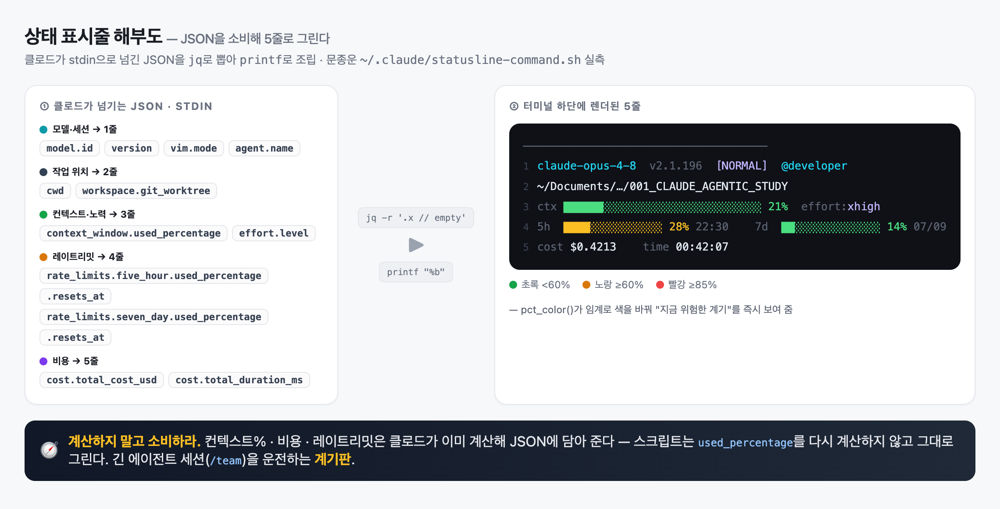

# CHAPTER 05 — 출력과 인터페이스 (문종운)

> 클로드가 **어떻게 응답하고**(출력 스타일) · **무엇을 보여 주고**(상태 표시줄) · **어떻게 조작되는지**(대화형 모드). 세 축 모두 "결과물의 형태를 내가 직접 통제"하는 인터페이스다.

> ### 💡 이 장에서 내가 챙긴 것
> 1. **출력 스타일**은 말투 설정이 아니라 **시스템 프롬프트 교체**다 — CLAUDE.md(더하기)와 근본이 다르다.
> 2. **상태 표시줄**은 계산기가 아니라 **소비기**다 — 클로드가 JSON에 담아 준 값을 그대로 그린다.
> 3. 세 축을 오케스트레이터 관점에서 보면: 스타일=워커의 보고 형식, 계기판=세션 운전대, 접두사=컨텍스트 주입구.

---

## 5-1 출력 스타일 (Output Style)

- **정의**: 클로드가 응답할 때 따르는 지침의 집합. 형식만 바꾸는 게 아니라 **시스템 프롬프트 자체를 교체**한다.
- **효과**: 기본이 아닌 스타일을 고르면 SWE(소프트웨어 엔지니어링) 지침이 빠지고 내 지침으로 대체 → 코딩 도구를 문서·교육·분석 도구로 전환. 단, 파일 작업·스크립트 실행 같은 핵심 기능은 유지.
- **접근**: `/config` → Output style. (구 `/output-style` 명령은 v2.1.73 폐기 → v2.1.91 제거. 기능은 유지.)
- **로딩 시점**: 시스템 프롬프트의 일부라 **세션 시작 시 1회 로드** → 바꾼 뒤엔 `/clear`나 새 세션에서 적용.

### 내장 스타일

| 스타일 | 성격 | 언제 |
|---|---|---|
| **Default** | SWE 최적화, 간결 | 대부분의 개발 작업 |
| **Explanatory** | 구현 이유를 교육적으로 함께 설명 | 코드 리뷰·기술 학습 |
| **Learning** | 인사이트 + `TODO(human)`로 일부는 내가 직접 구현 | 손으로 익히는 실습 |
| **Proactive** | 묻지 않고 합리적 가정으로 즉시 실행 | 자율 실행을 원할 때 |

> 🔧 **원본 메모 정정 2건** (조용히 안 바꾸고 명시)
> - 메모의 내장 4종 "Default/Explanatory/Learning/**Custom**" 중 **Custom은 내장이 아님** — 사용자가 직접 만드는 커스텀 스타일 메커니즘이다. 내장 4번째는(버전에 따라) **Proactive**.
> - "Learning은 **협업모드**" → 정확히는 인사이트를 주되 `TODO(human)`으로 일부를 **내가 직접 구현하는 실습 모드**.

### 커스텀 스타일

- 마크다운 1개 = **프론트매터(메타) + 지침 본문**. 저장: `~/.claude/output-styles/`(모든 프로젝트) 또는 `.claude/output-styles/`(프로젝트).
- **함정**: 커스텀 스타일은 기본적으로 내장 코딩 지침을 **제거**한다. 코딩은 그대로 하면서 말투만 바꾸려면 → **`keep-coding-instructions: true`** (사실상 코딩 세션 필수).

```markdown
---
name: team-verified
description: 검증 신뢰도를 붙여 보고하는 팀 표준
keep-coding-instructions: true   # false/생략 시 코딩 지침이 통째로 빠짐
---
## 불확실성 표현 허용
확인 못 한 정보는 "검증 필요"로 열어 둔다. 출처 없는 URL·미검증 버전 단정 금지.
```

### 출력 스타일 vs CLAUDE.md — 근본 차이

| | 지침을 어떻게 | 결과 |
|---|---|---|
| **CLAUDE.md** | 기존 지침 **+ 추가** | 기본 + 내 규칙 (덧셈) |
| **커스텀 output style** | `keep-coding-instructions: false`면 **대체** | 기본을 통째로 교체 (치환) |

- **팀 관점**: 이 치환 덕에 모든 팀원이 기본 클로드 지침을 벗어나 **팀 공통 지침**을 따르게 만들 수 있다. 특히 "불확실성 표현 허용"을 스타일에 심으면 요청마다 반복 안 해도 **시스템 수준에서 환각을 억제**한다.

> 📌 **내 시스템 실측** — `~/.claude/output-styles/` **없음**, settings.json에 `outputStyle` 키 **없음** → 나는 **Default로 구동 중**. 대신 글로벌 `~/.claude/CLAUDE.md`에 "항상 한국어로 응답" + 코딩 규칙 다수를 둔다 = 바로 **CLAUDE.md(덧셈) 방식**. 팀 표준을 "치환"으로 굳히려면 위 `team-verified` 스타일을 `.claude/output-styles/`에 커밋하면 된다.

---

## 5-2 상태 표시줄 (Statusline)

- **작동 원리 (한 줄)**: 클로드가 **JSON을 stdin으로** 넘김 → 스크립트가 가공 → **한 줄(또는 여러 줄)을 stdout으로**.
- **갱신**: 대화 갱신마다 최대 **300ms 간격** 재그리기. 스크립트가 느리면 이전 값 유지 → **빠를수록 좋다**.
- **설정**: `/statusline`(대화형 생성) 또는 `settings.json`에 직접.

```
[클로드] ──JSON(model·workspace·cost·context_window·rate_limits…)──▶ stdin
      ──▶ [파싱+포매팅 (bash/python/node)] ──▶ stdout ──▶ [터미널 하단]
```

```json
{ "statusLine": { "type": "command", "command": "~/.claude/statusline.sh", "padding": 0 } }
```

### 전체 필드 레퍼런스 (클로드가 넘겨 주는 JSON)

> 이게 이 장의 핵심 원료. "무엇을 보여 줄 수 있나"의 전량. ✓ = 내 실제 스크립트가 소비 중.

**모델·세션**

| 필드 | 뜻 | |
|---|---|---|
| `model.id` · `model.display_name` | 모델 식별자 / 표시 이름 | ✓ |
| `version` | 클로드 코드 버전 | ✓ |
| `session_id` · `session_name` | 세션 ID / `--name`·`/rename`으로 준 이름 | |
| `prompt_id` | 처리 중 프롬프트 UUID (OTel `prompt.id`와 일치, v2.1.196+) | |
| `transcript_path` | 대화 기록 파일 경로 | |
| `output_style.name` | 현재 출력 스타일 이름 | |
| `vim.mode` | vim 모드(NORMAL/INSERT/VISUAL…) | ✓ |
| `agent.name` | `--agent`·에이전트 설정 시 이름 | ✓ |

**작업 공간 (workspace)**

| 필드 | 뜻 |
|---|---|
| `cwd` · `workspace.current_dir` | 현재 작업 디렉터리(동일값, `current_dir` 선호) ✓ |
| `workspace.project_dir` | 클로드가 시작된 디렉터리(세션 중 cwd 바뀌면 다름) |
| `workspace.added_dirs` | `/add-dir`로 추가된 디렉터리(없으면 `[]`) |
| `workspace.git_worktree` | 연결된 worktree 이름(주 트리엔 없음, 모든 worktree에 채워짐) ✓ |
| `workspace.repo.host` · `.owner` · `.name` | origin 원격에서 파싱한 저장소 식별자(git·origin 없으면 없음) |

**비용·변경량 (cost)**

| 필드 | 뜻 |
|---|---|
| `cost.total_cost_usd` | 총 세션 비용 USD(클라이언트 계산, 청구서와 다를 수 있음) ✓ |
| `cost.total_duration_ms` | 세션 시작 후 총 벽시계 시간 ✓ |
| `cost.total_api_duration_ms` | API 응답 대기 총시간 |
| `cost.total_lines_added` · `_removed` | 변경된 코드 줄 |

**컨텍스트 (context_window)** — v2.1.132부터 "현재 창에 있는 양"(그 이전은 누적 합계)

| 필드 | 뜻 |
|---|---|
| `context_window.used_percentage` · `remaining_percentage` | 사용/잔여 % (사전 계산) ✓ used |
| `context_window.context_window_size` | 최대 창 크기(기본 200K, 확장 모델 1M) |
| `context_window.total_input_tokens` · `total_output_tokens` | 현재 창 토큰 수(입력엔 캐시 읽기/쓰기 포함) |
| `context_window.current_usage` | 마지막 API 호출 토큰 수 |
| `exceeds_200k_tokens` | 최근 응답 총 토큰이 200K 초과 여부(창 크기 무관 고정 임계값) |

**노력·사고 / 레이트리밋 / PR / worktree**

| 필드 | 뜻 |
|---|---|
| `effort.level` | 추론 노력(low~max). 세션 중 `/effort` 반영. Ultracode는 xhigh로 보고 ✓ |
| `thinking.enabled` | 확장 사고 활성 여부 |
| `rate_limits.five_hour.used_percentage` · `.resets_at` | 5시간 창 소비% / 재설정 epoch초 ✓ |
| `rate_limits.seven_day.used_percentage` · `.resets_at` | 7일 창 소비% / 재설정 epoch초 ✓ |
| `pr.number` · `pr.url` | 현재 브랜치의 열린 PR(없으면 없음) |
| `pr.review_state` | approved / pending / changes_requested / draft |
| `worktree.name` · `.path` · `.branch` | `--worktree` 세션의 worktree 정보(훅 기반은 branch 없음) |
| `worktree.original_cwd` · `.original_branch` | worktree 진입 전 위치·브랜치 |

### 📌 내 시스템 실측 — 5줄 계기판

`settings.json` → `statusLine: bash ~/.claude/statusline-command.sh`. 위 표에서 **13개 필드를 실제로 소비**하는 다줄 계기판이다. 골격은 `jq -r '.필드 // empty'` → 조립 → `printf "%b"`.

| 줄 | 소비 필드 |
|---|---|
| 1 · 모델/세션 | `model.id` · `version` · `vim.mode` · `agent.name` |
| 2 · 위치 | `cwd`(→ `~` 축약) · `workspace.git_worktree` |
| 3 · 컨텍스트 | `context_window.used_percentage`(막대+색) · `effort.level` |
| 4 · 레이트리밋 | `rate_limits.five_hour.*` · `seven_day.*`(막대 + 재설정 시각) |
| 5 · 비용 | `cost.total_cost_usd` · `cost.total_duration_ms`(HH:MM:SS) |

- 헬퍼로 정리: `progress_bar()`(█/░ 막대) · `pct_color()`(60/85% 임계로 초록→노랑→빨강) · `fmt_time()`(epoch → 로컬시각, GNU/BSD date 모두 대응).
- **모든 수치는 클로드가 준 값을 그대로 씀** — 컨텍스트% 자체 추정 로직 없음.



> HTML 원본: [statusline-anatomy.html](statusline-anatomy.html) (Pages 인앱 뷰용)

> 💡 **원칙: 계산하지 말고 소비하라.** 컨텍스트·비용·레이트리밋은 클로드가 이미 계산해 JSON에 담아 준다. 스크립트가 다시 계산하면 유지보수 부채만 는다. 안 보이면 순서대로 — ① `chmod +x` → ② **stdout**으로 내는지(stderr는 안 뜸) → ③ `jq` 설치.

---

## 5-3 대화형 모드

### 입력 접두사

| 접두사 | 기능 | 효과 |
|---|---|---|
| `#` | 메모리 | 입력이 `CLAUDE.md`에 기록돼 이후 세션에서도 참조 |
| `!` | Bash | 승인 없이 셸 실행 + **출력을 컨텍스트에 추가** |
| `@` | 파일 멘션 | 경로 자동완성으로 파일을 컨텍스트에 포함 |
| `/` | 슬래시 명령 | `/help` `/clear` `/config` 및 커스텀 명령 |

```
# 해당 프로젝트는 spring boot 3.4.12 이다.      → CLAUDE.md에 영구 기록
! ./gradlew bootRun --args=...                  → 즉시 실행 + 결과가 컨텍스트로
```

### 자주 쓰는 단축키

| 단축키 | 동작 |
|---|---|
| `Ctrl+R` | **역방향 명령 기록 검색**(키워드로 이전 프롬프트 찾기, 디렉터리별 저장) |
| `Esc Esc` | 코드·대화를 이전 지점으로 되감기(체크포인트) |
| `Ctrl+O` | 상세 출력 토글 · `Ctrl+L` 화면 지우기(기록 유지) |
| `Shift+Tab` | 권한 모드 전환(자동 수락 · 계획 · 일반) |
| `Ctrl+V`(mac/리눅스) · `Alt+V`(윈도우) | 클립보드 이미지 붙여넣기 |

> 📌 **내 시스템 실측** — `#`으로 쌓인 규칙이 글로벌 CLAUDE.md의 "Rules (update when Claude makes mistakes)" 블록으로 남아 있다(코틀린 idiom·생성자 주입 등). `!`는 커밋 전 `!git status`처럼 상태를 먼저 보여 준 뒤 작업을 잇는 데 쓴다.

> 💡 **핵심** — `@`·`!`는 **컨텍스트 주입** 도구. 작업을 시키기 전에 현재 상태부터 보여 주면 정확도가 오른다. 어긋나면 `Esc Esc`로 되감고, 키워드는 `Ctrl+R`로 되찾는다.

---

## 🎯 발표용 핵심 개념 1개 — 상태 표시줄 = 오케스트레이션 계기판

- **고른 이유**: 임정(=출력 스타일)·리드(=설계 원칙 "소비하라")와 각도가 겹치지 않고, 내 실제 5줄 스크립트가 곧 발표 자료다.
- **한 문장**: 상태 표시줄은 예쁜 장식이 아니라, **긴 에이전트 세션을 운전하기 위한 계기판**이다 — 컨텍스트 잔량·비용·5h/7d 레이트리밋·effort를 실시간으로 읽어 "언제 `/clear` 할지, 언제 멈출지"를 판단한다.
- **오케스트레이터 연결**: `/team` 같은 다단계 하네스는 세션이 길고 토큰을 많이 쓴다. 계기판이 없으면 컨텍스트 폭발·레이트리밋 소진을 늦게 안다. 그래서 나는 `context_window.used_percentage`와 `rate_limits.*`를 막대로 항상 띄운다.

## ❓ 읽으며 생긴 질문과 내 결론

- **"cwd와 workspace.current_dir이 같다면 왜 둘 다?"** → 값은 같지만 `workspace.current_dir`이 `workspace.project_dir`와 이름 짝을 이뤄 일관적이라 권장. 세션 중 디렉터리를 바꾸면 `cwd`와 `project_dir`이 갈린다.
- **"keep-coding-instructions를 빼면?"** → 코딩 지침이 통째로 사라진다. 글쓰기·분석 전용이면 OK, 코딩 세션이면 사고. 그래서 대비를 CLAUDE.md(덧셈) vs 스타일(치환)로 기억하면 안전.
