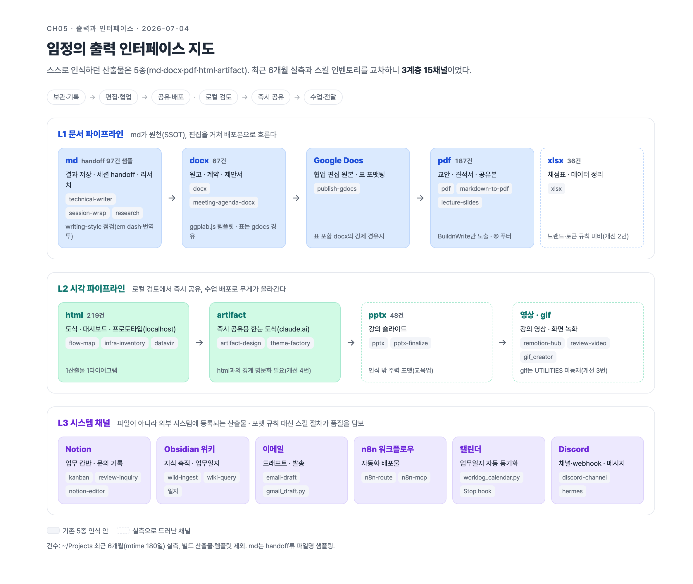

# 임정 · 5장 정리: 출력과 인터페이스 (2026-07-04)

- **관통 주제(발표 핵심 1개)**: "output style은 명령어가 아니라 체계다"
- ⚠️ **교정점**: `/output-style` 명령은 실제로 제거됨(v2.1.73 deprecated → v2.1.91 removed)[1][2]. 기능은 유지되며 접근 경로만 `/config` 메뉴와 `outputStyle` 설정으로 이동. 책의 해당 절은 이 업데이트를 얹어 읽을 것
- 조사 방식: ultracode 워크플로로 Sonnet 에이전트 5개 병렬 fan-out(문서 검증 · 로컬 실측 · 레포 규칙 · 스킬 인벤토리 · 파일 집계), 판단·종합은 메인 세션



- 도식 원본: [output-map.html](output-map.html) (Pages 인앱 뷰) · [claude.ai artifact](https://claude.ai/code/artifact/ee108d24-28b9-498c-bbe5-13eeeb5d8bcd)

---

## 핵심 질문 요약 (TL;DR)

| # | 질문 | 한 줄 답 |
|---|------|----------|
| Q1 | /output-style은 아직 있나 | 명령은 **제거**(v2.1.91), 기능은 **유지**. `/config` 또는 settings의 `outputStyle` 필드로 접근. 내 로컬(v2.1.201)은 Default로 동작 중 |
| Q2 | output style은 어떻게 동작하나 | CLAUDE.md와 달리 **시스템 프롬프트 자체를 교체**. 세션 시작 시 고정(프롬프트 캐싱 최적화). 커스텀은 `~/.claude/output-styles/*.md` |
| Q3 | 내 statusline은 뭘 보여주나 | 2행 구성: [모델] · 디렉토리 · 브랜치 · 비용 / 컨텍스트 바(70·90% 색상 임계값) · 경과시간 · 5h/7d 사용률. 전부 stdin JSON 소비, 자체 계산 없음 |
| Q4 | 내 산출물은 5종이 맞나 | 아니다. 실측 결과 **3계층 15채널**. 문서 파이프라인(md→docx/gdocs→pdf), 시각 파이프라인(html→artifact→pptx→영상), 시스템 채널(Notion·위키·캘린더·이메일·n8n) |
| Q5 | 포맷별 언제·어디서·무슨 스킬 | 아래 표 참조. 교육업 특성상 pptx(48건)·xlsx(36건)가 사실상 6·7번째 주력 포맷이었다 |
| Q6 | 개선할 점 | pptx·xlsx 규칙 공백, gif 채널 미등재, artifact vs html 경계 명문화, Learning 스타일 실험 등 6가지 |

---

## Q1. /output-style은 아직 존재하는가

| 버전 | 사건 |
|------|------|
| v1.0.81 | output styles 출시. 교육용 내장 스타일 Explanatory·Learning 포함 |
| v2.0.30 | 기능 자체가 한 차례 deprecated (CLAUDE.md·`--system-prompt`·플러그인 사용 권고) |
| v2.0.32 | 커뮤니티 피드백으로 **즉시 un-deprecate** (기능 부활) |
| v2.1.73 | `/output-style` **명령만** deprecated. 대체는 `/config`. 이때부터 스타일이 세션 시작 시 고정됨(프롬프트 캐싱) |
| v2.1.91 | `/output-style` 명령 **완전 제거** |

- 내장 스타일 4종[1]:
  - **Default**: 기본 SWE 최적화
  - **Explanatory**: 작업 중간 교육적 Insights 제공
  - **Learning**: Insights + `TODO(human)` 마커로 사용자가 직접 코드 일부 작성
  - **Proactive**: 계획보다 즉시 실행 우선

> **실측(내 환경)**
> - `claude --version` = 2.1.201 → 제거 시점보다 뒤라 `/output-style` 명령 없음
> - `~/.claude/settings.json`에 `outputStyle` 키 없음 · `~/.claude/output-styles/` 디렉토리 없음
> - 결론: 나는 **Default 스타일로만 써 왔다**

---

## Q2. output style의 동작 원리: 시스템 프롬프트를 교체한다

- **CLAUDE.md와의 차이**: CLAUDE.md는 시스템 프롬프트 뒤에 **추가**, output style은 시스템 프롬프트 자체를 **교체·증강**[1]
- 커스텀 스타일은 기본적으로 내장 SWE 지시문을 **제거**(`keep-coding-instructions` 기본 false) → 코딩 세션에서 함부로 쓰면 능력이 깎임
- 세션 시작 시 1회만 로드(프롬프트 캐싱) → 변경 후 `/clear` 또는 새 세션 필요
- 커스텀 만들기: 마크다운 1개 = frontmatter(`name`·`description`·`keep-coding-instructions`·`force-for-plugin`) + 시스템 프롬프트 본문
- 저장 위치 3곳: `~/.claude/output-styles/` · 프로젝트 `.claude/output-styles/` · managed policy. 플러그인 배포 가능[1]

> **ggplab 적용**
> - 내 환경에서 output style 역할은 이미 `~/.claude/rules/`가 대신함: writing-style(번역투·em dash 점검) · content-creation(디자인 SOP·브랜드 규칙) + CLAUDE.md 체인
> - rules = 시스템 프롬프트에 **추가**(SWE 능력 보존) / output style = **교체**(리스크)
> - 결론: 내 워크플로에는 rules 방식 유지. output style은 스터디 같은 학습 세션 한정 실험 가치(Q6-1)

---

## Q3. 내 statusline 설정 (실측 공유)

- 등록: `~/.claude/settings.json` → `statusLine: { type: "command", command: "bash ~/.claude/statusline-command.sh" }`
- 방식: Claude Code가 **stdin으로 주는 JSON을 jq로 파싱**해 2행 출력. 자체 토큰 계산·API 호출 없음

```text
[Fable 5] 📁 claude-agentic-study | 🌿 main | $1.23
███░░░░░░░ 34% ctx | 12m 5s | 5h: 21% 7d: 48%
```

| 표시 요소 | 데이터 출처 |
|-----------|-------------|
| 모델명 | stdin `.model.display_name` (없으면 `.model.id`) |
| 📁 디렉토리 | stdin `.workspace.current_dir` basename (fallback: `$PWD`) |
| 🌿 git 브랜치 | `git rev-parse --git-dir`로 repo 확인 후 `git branch --show-current` |
| 비용 | stdin `.cost.total_cost_usd` |
| 컨텍스트 바 | stdin `.context_window.used_percentage`를 10칸 블록(█/░)으로. 70% 미만 초록 · 70~89 노랑 · 90+ 빨강 |
| 경과시간 | stdin `.cost.total_duration_ms`를 분·초 환산 |
| 5h/7d 사용률 | stdin `.rate_limits.five_hour/seven_day.used_percentage`, 없으면 조용히 생략 |

- 구현 포인트 3가지:
  1. **계산하지 말고 소비하라**: 컨텍스트·rate limit 모두 statusline 입력 스키마가 이미 계산해 줌. 자체 추정 로직 = 유지보수 부채
  2. **graceful degradation**: 모든 jq 파싱에 `//` 기본값 연산자 → 필드가 빠져도 안 죽음
  3. **방어적 git 호출**: repo 여부 먼저 확인 → 비 git 디렉토리에서 stderr 노이즈 차단

---

## Q4 · Q5. 내 산출물 재구조화: 5종 인식 vs 3계층 15채널 실측

- 자기 인식: md·docx·pdf·html·artifact 5종
- 실측(최근 6개월, mtime 180일): **3계층 15채널**. pptx 48건·xlsx 36건은 인식 밖 주력 포맷(교육업 특성)
- 구조:
  - **L1 문서 파이프라인**: md(원천·SSOT) → docx/gdocs(편집) → pdf(배포)
  - **L2 시각 파이프라인**: html(로컬 검토) → artifact(즉시 공유) → pptx·강의 pdf(수업 배포) → 영상
  - **L3 시스템 채널**: 파일이 아니라 외부 시스템에 등록되는 산출물. 포맷 규칙 대신 스킬 절차가 품질 담보

### 5대 포맷: 언제 · 어디서 · 무슨 스킬과

| 포맷 | 언제 쓰나 | 자주 쓰는 프로젝트(최근 6개월 실측) | 동반 스킬 | 적용 규칙 |
|------|-----------|--------------------------------------|-----------|-----------|
| **md** | 결과 저장 · 세션 handoff · 리서치 정리 | data-research-hub(17) · doosan-cuvex(세션 핸드오프 시리즈) · ozcoding(7) | technical-writer · doc-coauthoring · research · session-wrap | writing-style.md: em dash 금지 · 번역투 grep 점검 |
| **docx** | 편집 가능 문서 · 원고 · 계약/제안 | 한빛 원고(claude-book-hanbit-v2) · doosan(8) · tech-research-hub(7) · ggplab-business(3) | docx · meeting-agenda-docx · publish-gdocs | ggplab.js 템플릿 강제 · **표 포함 시 publish-gdocs 경유**(python-docx 표 금지) · BuildnWrite + 카피라이트 푸터 |
| **pdf** | 파일 공유 · 강의 교안 · 견적서 | wrtn_contents(55) · alice-samsung(16) · n8n-youtube(12) | pdf · markdown-to-pdf · lecture-slides · pptx-finalize | 디자인 SOP 4종(팔레트·폰트·톤·레퍼런스) · BuildnWrite만 노출 · © 푸터 |
| **html** | 도식 · 대시보드 · 프로토타입(localhost) | ozcoding(41) · tech-research-hub(39) · claude-agentic-study(9) | flow-map · infra-inventory · daily-retro · dataviz · theme-factory | 1산출물 1다이어그램 · 스타일 미지정 시 흰 배경·플랫·파스텔 |
| **artifact** | 즉시 공유용 한눈 도식(claude.ai 호스팅) | (파일 실측 대상 아님 · 세션 단위) | artifact-design(호출 전 필수 로드) · theme-factory · dataviz | 공유 시 브랜드 규칙 동일 적용 |

### 실측이 추가로 알려준 채널

| 계층 | 채널 | 근거(스킬/실측) |
|------|------|------------------|
| 문서 | **pptx** 강의 슬라이드 | pptx · pptx-finalize 스킬, naver-smartstore 33건 등 총 48건 |
| 문서 | **xlsx** 채점표·데이터 정리 | xlsx 스킬, doosan·alice 각 8건 등 총 36건 |
| 문서 | **Google Docs 네이티브** 협업 편집 원본 | publish-gdocs 스킬(표 docx의 강제 경유지이기도 함) |
| 시각 | **영상 · gif** 강의 영상, 화면 녹화 | remotion-hub · review-video / gif_creator(도구 직접 호출) |
| 시스템 | **Notion** 업무 칸반·문의 기록 | kanban · review-inquiry 스킬, notion-editor 에이전트 |
| 시스템 | **Obsidian 위키** 지식 축적 | wiki-ingest · wiki-query · 일지 |
| 시스템 | **이메일 드래프트** | email-draft + gmail_draft.py(서명 자동 첨부) |
| 시스템 | **n8n 워크플로우** 자동화 배포물 | n8n-route + n8n-mcp 도구 |
| 시스템 | **캘린더 이벤트** 업무일지 자동 동기화 | worklog_calendar.py(Stop hook) |
| 시스템 | **Discord** 채널/webhook 인프라, 메시지 발송 | discord-channel 스킬 · hermes 브릿지 |

> **ggplab 적용**: 이 표가 실무 기준표. "이 결과물 뭘로 만들까" → 목적(보관/편집/공유/검토/즉시 공유)에서 포맷 선택 → 동반 스킬·규칙 열 그대로 적용

---

## Q6. 개선할 점 (이번 실측에서 드러난 공백)

1. **Learning 스타일 실험**: 이 레포 `.claude/settings.local.json`에 `"outputStyle": "Learning"` → 스터디 세션만 학습 모드. 코딩 프로젝트에는 미적용(Q2의 SWE 지시문 교체 리스크)
2. **pptx·xlsx 규칙 공백**: BuildnWrite 브랜드·카피라이트·디자인 토큰 규칙이 docx·pdf에만 존재. 실측 pptx 48건 → CLAUDE.md Document Generation 절에 확장 필요
3. **gif 채널 미등재**: gif_creator 도구 직접 호출뿐, UTILITIES.md에 없음 → 등재
4. **artifact vs 로컬 html 경계 명문화**: "외부에 바로 링크 = artifact / 레포 보존·Pages·localhost = html" 한 줄을 content-creation.md에 추가
5. **pdf 스킬 중복 정리**: pdf(범용) vs markdown-to-pdf(md 특화) 선택 기준 한 줄 확정(UTILITIES.md 갭 분석에 이미 언급)
6. **statusline 소폭 보강**: `command -v jq` 가드 추가. output style 이름 표시는 입력 스키마 필드 확인 후 결정(미검증 상태로는 추가하지 않음)

---

## 발표용 핵심 개념 선택

- 선택: **"output style: 명령은 사라지고 설정·체계로 남았다"**
- 이유:
  1. 책과 현재 CLI의 간극이 가장 큰 지점 → 스터디 교통정리 가치 최고
  2. "시스템 프롬프트 교체 vs 추가" 축이 CLAUDE.md·rules·스킬을 관통하는 설계 기준
  3. statusline은 다른 참여자가 고르기 좋은 독립 주제라 회피

---

## 출처

1. [code.claude.com/docs/en/output-styles](https://code.claude.com/docs/en/output-styles) · output styles 동작·커스텀·제거 Note (공식)
2. [github.com/anthropics/claude-code CHANGELOG.md](https://github.com/anthropics/claude-code/blob/main/CHANGELOG.md) · v1.0.81 / v2.0.30 / v2.0.32 / v2.1.73 / v2.1.91 원문 (공식)
3. [code.claude.com/docs/en/settings](https://code.claude.com/docs/en/settings) · `outputStyle` 설정 필드 (공식)
4. 로컬 실측: `~/.claude/settings.json` · `~/.claude/statusline-command.sh` · `claude --version`(2.1.201) · `~/Projects` find 집계(2026-07-04 기준)

## 검증 메모

1. **High confidence**: Q1·Q2 버전 타임라인은 공식 changelog 원문 + 문서 Note 이중 확인. Q3은 스크립트 전문 실측
2. **집계 한계(Q4·Q5)**: 최근 6개월(mtime 180일)만 집계 → 오래된 완료 프로젝트 산출물 누락. md는 handoff·report류 파일명 샘플링(97건). `_archive` 합산치는 프로젝트 단위 신뢰도 낮음. html 219건은 빌드 산출물·템플릿 제외 후 수치
3. **시각 자산**: [output-map.png](output-map.png)(2x, 2370px)는 [output-map.html](output-map.html)을 렌더한 것. 흰 배경·플랫·파스텔 기본 톤(브랜드 미노출), 다크 모드 토큰 포함
