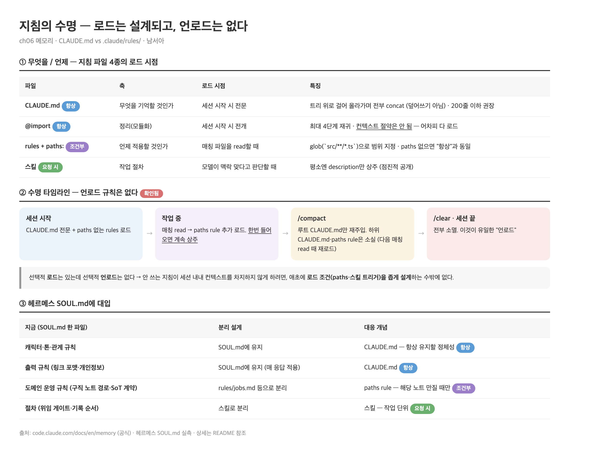

# 남서아 · 6장 정리: CLAUDE.md vs `.claude/rules/` — 지침의 로드 설계 (2026-07-12)

- **관통 질문**: "무엇을 기억할 것인가"(CLAUDE.md)와 "언제 어떤 지침을 적용할 것인가"(모듈형 룰)가 왜 다른 파일로 나뉘는가. 그리고 로드 타이밍의 반대편 — **언로드 규칙은 있는가?**
- 조사 방식: [공식 memory 문서](https://code.claude.com/docs/en/memory) 전문 확인 + 내가 만드는 헤르메스 에이전트의 SOUL.md 실측 대입
- ⚠️ **핵심 발견**: 선택적 로드는 설계된 기능인데 **선택적 언로드는 없다**. 유일한 언로드는 `/clear`·컴팩션이고, 그마저 비대칭(루트 CLAUDE.md만 재주입)이라 — 컨텍스트를 아끼려면 애초에 로드 조건을 좁게 설계하는 수밖에 없다

- 도식 원본: [load-design-map.html](load-design-map.html)

---

## 1. 두 파일의 축이 다르다

| | CLAUDE.md | `.claude/rules/` + `paths:` |
|---|---|---|
| **축** | 무엇을 항상 기억할 것인가 | 언제 어떤 지침을 적용할 것인가 |
| **로드** | 세션 시작 시 전문 | 매칭 파일을 read할 때만 |
| **결합** | 트리 위로 걸어 올라가며 전부 **concat** (덮어쓰기 아님 — 모순 규칙은 임의 선택됨) | 파일별 독립. paths 없으면 시작 시 로드(= CLAUDE.md와 동일 취급) |
| **적정 용도** | 빌드 명령·컨벤션·"항상 X" 규칙 (200줄 이하 권장) | 특정 파일 타입·디렉토리 전용 규칙 |

- `@path` import: CLAUDE.md 안에서 다른 파일을 끌어오는 문법. 최대 4단계 재귀. **주의 — 정리용이지 절약용이 아니다.** import된 파일도 세션 시작 시 전부 로드되므로 컨텍스트 소비는 같다. 컨텍스트를 아끼는 건 paths rule과 스킬뿐
- 공식 문서의 구분 기준: 매 세션 필요한 사실 → CLAUDE.md · 코드 일부에만 해당 → paths rule · 다단계 절차 → 스킬
- user 레벨(`~/.claude/rules/`)도 있다 — 프로젝트 rules보다 먼저 로드돼 프로젝트가 우선권을 가진다. symlink로 여러 프로젝트에 공유 가능

## 2. 언로드는 어떻게 되나 — 조사 결과: "없다"

- 한번 로드된 지침은 세션이 끝나거나 `/clear`·`/compact` 전까지 **계속 상주**한다. 중간에 내리는 메커니즘이 없다
- 컴팩션 후 재주입은 **비대칭**: 루트 CLAUDE.md는 디스크에서 다시 읽어 재주입 ✅ / 하위 디렉토리 CLAUDE.md·paths rule은 재주입 안 됨(다음 매칭 read 때 재로드) — 종운이 잡은 "긴 세션 후반에 규칙이 조용히 사라지는" 지점
- **시사점**: 언로드가 없으니 "안 쓰는 지침이 컨텍스트를 차지하지 않게" 하는 유일한 수단은 **로드 조건을 좁게 설계**하는 것 — paths glob을 넓게(`**/*`) 잡으면 사실상 CLAUDE.md와 다를 게 없어진다
- 디버깅: `/memory`로 현재 세션에 뭐가 로드됐는지 확인, `InstructionsLoaded` 훅으로 어떤 파일이 언제·왜 로드됐는지 로깅 가능

## 3. 헤르메스 SOUL.md에 대입 — 실측

- 실측: 내 헤르메스 에이전트의 SOUL.md **한 파일**에 성격이 다른 지침이 전부 들어 있다
  - 캐릭터·톤·관계 규칙 (항상 필요)
  - 출력 규칙 — 링크 포맷, 개인정보 보호 (매 응답 적용)
  - 도메인 운영 규칙 — 노트 저장 경로, SoT 계약, 탐색 순서 (특정 작업에서만 필요)
  - 절차 — 위임 게이트, 기록·병합 순서 (작업 단위)
- 그동안 "soul에 못 넣는 걸 아키텍처 룰이든 뭐든 구분해야 한다"고 느꼈는데, 이 장이 구분 기준을 줬다:

| 헤르메스 지침 | 갈 곳 | 근거 |
|---|---|---|
| 캐릭터·톤·출력 규칙 | SOUL.md 유지 | 항상 유지할 정체성 = CLAUDE.md 역할 |
| 도메인 운영 규칙 | rules/ 분리 + 경로 조건 | 해당 노트를 만질 때만 필요 = paths rule 역할 |
| 절차 | 스킬 분리 | 작업 단위 로드 = 스킬 역할 |

- 다음 실험: 헤르메스에 `@` import식 로드 + 모듈형 룰 디렉토리를 이식. 선택적 로드가 안 되는 환경이면 최소한 "정체성 파일 vs 절차 파일" 분리부터

## 4. 남은 미제

- paths rule의 매칭 단위가 "Claude가 read하는 파일" 기준인데, 대화만으로 해당 도메인을 다룰 때(파일을 안 읽을 때)는 로드 트리거가 없다 — 이 빈틈을 어떻게 메울지
- 헤르메스(클로드 코드가 아닌 환경)에서 선택적 로드를 흉내 낼 때, "로드 판단"을 누가 하나 — 결정론(경로 매칭)으로 할지 모델 판단(스킬 방식)으로 할지

---

## 출처

1. [code.claude.com — How Claude remembers your project](https://code.claude.com/docs/en/memory) (공식 · CLAUDE.md 계층/concat/@import 4단계/paths rule/컴팩션 비대칭/InstructionsLoaded 전부 이 문서)
2. 헤르메스 에이전트 SOUL.md 실측 (2026-07-12)
3. 책 〈클로드 코드로 시작하는 실전 에이전틱 코딩〉 6장
