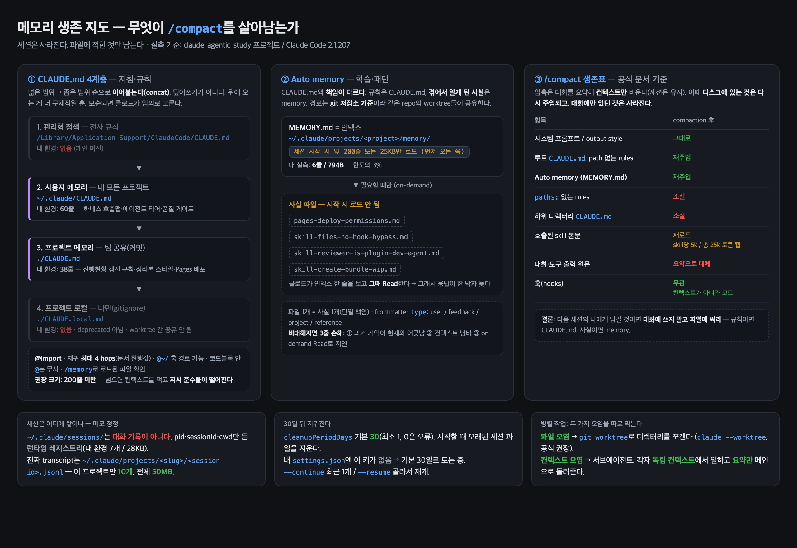

# CH06 — 메모리와 대화 세션 관리 (문종운)

> **한 줄**: 세션은 사라진다. **파일에 적힌 것만 남는다.** 그래서 "무엇을 어디에 적을지"가 곧 컨텍스트 설계다.

- 기준: Claude Code **2.1.207** / 공식 문서 실측 대조 (2026-07-12)
- 적용예시는 전부 **내 시스템에서 직접 읽어 확인한 값**(추정 없음)

---

## 📌 핵심 도식 — 메모리 생존 지도

> HTML 원본: [memory-survival-map.html](memory-survival-map.html) (Pages 인앱 뷰용)

---

## ⚠️ 먼저, 메모에서 정정한 3가지

읽으며 적어둔 메모를 공식 문서와 대조해 **틀린 곳 3개를 고쳤다.** 조용히 안 고치고 남겨둔다.

| # | 내가 적었던 것 | 실제 (공식 문서) |
|---|---|---|
| 1 | 우선순위 = 관리형 > **프로젝트 > 사용자** > 로컬 | 로드 순서 = 관리형 > **사용자 > 프로젝트** > 로컬. 게다가 **override가 아니라 concat**(전부 이어붙음). 모순되면 클로드가 **임의로** 하나 고른다 |
| 2 | `@import` 재귀 **최대 5단계** | 현행 문서는 **최대 4 hops** |
| 3 | 세션은 `~/.claude/sessions`에 기록·관리 | 그 폴더는 **대화 기록이 아니다**. 진짜 transcript는 `~/.claude/projects/<slug>/<session-id>.jsonl` |

**3번은 내 디스크에서 직접 확인:**
- `~/.claude/sessions/26128.json` (417B) → `{"pid":26128,"sessionId":"...","cwd":"...","kind":"interactive"}` = **실행 중 세션 레지스트리**(7개 / 28KB)
- `~/.claude/projects/-Users-bombo-...-STUDY/*.jsonl` → **진짜 대화 10개**, projects 전체 **50MB**
- 오해하면 위험한 이유: 백업·정리 대상을 **엉뚱한 폴더**로 잡게 된다

---

## 1. CLAUDE.md — 4계층 "지침·규칙"

### 개념정리
- **역할 분담이 핵심**: CLAUDE.md = **지침/규칙**, Auto memory = **학습/패턴**. (단일 책임 원칙)
- 4계층 (넓은 범위 → 좁은 범위, **로드 순서**):

| # | 계층 | 경로 | 용도 |
|---|---|---|---|
| 1 | 관리형 정책 | `/Library/Application Support/ClaudeCode/CLAUDE.md` (macOS) | 전사 규칙 |
| 2 | 사용자 메모리 | `~/.claude/CLAUDE.md` | 내 모든 프로젝트 공통 (개인 워크플로) |
| 3 | 프로젝트 메모리 | `./CLAUDE.md` | 팀 공유 (코딩 스타일·아키텍처·빌드 명령) |
| 4 | 프로젝트 로컬 | `./CLAUDE.local.md` | 나만 (샌드박스 URL·테스트 데이터) |

- **"우선순위"의 정확한 뜻** — 덮어쓰기 아님. **전부 이어붙어 로드된다.** 좁은 범위가 뒤에 올 뿐.
  - → 그래서 **모순되는 규칙을 여러 계층에 두면 안 된다** (클로드가 임의 선택)
- `CLAUDE.local.md`는 **deprecated 아님**. 단 **worktree 간 공유 안 됨** → 공유하려면 `@~/.claude/xxx.md` import
- **크기: 200줄 미만 권장** — 넘으면 컨텍스트를 먹고 **지시 준수율(adherence)이 떨어진다**
- `@import` — 재귀 **최대 4 hops** · `@~/` 홈 경로 가능 · **코드블록 안 `@`는 무시** · `/memory`로 로드된 파일 확인

### 내 시스템 적용예시 (실측)
| 계층 | 내 상태 | 내용 |
|---|---|---|
| 관리형 | **없음** | 개인 머신 |
| 사용자 `~/.claude/CLAUDE.md` | **60줄** | 하네스 호출맵(`/team`), 에이전트 티어(opus 판단/sonnet 실행/haiku 탐색), 품질 게이트 |
| 프로젝트 `./CLAUDE.md` | **38줄** | 진행현황 갱신 규칙, 개인 정리본 스타일, Pages 배포 |
| 로컬 | **없음** | — |

- **둘 다 200줄 미만 — 규격 통과.** 다만 `@import`는 **한 번도 안 쓰고 있었다**(마크다운 링크만 사용).
  - 마크다운 링크는 **로드되지 않는다**. `[CONTRIBUTING.md](CONTRIBUTING.md)`는 클로드에게 "읽어봐"라는 힌트일 뿐, `@CONTRIBUTING.md`여야 실제 컨텍스트에 들어온다.
  - 지금은 38줄이라 문제없지만, **커지는 순간 `@rules/*.md`로 쪼개는 게 정석**

---

## 2. Auto memory — 인덱스 + on-demand

### 개념정리
- 저장소: **`~/.claude/projects/<project>/memory/`** — **git 저장소 기준**이라 같은 repo의 worktree들이 공유
- **`MEMORY.md` = 인덱스**. 세션 시작 시 **앞 200줄 또는 25KB**(먼저 오는 쪽)만 로드
- **주제 파일은 시작 시 로드 안 됨** → 클로드가 인덱스 한 줄을 보고 **그때 Read**(on-demand)
- 파일 1개 = 사실 1개. frontmatter `type`: `user` / `feedback` / `project` / `reference`

### 왜 계속 정리해야 하나 (비대해질 때의 3중 손해)
1. **정확성** — 과거의 기억이 지금도 맞다는 보장이 없다 (스킬·경로·플래그는 바뀐다)
2. **컨텍스트** — 인덱스가 200줄/25KB를 넘으면 잘려서 **뒤쪽 기억은 존재조차 모른다**
3. **지연** — 인덱스만 갖고 있고 본문은 **매번 Read** → 응답이 한 박자 늦는다

### 성숙도 관리 3단계
1. **부트스트랩**: 기본 프로젝트 정보만
2. **성장**: 자주 쓰는 패턴 추가
3. **정리**: 정기 검토 → 죽은 기억 **삭제**, 굳어진 규칙은 **CLAUDE.md로 승격**, 장황한 설명은 **간결한 지침으로 압축**

### 내 시스템 적용예시 (실측)
- `~/.claude/memory/` (유저 전역) → **없음**. 내 auto memory는 **프로젝트 스코프만** 쓰고 있다.
- 이 프로젝트 `memory/` → **MEMORY.md 6줄 / 794B** + 사실 파일 4개, 총 20KB
  - `pages-deploy-permissions.md` — ggplab Pages 첫 활성화는 org admin 수동 필요
  - `skill-files-no-hook-bypass.md` — 커밋되는 SKILL.md에 훅 우회 지침 넣으면 git add가 차단됨
  - `skill-reviewer-is-plugin-dev-agent.md` — skill-reviewer는 plugin-dev의 서브에이전트
  - `skill-create-bundle-wip.md` — 커밋 완료(정본 스킬), 임의 삭제 금지
- **인덱스가 한도의 3%** — 아직 여유. 하지만 **`skill-create-bundle-wip.md`는 이름이 거짓말**이다(WIP가 아니라 커밋 완료). → 정리 대상 1호.
- **관찰**: 4개 중 3개가 "스킬 관련 삽질 기록"이다. 이게 auto memory의 정체 — **규칙이 아니라 내가 겪어서 알게 된 사실**.

---

## 3. /compact를 살아남는 것 — 컨텍스트 생존 규칙

### 개념정리
- `/compact` = 대화를 요약해 **컨텍스트만 비움**(세션 유지) · `/clear` = 새 대화 시작(이전 건 `/resume`으로 조회 가능)
- **디스크에 있는 것은 재주입되고, 대화에만 있던 것은 사라진다**

| 항목 | compaction 후 |
|---|---|
| 시스템 프롬프트 / output style | 그대로 |
| 루트 `CLAUDE.md`, path 없는 rules | **재주입** |
| **Auto memory (MEMORY.md)** | **재주입** |
| `paths:` 붙은 rules | 소실 (해당 파일 다시 읽을 때까지) |
| **하위 디렉터리 `CLAUDE.md`** | **소실** |
| 호출된 skill 본문 | 재로드 (skill당 5k / 총 25k 토큰 캡) |
| 대화·도구 출력 원문 | 요약으로 대체 |
| 훅(hooks) | 무관 — 컨텍스트가 아니라 **코드** |

- **실전 결론**: 다음 세션의 나에게 남길 것이면 **대화에 쓰지 말고 파일에 써라.**
- **놓치기 쉬운 함정**: 하위 디렉터리 `CLAUDE.md`는 **compaction 후 사라진다** → 모노레포에서 서브패키지 규칙을 거기만 두면, 긴 세션 후반부에 조용히 무시된다.

---

## 4. 세션 관리 — 상태·수명

### 개념정리
- 세션 3상태: **활성**(대화 중) / **유휴**(일시 중단) / **보관**(종료, 체크포인트만)
- **`cleanupPeriodDays` 기본 30일**(최소 1, `0`은 오류) — 시작 시 오래된 세션 파일 삭제. orphaned worktree에도 같은 기준 적용
- 재개: `--continue`(현재 디렉터리 **최근 1개** 자동) / `--resume`(**골라서** 재개, 백그라운드 세션 포함)

### 내 시스템 적용예시 (실측)
- `settings.json`에 **`cleanupPeriodDays` 키 없음** → **기본 30일로 도는 중**
- 이 프로젝트 transcript 10개, `~/.claude/projects` 전체 **50MB**
- **판단**: 이 스터디는 **주 1회 챕터** 페이스다. 30일이면 3~4주치 — 아슬아슬하다. 지난 챕터 세션을 되짚고 싶으면 **늘려야 한다**(예: 90). 대신 디스크는 3배.

---

## 5. 다중 세션 — **두 가지 오염을 따로 막는다**

이 장에서 내가 가장 크게 얻은 프레임.

| 오염 종류 | 증상 | 해법 |
|---|---|---|
| **파일 오염** | 두 세션이 같은 워킹트리를 건드려 서로 덮어씀 | **git worktree** — 디렉터리 자체를 분리 |
| **컨텍스트 오염** | 한 컨텍스트에 무관한 작업이 섞여 판단이 흐려짐 | **서브에이전트** — 독립 컨텍스트, **요약만** 반환 |

- **git worktree**: 원래는 `git stash → switch → stash pop`을 대체하는 도구였지만, **에이전트에게는 격리된 작업장**이다. 공식 문서도 병렬 세션용으로 권장(`claude --worktree`).
- **서브에이전트**: 메인 대화 이력을 **못 본다**. 파일 읽기·로그 같은 대용량 출력은 **자기 컨텍스트에만** 쌓이고, 메인에는 **요약만** 돌아온다. → 컨텍스트 절약의 핵심.

### 공유 파일 + 락 (메모의 아이디어)
- 서브에이전트끼리는 서로를 못 보므로, 협업하려면 **공유 파일 하나**로 컨텍스트를 모아야 한다.
- 그런데 공유 파일 1개 + 동시 접근 N개 = **경합**. → 쓰기 전에 **락**을 잡고, 못 잡으면 대기.
- 메인 에이전트가 **세마포어처럼** 대기 중인 에이전트를 깨워 순서대로 진행시킨다.
- ⚠️ **솔직한 메모**: 이건 **내 설계 아이디어이지 Claude Code 기본 제공 기능이 아니다.** 락은 직접 구현해야 한다(파일 락 / 훅). 실제로 병렬 3개를 돌려보고 경합이 나는지부터 확인할 것.

### 내 시스템 적용예시 (실측)
- 현재 worktree: **1개(main)뿐** — 병렬 세션 **안 쓰고 있다.**
- 그런데 내 `~/.claude/CLAUDE.md`엔 이미 `/team sprint`, `/team work #N`, `/team integrate` (멀티세션 병렬 개발) 호출맵이 **적혀만 있다.**
- **도입한다면 여기**: `/team work #N`이 이슈별 worktree를 파고, 각 세션이 공유 상태 파일에 진행상황을 기록 → `/team integrate`가 병합. 지금은 "선언만 하고 안 쓰는" 상태.

---

## 🎯 이번 주 발표용 핵심 개념

### **"세션은 사라진다 — 무엇이 `/compact`를 살아남는가"**

**고른 이유**
1. **다른 참여자와 안 겹칠 각도**: 메모리 하면 대개 "CLAUDE.md 4계층 / 200줄 규칙"으로 간다. 나는 **생존표**(compaction 후 재주입 vs 소실)로 간다 — 계층 얘기를 **실행 시점의 관점**으로 뒤집는 것.
2. **실무에서 진짜 아픈 지점**: 긴 에이전트 세션(`/team`)을 돌리면 compaction이 반드시 일어난다. 이때 **하위 디렉터리 CLAUDE.md와 `paths:` rules는 조용히 사라진다.** 규칙을 적어뒀는데 후반부에 안 지켜지는 이유가 이거다.
3. **ch05와 이어진다**: 지난 장에서 상태 표시줄로 **"언제 `/clear` 할지"**를 읽었다면, 이번 장은 **"`/clear` 해도 살아남게 하려면 어디에 적어야 하는지"**다. 계기판 → 생존 설계.

**한 문장**: 다음 세션의 나에게 남길 것이면 **대화가 아니라 파일에 써라. 규칙이면 CLAUDE.md, 겪어서 안 사실이면 memory.**

---

## 🧱 시행착오

- **메모 3곳이 틀렸다** — 우선순위 순서, import depth(5→4), 세션 경로. 공식 문서를 안 봤으면 그대로 발표할 뻔.
- `~/.claude/sessions/`가 **실제로 존재해서** 더 헷갈렸다. 열어보니 pid 레지스트리였다. **"있다"와 "그 용도다"는 다른 얘기.**
- 내 CLAUDE.md가 `@import`를 **하나도 안 쓰고 있었다** — 마크다운 링크를 import라고 착각하고 있었다.
