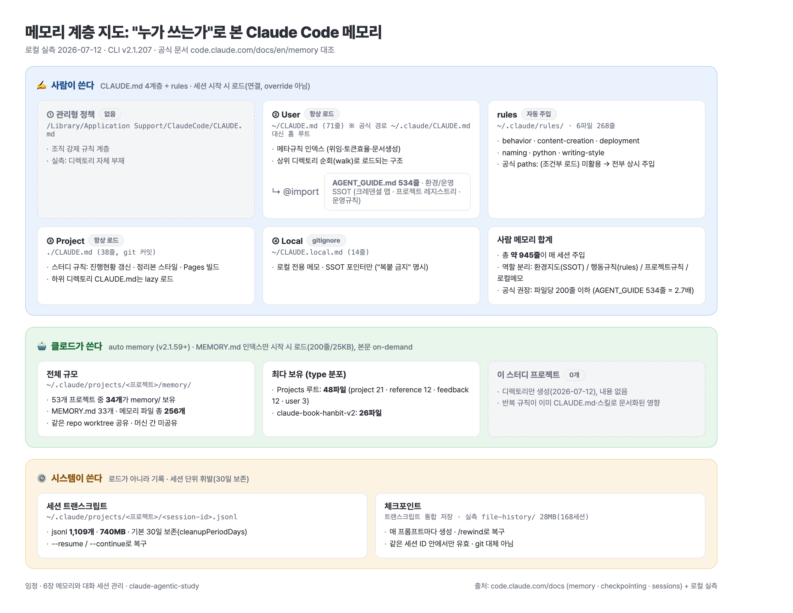
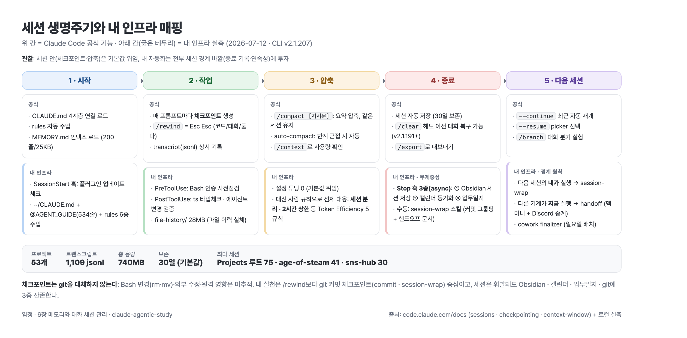

# 임정 · 6장 정리: 메모리와 대화 세션 관리 (2026-07-12)

- **관통 주제(발표 핵심 1개)**: "메모리는 '누가 쓰는가'로 나뉜다: 사람이 쓰는 CLAUDE.md·rules / 클로드가 쓰는 auto memory / 시스템이 쓰는 transcript·checkpoint"
- ⚠️ **교통정리 2건**: ① `#` 단축키(대화 중 메모리 추가)는 현행 공식 문서에서 확인되지 않음. 현행 방식은 CLAUDE.md 직접 편집 또는 `/memory`[3]. ② `.claude/rules/`와 auto memory(v2.1.59+)는 **공식 기능**으로 정착. 책 출간(2026-05) 시점과 현행 CLI(내 로컬 v2.1.207) 사이 갱신분을 얹어 읽을 것[3][8]
- 조사 방식: 에이전트 4개 병렬 fan-out(공식 문서 검증 2 · 로컬 실측 2), 판단·종합은 메인 세션

- 도식 원본: [memory-hierarchy.html](memory-hierarchy.html) (Pages 인앱 뷰)

---

## 핵심 질문 요약 (TL;DR)

| # | 질문 | 한 줄 답 |
|---|------|----------|
| Q1 | 메모리 계층은 어떻게 구성되나 | 4계층(managed → user → project → local)이 **override가 아니라 연결**로 합쳐짐. 루트→작업 디렉토리 순회 로드, 하위 디렉토리는 lazy |
| Q2 | rules·auto memory는 뭐가 다른가 | rules = 사람이 쓰는 **조건부** 지시(`paths:`로 lazy 로드 가능) / auto memory = **클로드가 스스로 쓰는** 학습 메모(MEMORY.md 인덱스만 세션 시작 로드) |
| Q3 | 내 메모리 계층 실측 | user 레벨을 공식 경로 대신 `~/CLAUDE.md`(71줄)+`@AGENT_GUIDE.md`(534줄 SSOT)로 운용. rules 6파일 268줄. auto memory는 53개 프로젝트 중 34개·총 256파일, **이 스터디 프로젝트는 0** |
| Q4 | 체크포인트란 무엇인가 | 매 프롬프트마다 자동 생성되는 **세션 내 undo**. `/rewind`(Esc Esc)로 코드/대화/둘 다 복구. Bash 변경은 미추적 → **git을 대체하지 않는다** |
| Q5 | 세션 관리 핵심 명령은 | `--continue`(최근 자동) vs `--resume`(picker) / `/clear`(비우되 복구 가능) vs `/compact`(요약·같은 세션 유지) / `/branch`(대화 분기) |
| Q6 | 내 세션 관리 실측 | 트랜스크립트 1,109개·740MB·30일 보관. 자동화 무게중심은 **Stop 훅 3종**(Obsidian 저장·캘린더 동기화·업무일지). 압축·보존은 전부 CLI 기본값 위임 |
| Q7 | 개선할 점 | rules `paths:` 미활용, AGENT_GUIDE 534줄 상시 주입, `#` 습관 대신 `/memory` 등 5가지 |

---

## Q1. 메모리 계층: 4계층이 "연결"된다

- 로드 순서(전부 공식)[3]:

| 계층 | 경로 | 용도 | 내 실측 |
|------|------|------|---------|
| ① 관리형 정책 | `/Library/Application Support/ClaudeCode/CLAUDE.md` (macOS) | 조직 강제 규칙 | ✗ 없음 (디렉토리 자체 부재) |
| ② User | `~/.claude/CLAUDE.md` | 모든 프로젝트 공통 개인 규칙 | ✗ 이 경로엔 없음. 대신 `~/CLAUDE.md` 사용 (아래) |
| ③ Project | `./CLAUDE.md` 또는 `./.claude/CLAUDE.md` | 팀 공유(git 커밋) | ✓ 38줄 (스터디 규칙) |
| ④ Local | `./CLAUDE.local.md` | 개인 전용(gitignore) | ✓ `~/CLAUDE.local.md` 14줄 (SSOT 포인터만) |

- 동작 원리 3가지:
  1. **연결(concatenate)이지 override가 아님**: 파일시스템 루트 → 작업 디렉토리 순으로 발견되는 모든 CLAUDE.md를 이어 붙임. 작업 디렉토리 파일이 마지막에 읽혀 사실상 우선[3]
  2. **하위 디렉토리는 lazy**: 하위 폴더의 CLAUDE.md는 그 폴더 파일을 읽을 때 로드[3]
  3. **@import**: `@path` 문법, 홈 참조(`@~/`) 지원, 최대 4단계 재귀, 코드블록 안은 무시[3]
- 권장 크기: 파일당 200줄 이하[3]

> **내 실측 포인트**: 나는 user 메모리를 공식 경로(`~/.claude/CLAUDE.md`)가 아니라 **홈 루트 `~/CLAUDE.md`에 두고, 상위 디렉토리 순회로 로드**시키고 있다. 작업 디렉토리가 항상 `~/Projects/` 하위라 walk에 걸리는 구조. 결과는 같지만 "공식 user 레벨"이 아니라 "walk에 걸린 조상 디렉토리 파일"로 동작한다

---

## Q2. rules와 auto memory: 작성 주체가 다르다

### rules (`.claude/rules/`): 사람이 쓰는 조건부 규칙 [3][8]

- 공식 기능. 토픽별 `.md` 파일을 자동 탐색해 주입. user 레벨(`~/.claude/rules/`) 지원
- **path-specific rules**: frontmatter `paths:`에 글롭 패턴을 지정하면 해당 파일을 읽을 때만 로드(lazy). CLAUDE.md 비대화의 공식 해법
- CLAUDE.md와 차이: CLAUDE.md는 항상 로드되는 본문, rules는 토픽별 분리·조건부 로드 가능

### auto memory: 클로드가 스스로 쓰는 학습 메모 [3][8]

- v2.1.59+. 저장소: `~/.claude/projects/<프로젝트>/memory/`
- 구조: `MEMORY.md`(인덱스) + 토픽 파일들
  - MEMORY.md는 세션 시작 시 **첫 200줄 또는 25KB까지만** 로드
  - 토픽 파일은 필요할 때만(on-demand)
- 공유 범위: 같은 git repo의 **모든 worktree 공유**, 머신 간 미공유(로컬 전용)
- 제어: `autoMemoryEnabled` 설정 · `CLAUDE_CODE_DISABLE_AUTO_MEMORY=1` · `/memory`에서 토글
- `/memory` 명령: 로드된 CLAUDE.md/local/rules 목록 표시 + auto memory 토글 + 폴더 열기

### 역할 구분 한 장 (작성 주체 축)

| 메커니즘 | 누가 쓰나 | 언제 로드 | 세션 간 공유 |
|----------|-----------|-----------|--------------|
| CLAUDE.md 4계층 | **사람** | 세션 시작(항상) | 모든 세션 |
| rules | **사람** | 세션 시작 또는 `paths:` 매칭 시 | 모든 세션 |
| auto memory | **클로드** | 인덱스만 시작 시, 본문 on-demand | 같은 repo 모든 worktree |
| checkpoint / transcript | **시스템** | 로드가 아니라 기록 | 같은 세션 ID만 / `--resume`로 복구 |

---

## Q3. 내 메모리 계층 실측 (2026-07-12)

- **체인 지도** (도식 = 이 표의 시각화):

| 파일 | 규모 | 성격 |
|------|------|------|
| `~/CLAUDE.md` | 71줄 | 메타규칙 인덱스: rules 인덱스 + 위임·토큰효율·문서생성·브랜드 규칙 |
| ↳ `@~/Projects/shared/AGENT_GUIDE.md` | **534줄** | 환경·운영 SSOT (크레덴셜 맵·프로젝트 레지스트리·운영 규칙) |
| `~/CLAUDE.local.md` | 14줄 | 로컬 전용 메모: SSOT 포인터만("복붙 금지" 명시) |
| `~/.claude/rules/` | 6파일 268줄 | behavior·content-creation·deployment·naming·python·writing-style |
| 프로젝트 `CLAUDE.md` | 38줄 | 스터디 규칙(진행 현황 갱신·정리본 스타일·Pages 빌드) |

- **auto memory 실측**:
  - `~/.claude/projects/` 53개 엔트리 중 **34개가 memory/ 보유**, MEMORY.md 33개, 메모리 파일 총 **256개**
  - 최다 보유: Projects 루트 48파일(project 21 / reference 12 / feedback 12 / user 3) · claude-book-hanbit-v2 26파일
  - **이 스터디 프로젝트: 0개** (디렉토리만 오늘 생성). 반복 규칙이 이미 프로젝트 CLAUDE.md·스킬(study-chapter)로 문서화돼 있어 클로드가 새로 배울 게 적었던 것으로 해석
- **settings.json에는 메모리 관련 키가 하나도 없음**(`autoMemoryEnabled`·`outputStyle` 등 전부 미설정) → 전부 기본값 운용
- 계층별 역할 분리가 이미 SSOT 원칙으로 잡혀 있음: 환경 지도(AGENT_GUIDE) / 행동 규칙(rules) / 프로젝트 규칙(각 CLAUDE.md) / 로컬 메모(CLAUDE.local.md)

---

## Q4. 체크포인트: 세션 내 undo, git의 대체물이 아니다

- 도식 원본: [session-lifecycle.html](session-lifecycle.html) (Pages 인앱 뷰)

- **동작**[1]: 매 사용자 프롬프트마다 자동 생성. 세션 트랜스크립트(`<session-id>.jsonl`)에 통합 저장, 기본 30일 보존(`cleanupPeriodDays`)
- **`/rewind`** (프롬프트 비어 있을 때 `Esc Esc`, 별칭 `/checkpoint`·`/undo`)[1][4]:

| 복구 모드 | 동작 |
|-----------|------|
| 코드+대화 | 둘 다 해당 시점으로 |
| 대화만 | 코드 유지, 맥락만 되돌림 |
| 코드만 | 논의 유지, 파일 변경만 취소 |
| 여기서부터/여기까지 요약 | 되돌리기 대신 구간 요약(컨텍스트 절약) |

- v2.1.191+: `/clear` 했어도 rewind 메뉴 최상단 `/resume <session-id>`로 이전 세션 복구 가능[1][8]
- **한계 4가지**[1]: ① Bash 변경(`rm`·`mv` 등) 미추적 ② 외부·타 세션 변경 미추적 ③ DB·API 등 원격 영향 미추적 ④ **git 대체 아님**. 영구 이력·협업·분기는 git

> **내 실측**: 로컬에 checkpoint 명명 디렉토리는 없고, 파일 이력의 물리 실체는 `~/.claude/file-history/`(28MB·168세션 분)가 담당. 그리고 내 실천은 `/rewind`보다 **git 커밋 체크포인트**(commit·session-wrap 스킬, "logical checkpoint마다 커밋" 규칙) 중심. Bash·스크립트 작업 비중이 큰 워크플로에선 한계 ① 때문에 git이 정답이라는 걸 실측이 확인해 줌

---

## Q5. 대화 세션 관리: 이어가기 · 비우기 · 압축하기 · 분기하기

- **세션 = 프로젝트 디렉토리에 붙는 저장된 대화**. `~/.claude/projects/<정규화 경로>/<session-id>.jsonl`, 30일 보존[2]

| 하고 싶은 것 | 명령 | 비고 |
|--------------|------|------|
| 최근 세션 바로 이어가기 | `claude --continue` | 자동 선택 |
| 골라서 이어가기 | `claude --resume` / `/resume` | picker: `Ctrl+A` 전 프로젝트 · `Ctrl+W` 전 worktree · `Ctrl+R` 이름 변경 |
| 새 작업으로 전환 | `/clear` | 컨텍스트 비움. 이전 대화는 `(cleared conversation)`으로 남아 복구 가능 |
| 컨텍스트 압축 | `/compact [지시문]` | 요약으로 압축, **같은 세션 유지**. CLAUDE.md 재주입(v2.1.198+) |
| 대화 분기 실험 | `/branch <이름>` / `--fork-session` | 현재 대화 복사 → 새 세션 ID, 원본 보존 |
| 세션 이름 관리 | `claude -n <이름>` / `/rename` | 미명명 세션은 자동 명명(v2.1.196+) |
| 대화 내보내기 | `/export [파일]` | plain text |
| 사용량 확인 | `/context` | 자동 컴팩션 판단의 기초 |

- **auto-compact**[6]: 컨텍스트 한계 근접 시 자동 실행. 오래된 도구 출력부터 제거 → 필요 시 요약 → 요청·핵심 코드 보존. 단일 출력이 너무 크면 thrashing 에러 후 중단
- `/clear` vs `/compact` 판단축: 다른 작업으로 전환 = clear / 같은 작업 계속 + 컨텍스트만 줄이기 = compact[4]

---

## Q6. 내 세션 관리 실측: 무게중심은 Stop 훅

- **저장소 규모**: 53개 프로젝트 · jsonl **1,109개** · **740MB** · 보관 폭 약 30일(기본값). 최다: Projects 루트 75 · age-of-steam-web 41 · sns-content-hub 30
- **설정 튜닝 0**: `cleanupPeriodDays`·autoCompact 관련 키 전부 없음 → 압축·보존은 CLI 기본값 위임
- **세션 생명주기별 내 인프라** (도식 = 이 표):

| 단계 | 공식 기능 | 내 인프라(실측) |
|------|-----------|------------------|
| 시작 | CLAUDE.md 체인·MEMORY.md 로드 | SessionStart 훅(플러그인 업데이트 체크) |
| 작업 | 매 프롬프트 체크포인트·transcript 기록 | PreToolUse(Bash 인증 사전점검)·PostToolUse(ts 타입체크·에이전트 변경 검증) 훅 |
| 압축 | /compact·auto-compact | 튜닝 없음. 대신 **사람 규칙**으로 선제 대응: 세션 분리·2시간 상한 등 Token Efficiency 5규칙(~/CLAUDE.md) |
| 종료 | 세션 저장(자동) | **Stop 훅 3종(전부 async)**: ① Obsidian 세션 저장 ② worklog 캘린더 동기화(idempotent) ③ 업무일지 갱신 + 수동 트리거 session-wrap 스킬(커밋 그룹핑+핸드오프 문서) |
| 다음 세션 | --continue/--resume·/branch | **경계 원칙**: "다음 세션의 내가 실행 → session-wrap / 다른 기계가 지금 실행 → handoff(맥미니+Discord 중계)" + cowork finalizer(일요일 배치) |

- 해석: 공식 기능이 커버하는 "세션 안"은 기본값에 맡기고, 내 자동화는 전부 **세션 경계 바깥**(종료 후 기록·다음 세션 연속성)에 투자돼 있다. 세션은 휘발돼도 Obsidian·캘린더·업무일지·git에 3중 잔존

---

## Q7. 개선할 점 (이번 실측에서 드러난 공백)

1. **rules `paths:` 미활용**: 내 rules 6종은 전부 무조건 주입. `python.md`는 `paths: ["**/*.py"]`식 조건부 로드로 전환하면 비Python 세션 토큰 절약. 공식 기능이므로 바로 적용 가능
2. **AGENT_GUIDE.md 534줄 상시 주입**: 공식 권장(파일당 200줄)의 2.7배가 매 세션 로드. 크레덴셜 맵·프로젝트 레지스트리 등 참조성 내용은 "포인터만 CLAUDE.md에, 본문은 필요 시 Read" 구조로 다이어트 검토
3. **`#` 습관 → `/memory` 전환**: 대화 중 메모리 추가는 `/memory`(목록·토글·폴더 열기)와 "CLAUDE.md에 추가해줘" 요청이 현행 방식
4. **auto memory 관찰 시작**: 34개 프로젝트에 256파일이 이미 쌓여 있는데 내용 품질을 점검한 적 없음. 월간 거버넌스에 "memory 파일 스팟체크" 1줄 추가 후보
5. **`/branch` 실험 도입**: 접근법 A/B 비교를 새 세션에서 다시 설명하며 시작하는 습관 → `/branch`로 같은 맥락에서 분기하면 재설명 비용 제거

---

## 발표용 핵심 개념 선택

- 선택: **"메모리는 '누가 쓰는가'로 나뉜다: 사람(CLAUDE.md·rules) / 클로드(auto memory) / 시스템(checkpoint·transcript)"**
- 이유:
  1. 계층(어디에 두나)보다 작성 주체(누가 쓰나)가 CLAUDE.md·rules·auto memory·체크포인트를 한 축으로 관통. 6장 전체를 한 문장으로 접는 프레임
  2. 실측 대비가 선명: 사람 메모리는 SSOT 체계로 정돈(945줄), 클로드 메모리는 256파일이 무점검 축적. "관리되는 메모리 vs 방치된 메모리" 논점 제공
  3. /rewind·/compact 같은 명령 각론은 다른 참여자가 고르기 좋은 독립 주제라 회피

---

## 출처

1. [code.claude.com/docs/en/checkpointing](https://code.claude.com/docs/en/checkpointing.md) · 체크포인트 동작·/rewind·한계 (공식)
2. [code.claude.com/docs/en/sessions](https://code.claude.com/docs/en/sessions.md) · 세션 저장 위치·--continue/--resume·/branch·/export (공식)
3. [code.claude.com/docs/en/memory](https://code.claude.com/docs/en/memory.md) · CLAUDE.md 4계층·@import·rules·auto memory·/memory (공식)
4. [code.claude.com/docs/en/commands](https://code.claude.com/docs/en/commands.md) · /rewind·/clear·/compact·/context 상세 (공식)
5. [code.claude.com/docs/en/how-claude-code-works](https://code.claude.com/docs/en/how-claude-code-works.md) · 기본 개념 (공식)
6. [code.claude.com/docs/en/context-window](https://code.claude.com/docs/en/context-window.md) · auto-compact 동작 (공식)
7. [code.claude.com/docs/en/settings](https://code.claude.com/docs/en/settings.md) · cleanupPeriodDays·autoMemoryEnabled (공식)
8. [github.com/anthropics/claude-code CHANGELOG.md](https://github.com/anthropics/claude-code/blob/main/CHANGELOG.md) · v2.1.59 / v2.1.191 / v2.1.196 / v2.1.198 (공식)
9. 로컬 실측: `~/CLAUDE.md`·`~/.claude/rules/`·`~/.claude/settings.json`·`~/.claude/projects/` 집계·`claude --version`(2.1.207) (2026-07-12 기준)

## 검증 메모

1. **High confidence**: Q1·Q2·Q4·Q5 개념은 공식 문서 6개 페이지를 WebFetch로 직접 확인(기억 서술 배제). Q3·Q6 수치는 전부 실측 명령 결과
2. **한계**: ① `#` 단축키는 "현행 공식 문서에서 미확인"까지만 검증(제거 시점 changelog 항목은 특정 못함) ② auto memory 256파일은 개수·type 분포만 집계, 내용 품질은 미점검(Q7-4) ③ 체크포인트 물리 저장 위치는 공식 문서(트랜스크립트 통합)와 로컬 관찰(`file-history/` 디렉토리)을 병기. 내부 구현은 문서화돼 있지 않음
3. **시각 자산**: [memory-hierarchy.png](memory-hierarchy.png)·[session-lifecycle.png](session-lifecycle.png)는 같은 폴더의 HTML 원본을 렌더한 것. 흰 배경·플랫·파스텔 톤(브랜드 미노출), 다크 모드 토큰 포함
