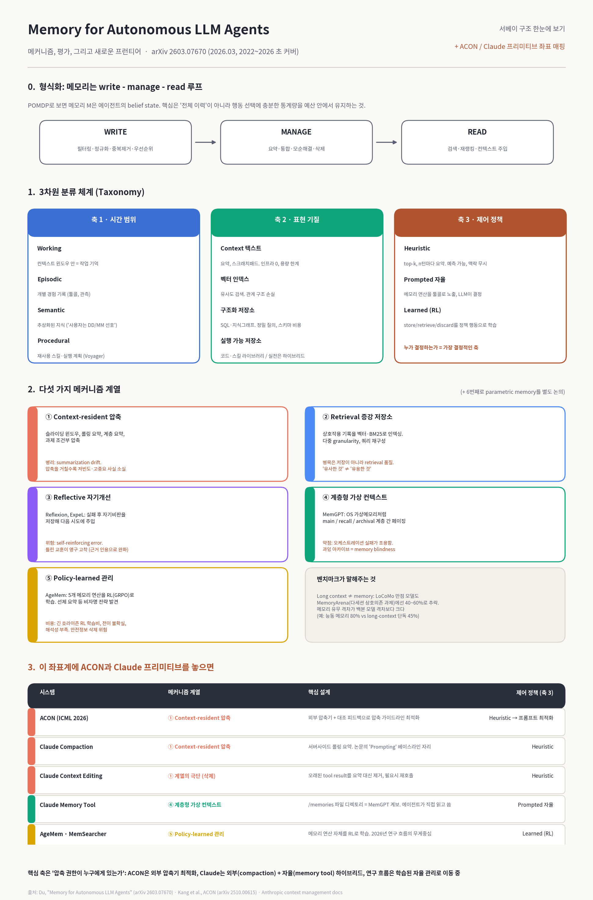

# ch06 — 메모리와 대화 세션 관리

- 읽은 날짜: 2026-07-12
- 한 줄 요약: **세션은 사라지고, 파일에 적힌 것만 남는다.** CLAUDE.md 4계층·모듈형 룰·메모리 압축으로 "무엇을 어디에 적을지"를 설계하고, 체크포인트·다중 세션 분리로 컨텍스트를 지킨다.


---

## 핵심 개념

### 1. CLAUDE.md 4계층 — "지침·규칙"의 집

| # | 계층 | 경로 | 용도 |
|---|---|---|---|
| 1 | 관리형 정책 | `/Library/Application Support/ClaudeCode/CLAUDE.md` (macOS) | 전사 규칙 |
| 2 | 사용자 메모리 | `~/.claude/CLAUDE.md` | 내 모든 프로젝트 공통 |
| 3 | 프로젝트 메모리 | `./CLAUDE.md` | 팀 공유 (커밋됨) |
| 4 | 프로젝트 로컬 | `./CLAUDE.local.md` | 나만 (gitignore) |

- **"우선순위"는 덮어쓰기가 아니라 concat** — 전부 이어붙어 로드되고, 좁은 범위가 뒤에 올 뿐. 모순되는 규칙을 여러 계층에 두면 클로드가 **임의로** 하나 고른다. (문종운 님이 공식 문서 대조로 정정한 부분)
- `@import`: 재귀 최대 **4 hops**, `@~/` 홈 경로 가능, **코드블록 안 `@`는 무시**, `/memory`로 로드 확인.
- **마크다운 링크는 로드되지 않는다** — `[docs](docs.md)`는 힌트일 뿐, `@docs.md`여야 컨텍스트에 들어온다.
- 권장 크기 **200줄 미만** — 넘으면 컨텍스트를 먹고 지시 준수율(adherence)이 떨어진다.
- `CLAUDE.local.md`는 deprecated 아님. 단 **worktree 간 공유 안 됨**.

### 2. 메모리 파일 성숙도 모델 (169쪽, 그림 6-4)

메모리는 한 번 쓰고 끝이 아니라 **프로젝트와 함께 진화하는 살아있는 문서**.

1. **부트스트랩**: `/init` 자동 생성 — 프로젝트 구조·언어·빌드 명령어 등 기본 정보
2. **경험 기반**: 개발하며 자주 쓰는 패턴·반복 지침·팀 규칙 추가
3. **최적화**: 정기 검토 — 죽은 정보 제거, 자주 참조되는 것 상위로, 관련 정보 그룹화

### 3. 실전 메모리 압축 기법 3가지 (170쪽)

| 기법 | 방법 | 예 |
|---|---|---|
| 핵심 정보 추출 | 장황한 설명 → 간결한 지침 | 문단 하나 → `- 변수명: 전체 단어 사용(usr → user)` |
| 참조 링크 | 상세 문서는 외부에, 메모리엔 링크만 | `- 코딩 스타일: @docs/coding-style.md 참조` |
| 조건부 세부 사항 | 일반 규칙은 메모리에, 예외는 별도 파일 | `레거시 작업 시 @docs/legacy-typescript-rules.md 참조` |

### 4. 사례 연구 — 20만 토큰 프로젝트 최적화 (170~173쪽)

저자의 MoAI-ADK 프로젝트에서 `/context`로 확인하며 3단계 최적화:

| 단계 | 조치 | 컨텍스트 사용률 |
|---|---|---|
| 초기 | 단일 CLAUDE.md에 전부 (Memory files 62.1k = 31.1%) | **160k/200k (80%)** |
| 1차 | 루트 CLAUDE.md 5k로 축소 + 모듈별 규칙은 스킬로 분리 (Memory 2.5%) | 103k (51%) |
| 2차 | `/mcp`로 안 쓰는 MCP 서버 비활성화 | ↓ |
| 3차 | `/config`에서 **Auto Compact 비활성화** (버퍼 45k = 22.5% 회수) | **40k (20%)** |

- 저자의 운영 방식: Auto Compact는 압축 시 중요 정보가 유실되는 경우가 많아 끄고, **200k 안에서 작업을 끝내고 `/clear`로 초기화**. 넘칠 것 같으면 `/export`(클립보드/파일) → `/clear` → 붙여넣고 "이어서 계속 진행해 줘".

### 5. 모듈형 룰 시스템 — `.claude/rules/` (174~176쪽)

CLAUDE.md가 '무엇을'이라면, 룰은 **'언제 어떤 지침을 적용할 것인가'**.

```
.claude/rules/
├── core/
│   ├── constitution.md         # 핵심 원칙 (항상 로드)
│   └── security-policy.md      # 보안 정책 (항상 로드)
├── development/
│   └── coding-standards.md     # 코딩 표준 (항상 로드)
├── languages/
│   ├── python.md               # *.py 작업 시에만 로드
│   ├── typescript.md           # *.ts 작업 시에만 로드
│   └── go.md                   # *.go 작업 시에만 로드
└── workflow/
    └── spec-workflow.md        # SPEC 워크플로 (항상 로드)
```

- **`paths` 프론트매터 = 조건부 로딩**. glob 패턴(`*` 파일명, `**` 재귀 디렉터리)이 현재 작업 파일과 일치할 때만 로드:

```markdown
---
paths:
  - "**/*.py"
  - "**/pyproject.toml"
  - "**/requirements*.txt"
---

# Python Rules
Version: Python 3.13+

## Tooling
- Linting: ruff (not flake8)
- Formatting: black, isort (or ruff format)
```

- `paths` 없는 룰 파일은 항상 로드 → 보안 정책 같은 전역 규칙용.
- **실무 판단 기준**: 항상 적용되는 핵심 규칙 → CLAUDE.md 직접 / 특정 언어·유형 전용의 긴 규칙 → rules + `paths` / 전역이지만 분량 많은 규칙 → rules에 프론트매터 없이.

### 6. 체크포인트 복구 패턴 (184쪽)

즉시 복구(Fail-Fast Recovery)는 TDD와 유사하되 더 유연 — 깨지면 바로 되돌리고 다른 접근을 시도.

- **시나리오 1 — 버그 도입 후 복구**: 최적화 요청이 코드를 깨뜨림 → `Esc`+`Esc`로 즉시 복원 → "테스트를 먼저 추가한 후 최적화해 줘"로 재요청
- **시나리오 2 — 프롬프트 개선 반복**: 결과가 애매하면 'Restore conversation'으로 **코드는 유지하고 프롬프트만 되돌려** 더 구체적으로 재요청
- **시나리오 3 — 대규모 리팩터링 중간 복구**: 파일 10개를 단계별 확인 방식으로 진행 → 6번째에서 문제 발생 시 5번째 완료 시점 체크포인트로 복귀

### 7. 세션 생애 주기와 복구 (184~186쪽)

- 세션 3상태: **활성**(컨텍스트 메모리 로드) / **유휴**(저장됨, 비활성) / **보관**(체크포인트만 유지)
- **30일 후 자동 정리** (`cleanupPeriodDays`, 기본 30 · 최소 1 · 0은 오류) — 기간 내에는 복구 가능
- 복구 3종: ① `claude -c` (최근 대화 자동 복원) ② `claude -r` (특정 세션 골라 복구) ③ `/rewind` 또는 `Esc`+`Esc` (체크포인트로 — 대화/코드 선택 복구)
- 컨텍스트 최적화 4방법: `/clear` 정기 정리(중요한 건 `/export` 먼저) / 결과·계획은 파일로 저장 후 `@` 참조 / 독립 작업은 서브에이전트 위임 / 반복 참조 정보는 CLAUDE.md에

### 8. 다중 세션 — 두 가지 오염을 따로 막는다 (186~188쪽)

| 오염 | 증상 | 해법 |
|---|---|---|
| 파일 오염 | 두 세션이 같은 워킹트리를 덮어씀 | **git worktree** (`claude --worktree`) — 디렉터리 분리 |
| 컨텍스트 오염 | 무관한 작업이 섞여 판단이 흐려짐 | **서브에이전트** — 독립 20만 컨텍스트, 요약만 반환 |

- 그림 6-10 패턴: 메인 세션(워크플로 조율·결과 통합) ↔ 세션들(기능 개발/버그 수정/코드 리뷰, 각자 독립 20만) ↔ **공유 파일**로 결과 수렴.
- 세션 데이터 보관: "지금까지의 대화를 `conversation-log.md`로 저장해 줘" → 이후 세션에서 `@conversation-log.md` 참조. 원문보다 **핵심만 추린 `decisions.md`가 더 유용**.
- 서브에이전트는 메인 대화 이력을 못 보고, 대용량 출력은 자기 컨텍스트에만 쌓인다 → 컨텍스트 절약의 핵심. 중단 시 agentId로 재개 가능(4장 연계).

### 9. 협업·장기 프로젝트·기타 (189~190쪽)

- **팀**: `./CLAUDE.md`는 팀 공유(버전 관리로 이력 추적) / 개인 설정은 `~/.claude/CLAUDE.md` 또는 `CLAUDE.local.md`로 분리 / **리뷰어는 작성자와 다른 세션**에서 분석해야 객관성 유지.
- **장기 프로젝트**: 단계(설계/구현/테스트/배포)별 세션 그룹 분리, 축적된 결정·패턴은 CLAUDE.md로 지속 반영, 마일스톤마다 세션 아카이브.
- **웹 원격 제어**: 같은 앤트로픽 계정으로 claude.ai 접속 → 로컬에서 실행 중인 세션에 연결해 원격 지시 가능.
- **1M 토큰 컨텍스트**: Opus 4.6/Sonnet 4.6 지원. `/compact` 빈도가 크게 줄지만 **20만 초과분은 별도 요금** → 끄려면 `CLAUDE_CODE_DISABLE_1M_CONTEXT=1`.

### 10. /compact 생존표 — 무엇이 살아남는가 (메모리 생존 지도)

| 항목 | compaction 후 |
|---|---|
| 시스템 프롬프트 / output style | 그대로 |
| 루트 CLAUDE.md, `paths` 없는 rules | **재주입** |
| Auto memory (MEMORY.md) | **재주입** |
| `paths:` 붙은 rules | 소실 |
| **하위 디렉터리 CLAUDE.md** | **소실** ← 모노레포 함정 |
| 호출된 skill 본문 | 재로드 (skill당 5k / 총 25k 캡) |
| 대화·도구 출력 원문 | 요약으로 대체 |
| 훅(hooks) | 무관 — 컨텍스트가 아니라 **코드** |

**결론 한 문장**: 다음 세션의 나에게 남길 것이면 대화가 아니라 파일에 써라 — **규칙이면 CLAUDE.md, 겪어서 안 사실이면 memory.**

### 11. 연구 좌표에서 본 6장 — 논문 2편과의 매핑



> 서베이 "Memory for Autonomous LLM Agents"(arXiv 2603.07670) + ACON(ICML 2026, arXiv 2510.00615)을 보고 직접 만든 인포그래픽.
> 서베이의 형식화: 메모리는 **write–manage–read 루프**이고(POMDP의 belief state), 분류 축은 시간 범위 / 표현 기질 / **제어 정책** 3가지. 가장 결정적인 축은 **"압축 권한이 누구에게 있는가"**(제어 정책 축)다.

6장에서 배운 기능들을 이 좌표계에 놓으면:

| 책(이 문서 섹션) | 논문 좌표 | 통찰 |
|---|---|---|
| `/compact` 생존표 (§10) | ① Context-resident 압축 · **Heuristic** 제어 | 저자가 Auto Compact를 끄는 이유(173쪽 "정보 유실") = 서베이의 **summarization drift** 병리 그 자체 |
| Auto memory — MEMORY.md 인덱스 + on-demand Read | ④ 계층형 가상 컨텍스트 (MemGPT 계보) · **Prompted 자율** | 인덱스만 상주, 본문은 페이징 = OS 가상메모리 패턴의 실제 구현 |
| CLAUDE.md 4계층 / rules `paths` (§1, §5) | Semantic·Procedural 메모리 · Context 텍스트 기질 | "규칙이면 CLAUDE.md, 사실이면 memory" = 시간 범위 축의 역할 분담 |
| 체크포인트·세션 transcript (§6~7) | Episodic 메모리 | `/rewind` = 에피소드 단위 롤백 |
| 서브에이전트 요약 반환 (§8) | 압축의 **위임**(격리) | 컨텍스트 오염 해법이 곧 압축 전략 |

- **6장의 딜레마에 대한 ACON의 답**: Auto Compact를 "끄냐 켜냐"(173쪽)가 아니라 제3의 길 — **압축 가이드라인을 에이전트 실패 분석으로 최적화**한다(peak 토큰 26~54% 절감 + 태스크 성공률 향상, 작은 모델로 압축기 증류까지). 클로드 코드에서의 실무 대응물 = `/compact`에 전달하는 `custom_instructions` + PreCompact 훅.
- **"long context ≠ memory"**: 서베이의 MemoryArena 벤치마크에서 만점급 long-context 모델도 다세션 상호의존 과제에선 40~60%로 추락 → 1M 컨텍스트(190쪽)가 있어도 메모리 관리 전략은 사라지지 않는다는 근거.
- **연구 흐름의 방향**: Heuristic(compaction) → Prompted 자율(memory tool) → Learned RL(AgeMem 등). 클로드 코드는 현재 외부 compaction + 자율 memory tool의 하이브리드 지점에 있다.

---

## 내가 직접 해본 것

- 내 `~/.claude/settings.json`에 `cleanupPeriodDays` 키 없음 확인 → 기본 30일이었음. 주 1회 스터디 페이스면 지난 회차 세션을 되짚기에 빠듯해서 **60일로 설정 완료** (`"cleanupPeriodDays": 60`, 2026-07-12).
- 6장의 "파일에 써라" 원리가 내 환경에선 이미 **훅으로 자동화**되어 있음을 확인: OMC가 `PreCompact`/`SessionEnd`에서 프로젝트 메모리·위키를 보존하고, anamnesis가 같은 이벤트에서 세션을 인덱싱(`async: true`) — ch07 정리에서 만든 "내 환경 훅 지도"와 직결 (ch07 폴더로 추후 업로드 예정).
- 추가 논문 분석 : https://arxiv.org/html/2603.07670v1 / ACON 

## 의문 / 더 파볼 것
## 다음 챕터로 넘기는 메모

- 7장(자동화: 비대화형 모드·훅·MCP·플러그인)은 이미 정리 완료 — ch07 폴더로 추후 업로드 예정.
- 6장→7장 연결 고리: ① `/compact`에도 훅은 살아남는다(코드니까) — 결정론적 자동화의 근거 ② 체크포인팅의 Bash 사각지대를 7장의 pre/post-bash 훅이 메꾼다 ③ 6장의 "공유 파일로 다중 세션 통합" 패턴은 7장 플러그인 팀 배포와 이어진다.
