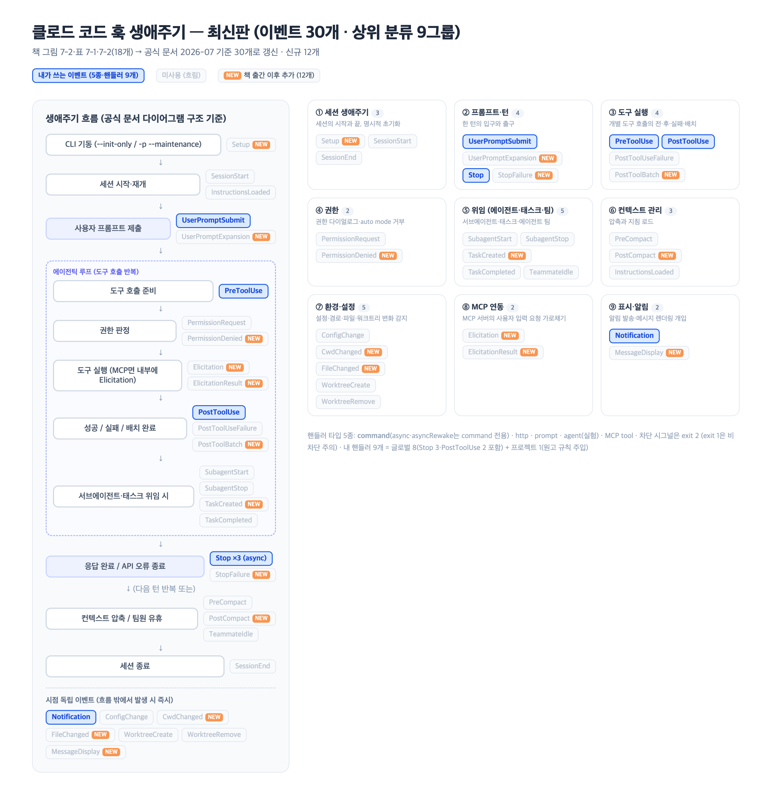
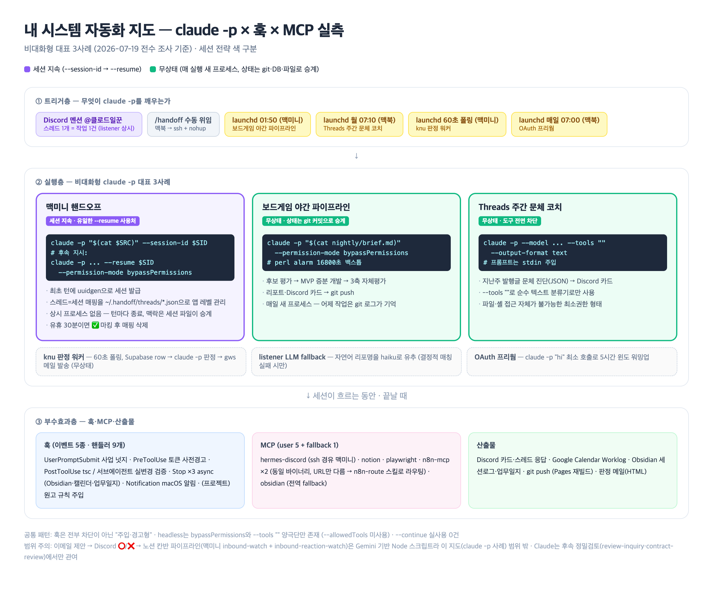

# 임정 · 7장 정리: 자동화 — claude -p · 훅 · MCP/플러그인 (2026-07-19)

- **관통 주제 (발표 핵심 1개)**: 내 자동화는 "차단"이 아니라 "주입" — 훅·headless·MCP 전부 흐름을 끊지 않는 부수효과로 설계되어 있었다
- **⚠️ 교통정리 3건**
  1. 책의 훅 이벤트는 18개(그림 7-2 + 표 7-1·7-2) — 공식 문서 기준 현재 **30개**. 삭제된 건 없고 12개가 추가됨 (Setup, UserPromptExpansion, MessageDisplay, PostToolBatch, PermissionDenied, TaskCreated, StopFailure, CwdChanged, FileChanged, PostCompact, Elicitation, ElicitationResult) [1]
  2. 내 인식 교정(재교정 2026-07-19): "이메일 제안 → Discord o/x → 노션 칸반"은 headless로 도는 게 맞으나 그 주체가 `claude -p`가 아니라 **Gemini 기반 Node 스크립트 2개**였음 — 맥미니 launchd `inbound-watch`(매시간: gws Gmail 폴링 → Gemini 분류·요약 → Notion 수주판단 DB + Discord 카드) + `inbound-reaction-watch`(5분: ⭕/❌ 리액션 폴링 → 칸반 진행/거절). Claude는 그 뒤 **정밀검토 단계**(대화형 스킬 review-inquiry·contract-review)에서만 등장 — 자동화 계층(Gemini)과 판단 계층(Claude 대화형)의 2단 구조
  3. `--resume` 실사용은 맥미니 핸드오프 **단 1곳**, `--continue`/`-c`는 전 워크스페이스에서 **0건** — "다양하게 썼다"는 기억과 실측이 달랐음
- **조사 방식**: sonnet Explore 서브에이전트 3개 fan-out (① 훅·MCP·플러그인 설정 ② claude -p 전수 grep ③ 저장소 규격) + 공식 문서(`code.claude.com/docs/en/hooks.md`) 원문 curl 대조

> HTML 원본: [hook-lifecycle-latest.html](hook-lifecycle-latest.html) (Pages 인앱 뷰용)

---

## 핵심 질문 요약 (TL;DR)

| 질문 | 한 줄 답 |
|---|---|
| Q1. `claude -p`를 나는 어떻게 쓰고 있나 | 비대화형 7사례 중 대표 3개 — 핸드오프(세션 지속), 보드게임 야간(무상태·git 승계), Threads 문체 코치(도구 전면 차단) |
| Q2. 훅 이벤트는 지금 몇 개고 나는 뭘 쓰나 | 30개·9분류 — 나는 5종 이벤트에 핸들러 9개, 전부 "주입·경고형"이고 차단형은 0개 |
| Q3. MCP·플러그인은 어떻게 굴러가나 | user 5 + fallback 1, 동일 바이너리 이중 등록(n8n ×2)은 스킬로 라우팅. 플러그인이 훅을 심는다는 것도 이번에 확인 |
| Q4. 세 축은 어디서 만나나 | 핸드오프 파이프라인 한 곳에서 claude -p(실행) × hermes-discord MCP(관문) × Stop 훅(기록)이 결합 |
| Q5. 개선할 점은 | 6가지 — 출력 구조화, 최소권한, 실패 이벤트 활용, asyncRewake, Setup 이벤트, hookify 활용 |

---

## Q1. `claude -p` 비대화형 호출 — 개념과 내 실사용

### 개념: 플래그 지도

| 플래그 | 역할 | 내 실사용 |
|---|---|---|
| `-p` / `--print` | 비대화형 1회 실행 후 종료 | 6곳 |
| `--session-id <uuid>` | 세션 ID를 직접 발급·주입 | 핸드오프 최초 턴 |
| `--resume <uuid>` | 기존 세션 맥락을 이어 재진입 | 핸드오프 후속 턴 (유일) |
| `--continue` / `-c` | 직전 세션 이어가기 | **0건** |
| `--permission-mode bypassPermissions` | 권한 프롬프트 전면 생략 | headless 전 사례 |
| `--tools ""` | 도구 전면 차단 (순수 텍스트 생성기화) | Threads 문체 코치 |
| `--output-format json/text` | 출력 구조화 | text 1건, json 0건 |
| `--allowedTools` | 도구 화이트리스트 (최소권한) | **0건** |

### 내 시스템 대표 3사례 (실측)

> HTML 원본: [automation-map.html](automation-map.html) (Pages 인앱 뷰용)

| 사례 | 트리거 | 세션 전략 | 핵심 설계 |
|---|---|---|---|
| **맥미니 핸드오프** (`task-orchestrator/handoff/runner.sh`) | Discord 멘션 `@클로드일꾼` / `/handoff` | **세션 지속** — `--session-id` 발급 → 후속 발화마다 `--resume` | 스레드 1개 = 작업 1건 = 세션 1개. 매핑은 `~/.handoff/threads/*.json`에 앱 레벨로 저장, 유휴 30분이면 ✅ 후 폐기 |
| **보드게임 야간 파이프라인** (`boardgame-hub/nightly/nightly.sh`) | launchd 매일 01:50 (맥미니) | **무상태** — 매일 새 프로세스 | brief.md를 프롬프트로 주입, 상태는 git 커밋이 승계. perl alarm 16800초 백스톱 |
| **Threads 주간 문체 코치** (`sns-content-hub/scripts/weekly_style_coach.py`) | launchd 매주 월 07:10 (맥북) | **무상태** | `--tools ""`로 파일·셸 접근 원천 차단 — claude를 순수 분류기로만 사용. 진단 JSON → Discord 카드 |

- 보조 사례: knu 판정 워커(60초 폴링, Supabase row → 판정 → gws 메일), 핸드오프 리스너 haiku fallback(자연어 리포명 유추), OAuth 프리웜(`claude -p "hi"`)
- > **내 실측 포인트**: resume의 진짜 쓸모는 "사람이 중간에 끼어드는 위임"에서만 나왔다. 무인 파이프라인은 전부 세션 대신 git·DB·파일로 상태를 승계 — 세션 파일보다 재현·감사가 쉬운 매체를 고른 결과

### resume 메커니즘 상세 (핸드오프)

- 상시 프로세스 없음 — 턴마다 `claude -p`가 완전히 종료되고, 맥락은 Claude Code 세션 파일이 보존
- Discord 스레드에 멘션 없이 올린 발화 = 후속 지시 → 리스너가 `HANDOFF_RESUME=1`로 runner 재호출 → `--resume $SID`
- "어느 스레드가 어느 세션인가"는 Claude가 아니라 **애플리케이션이 기억** — 세션 연속성의 절반은 내 코드 몫

---

## Q2. 훅 시스템 — 이벤트 30개 · 상위 분류 9그룹

### 상위 분류 (이벤트가 많아져 집합으로 묶음)

| 분류 | 이벤트 (🆕 = 책 이후 추가) | 내 사용 |
|---|---|---|
| ① 세션 생애주기 | Setup 🆕 · SessionStart · SessionEnd | — |
| ② 프롬프트·턴 | **UserPromptSubmit** · UserPromptExpansion 🆕 · **Stop** · StopFailure 🆕 | 2/4 |
| ③ 도구 실행 | **PreToolUse** · **PostToolUse** · PostToolUseFailure · PostToolBatch 🆕 | 2/4 |
| ④ 권한 | PermissionRequest · PermissionDenied 🆕 | — |
| ⑤ 위임 (에이전트·태스크·팀) | SubagentStart · SubagentStop · TaskCreated 🆕 · TaskCompleted · TeammateIdle | — |
| ⑥ 컨텍스트 관리 | PreCompact · PostCompact 🆕 · InstructionsLoaded | — |
| ⑦ 환경·설정 | ConfigChange · CwdChanged 🆕 · FileChanged 🆕 · WorktreeCreate · WorktreeRemove | — |
| ⑧ MCP 연동 | Elicitation 🆕 · ElicitationResult 🆕 | — |
| ⑨ 표시·알림 | **Notification** · MessageDisplay 🆕 | 1/2 |

- 핸들러 타입 5종: `command`(async·asyncRewake는 command 전용) · `http` · `prompt` · `agent`(실험) · MCP tool [1]
- 차단 시그널은 **exit 2** — exit 1은 관례와 달리 비차단이라 정책 강제 훅은 반드시 exit 2 [1]

### 내 훅 실측 (이벤트 5종 · 핸들러 9개)

| 이벤트 | matcher | 핸들러 | 성격 |
|---|---|---|---|
| UserPromptSubmit | 전체 | 사업 키워드 → yc-office-hours 스킬 넛지 | 주입 |
| PreToolUse | Bash | gws/Notion 토큰 만료 사전 경고 (항상 exit 0) | 경고 |
| PostToolUse | Edit\|Write | .ts/.tsx → 로컬 tsc만 실행 (npx 스쿼팅 방지 설계) | 검증 |
| PostToolUse | Agent | 서브에이전트 후 `git status`로 실변경 주입 | 검증 |
| Stop ×3 | 전체 | **모두 async** — Obsidian 세션저장 · Worklog 캘린더 · Gemini 업무일지 | 기록 |
| Notification | 전체 | terminal-notifier macOS 알림 | 알림 |
| (프로젝트) PostToolUse | Write\|Edit | 이 저장소의 `ggplab-study-check.py` — 원고 규칙 체크리스트 주입 | 주입 |

- > **내 실측 포인트 1**: 9개 전부 "주입·경고·기록형"이고 차단형(deny/exit 2)은 0개 — 흐름을 끊지 않는다는 일관된 철학이 사후적으로 확인됨
- > **내 실측 포인트 2**: 이 정리본을 쓰는 지금도 프로젝트 훅이 매 Write마다 원고 규칙을 주입 중 — "저자의 집필 프로세스를 훅으로 자동화"한 메타 사례
- > **내 실측 포인트 3**: 조사 중 gptaku 플러그인이 심어둔 SessionStart 업데이트 체크 훅을 발견 → 원치 않아 이번 세션에서 제거 (플러그인 훅은 설치 시 조용히 들어올 수 있으니 주기 점검 필요)

---

## Q3. MCP와 플러그인 — 내 등록 현황

### MCP (user scope 5 + 전역 fallback 1)

| 서버 | 연결 방식 | 용도 |
|---|---|---|
| notion | npx notion-mcp-server | 페이지·DB CRUD |
| hermes-discord | **ssh -T macmini** 경유 stdio | Discord 브리지 (핸드오프 관문) |
| playwright | npx @playwright/mcp | 브라우저 자동화 — 이 정리본 PNG도 이걸로 렌더 |
| n8n-mcp | npx n8n-mcp (맥미니 URL) | self-hosted n8n |
| n8n-mcp-datapopcorn | npx n8n-mcp (클라우드 URL) | 협업사 n8n |
| obsidian (fallback) | obsidian-mcp-server | vault 읽기/쓰기 |

- **동일 바이너리 이중 등록 패턴**: n8n-mcp ×2는 같은 패키지에 URL·키만 다름. 도구가 엔드포인트에 고정되어 런타임 전환 불가 → 인스턴스 선택을 `n8n-route` 스킬로 해결
- stdio MCP를 **ssh 너머 원격 프로세스**로 띄우는 것도 가능(hermes-discord) — MCP는 전송이 stdio면 프로세스가 어디서 돌든 무관

### 플러그인 (마켓 3곳 · 활성 6개)

| 플러그인 | 마켓 | 비고 |
|---|---|---|
| hookify | official | 사용량 압도적 1위 — 훅을 만들어주는 플러그인 |
| codex | openai-codex | Codex CLI 위임 (2위) |
| supabase · code-review · feature-dev | official | — |
| insane-search | gptaku | 이 플러그인 경유로 SessionStart 훅이 들어왔었음 (Q2 참조) |

- > **내 실측 포인트**: 플러그인은 "도구 추가"만이 아니라 **훅·에이전트·스킬을 함께 설치하는 배포 단위** — 마켓플레이스 업데이트가 곧 내 자동화 레이어 변경이므로 신뢰 경계로 다뤄야 함

---

## Q4. 세 축의 결합 — 한 파이프라인에서 만나는 지점

- 핸드오프 1건의 생애: **Discord 멘션** → 리스너(launchd 상시) → **`claude -p --resume`**(실행) → 작업 중 질문·허락은 **hermes-discord MCP**로 중계 → 턴 종료 시 **Stop 훅 3종**이 Obsidian·캘린더·업무일지에 기록
- 즉 트리거(OS launchd) / 실행(headless) / 대화 관문(MCP) / 기록(훅)이 각자 다른 계층에서 한 작업을 감쌈 — 책의 3개 절이 실제로는 하나의 파이프라인 부품들
- 주의: 같은 `~/.claude/scripts/` 디렉토리에도 훅 스크립트와 launchd 전용 스크립트가 섞여 있음 — **Claude Code 훅과 OS 레벨 cron/launchd는 등록 방식이 다른 별개 계층**

---

## Q5. 개선할 점 (실측 기반 6가지)

1. **출력 구조화**: knu 워커·문체 코치가 `--output-format json` 없이 응답 문자열에서 JSON을 파싱 — `--output-format json`으로 전환해 파싱 취약성 제거
2. **최소권한**: headless가 `bypassPermissions`(전부 허용)와 `--tools ""`(전부 차단) 양극단뿐 — 야간 파이프라인은 `--allowedTools`로 필요한 도구만 여는 중간값이 적정
3. **실패 이벤트 공백**: PostToolUseFailure·StopFailure 미사용 — 야간 파이프라인이 API 오류로 죽으면 아침까지 모름. StopFailure → Discord 알림 훅 추가
4. **asyncRewake 미활용**: Stop 훅 3종이 fire-and-forget이라 캘린더 동기화 실패를 인지 못함 — asyncRewake로 실패 시 되짚기 [1]
5. **Setup 이벤트 검토**: OAuth 프리웜(`claude -p "hi"`)을 `-p --maintenance` + Setup 훅 조합으로 대체 가능성 (신규 이벤트의 정확한 용도 매칭)
6. **hookify 역설 해소**: 최다 사용 플러그인이 hookify인데 정작 내 훅 9개는 전부 수제 — 신규 훅(3·4번)부터 hookify로 생성해 비교

---

## 발표용 핵심 개념 선택

- **선택**: "훅 이벤트 상위 분류 9그룹 — 30개를 외우지 말고 집합으로 기억"
- 이유:
  1. 책(18개)과 현재(30개)의 간극이 가장 큰 파트라 스터디원 전원에게 최신화 가치가 있음
  2. 분류축(세션/턴/도구/권한/위임/컨텍스트/환경/MCP/표시)이 있으면 신규 이벤트가 또 늘어도 어느 칸에 꽂히는지만 보면 됨
  3. 내 훅 9개가 5종 이벤트에 몰려 있다는 것도 분류표 위에서 한눈에 보임 (도식 1)

---

## 출처

1. [Hooks reference — 공식 문서](https://code.claude.com/docs/en/hooks) (2026-07-19 원문 curl로 이벤트 30개 전수 확인)
2. [Claude Code hooks guide — 공식 문서](https://code.claude.com/docs/en/hooks-guide)
3. 책 〈클로드 코드로 시작하는 실전 에이전틱 코딩〉 7장 그림 7-2, 표 7-1·7-2 (비교 기준)
4. 실측: `~/.claude/settings.json` · `~/.claude.json` · `~/.claude/plugins/` · `task-orchestrator/handoff/runner.sh` · `boardgame-hub/nightly/nightly.sh` · `sns-content-hub/scripts/weekly_style_coach.py` 외 (sonnet Explore ×3)

## 검증 메모

1. **High confidence**: 이벤트 30개 목록·설명은 공식 문서 마크다운 원문을 curl로 받아 `###` 헤딩 grep으로 전수 대조 (소형 모델 요약 미신뢰, 원문 재검증 완료). 내 훅·claude -p 사례는 전부 설정 파일·스크립트 원문 실측
2. **한계**: "책 이후 추가 12개"는 책 지면(18개)과의 차집합 기준 — 책 집필 시점에 문서에 있었는데 지면에서 생략됐을 가능성은 배제 못함. 플러그인 사용량 수치는 로컬 통계라 기간 미상
3. **시각 자산**: 도식 2종은 standalone HTML로 제작 후 Playwright MCP 스크린샷(zoom 2x, ~2385px)으로 PNG 렌더
