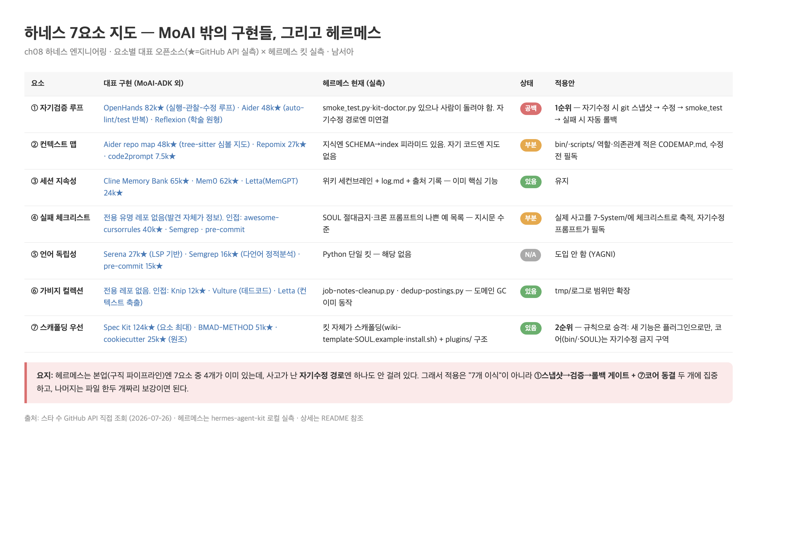

# 남서아 · 8장 정리: 하네스 7요소 — MoAI 밖의 구현들, 그리고 헤르메스 (2026-07-26)

- **관통 질문**: 하네스 엔지니어링 7요소는 MoAI-ADK 없이도 구현돼 있나? 내가 배포 중인 헤르메스 에이전트의 자기수정 사고에는 뭘 씌워야 하나?
- 조사 방식: 요소별 대표 오픈소스 웹 조사(스타 수는 GitHub API 직접 조회, 2026-07-26) + 헤르메스 킷(hermes-agent-kit) 로컬 실측
- 배경: 헤르메스를 비기술직군 사람들에게 깔아주고 있는데, 자기개선루프가 완성된 스크립트의 맥락을 잃고 기존 코드를 부수는 사고가 실제로 났다. 이 정리는 그 사고에 씌울 하네스를 고르는 작업이다

- 도식 원본: [harness-7-map.html](harness-7-map.html)

---

## 1. 7요소별 대표 구현 — MoAI-ADK가 유일한 답이 아니다

| 요소 | 대표 오픈소스 (★ 대략치) | 한 줄 |
|---|---|---|
| ① 자기검증 루프 | [OpenHands](https://github.com/All-Hands-AI/OpenHands) 82k · [Aider](https://github.com/Aider-AI/aider) 48k · [Reflexion](https://github.com/noahshinn/reflexion) (NeurIPS 2023) | 실행-관찰-수정 루프 / 편집 후 자동 린트·테스트 반복 / 언어적 자기반성의 학술 원형 |
| ② 컨텍스트 맵 | Aider repo map 48k · [Repomix](https://github.com/yamadashy/repomix) 27k · [code2prompt](https://github.com/mufeedvh/code2prompt) 7.5k | tree-sitter 심볼 지도 / 레포 전체를 AI 친화 단일 파일로 패킹 |
| ③ 세션 지속성 | [Cline Memory Bank](https://docs.cline.bot/prompting/cline-memory-bank) 65k · [Mem0](https://github.com/mem0ai/mem0) 62k · [Letta(MemGPT)](https://github.com/letta-ai/letta) 24k | 구조화 마크다운으로 컨텍스트 리셋 후에도 이어서 작업 |
| ④ 실패 체크리스트 | **전용 유명 레포 없음** — 인접: [awesome-cursorrules](https://github.com/PatrickJS/awesome-cursorrules) 40k · [Semgrep](https://github.com/semgrep/semgrep) · [pre-commit](https://github.com/pre-commit/pre-commit) | AI 상습 실수를 규칙 파일로 명문화해 매 세션 주입 |
| ⑤ 언어 독립성 | [Serena](https://github.com/oraios/serena) 27k · Semgrep 16k · pre-commit 15k | LSP 기반이라 언어서버만 있으면 어떤 언어든 동작 |
| ⑥ 가비지 컬렉션 | **전용 유명 레포 없음** — 인접: [Knip](https://github.com/webpro-nl/knip) 12k · [Vulture](https://github.com/jendrikseipp/vulture) · Letta의 컨텍스트 축출 | 데드코드 도구 + 메모리 축출 조합이 현재 실무 답 |
| ⑦ 스캐폴딩 우선 | [Spec Kit](https://github.com/github/spec-kit) 124k · [BMAD-METHOD](https://github.com/bmad-code-org/BMAD-METHOD) 51k · [cookiecutter](https://github.com/cookiecutter/cookiecutter) 25k | 스펙→플랜→태스크 구조를 먼저 깔고 채운다. 요소 최대 스타는 Spec Kit |

- 발견 2개: ④실패 체크리스트와 ⑥GC는 그 이름을 표방하는 단독 레포가 아직 없다(인접 도구 조합이 답) — MoAI가 이 둘을 요소로 명명한 게 오히려 특이점
- ralph 루프(①의 사촌)는 개별 레포는 소규모지만 클로드 코드 공식 플러그인(ralph-wiggum)으로 편입됨

## 2. 헤르메스 실측 — 이미 있는 것과 비어 있는 것

- 킷 실측 결과, 본업(구직 파이프라인)엔 7요소 중 4개가 이미 있다:
  - ③ 세션 지속성: 위키 세컨브레인 + log.md + 출처 기록
  - ⑥ GC: `job-notes-cleanup.py` · `dedup-postings.py` (도메인 GC 동작 중)
  - ⑦ 스캐폴딩: 킷 자체가 스캐폴딩(wiki-template · SOUL.example · install.sh) + `plugins/` 구조
  - ② 컨텍스트 맵 절반: 지식엔 SCHEMA→index 피라미드 탐색이 있다
- 비어 있는 곳이 정확히 사고 지점이다:
  - ① 자기검증 루프: `smoke_test.py` · `kit-doctor.py`가 있지만 **사람이 돌려야 하고, 자기수정 경로에는 연결돼 있지 않다**
  - ② 나머지 절반: 자기 코드(bin/·scripts/)엔 지도가 없다 — 수정하는 에이전트가 전체 구조를 모른 채 파일 하나만 보고 고친다
  - ④ 실패 체크리스트: SOUL의 절대금지·크론 프롬프트의 나쁜 예 목록뿐 — 코드 수정 사고용은 없다

## 3. 적용 설계 — 우선순위 4개

| # | 적용안 | 내용 | 재료 |
|---|---|---|---|
| 1 | 자기수정 게이트 (①) | 자기 파일을 고칠 땐 git 스냅샷 → 수정 → smoke_test 통과 → 실패 시 자동 롤백. 이 순서를 자기수정 절차(위임 프롬프트 계약)에 박는다 | smoke_test.py·git 이미 있음 — 연결만 하면 됨 |
| 2 | 코어 동결 + 플러그인 전용 (⑦) | 새 기능은 `plugins/`로만 추가, `bin/`·`scripts/`·SOUL.md는 자기수정 금지 구역. 최악의 경우에도 플러그인 하나 지우면 복구 | plugins/ 구조(eagle-eye) 이미 있음 — 규칙으로 승격 |
| 3 | 실패 체크리스트 축적 (④) | 실제 사고(이번 코드 파괴 건 포함)를 `7-System/`에 체크리스트로 쌓고, 자기수정 프롬프트가 필독 | 위키 이미 있음 — 파일 1개 + 프롬프트 1줄 |
| 4 | 자기 코드의 CODEMAP (②) | bin/·scripts/의 역할·의존관계를 적은 CODEMAP.md, 수정 전 필독 | 문서 1개 |

- ⑤ 언어 독립성은 Python 단일 킷이라 도입 안 함. ③⑥은 유지·소폭 확장
- 클로드 코드/Codex에 코딩을 위임하는 모드는 1번 절차를 위임받는 쪽 프롬프트에 계약으로 넣으면 자연스럽게 결합된다

## 4. 그냥 MoAI를 헤르메스에 깔면 안 되나?

- 안 된다. 세 가지 이유:
  1. **층이 다르다** — MoAI는 클로드 코드 위 규약층, 즉 개발자의 코딩 세션용 하네스다. 사고는 헤르메스가 런타임에 스스로를 수정할 때 나는데, 그 경로에 MoAI가 끼어들 자리가 없다
  2. **호스트가 안 맞다** — 헤르메스 크론 잡의 provider는 openai-codex(GPT)다. MoAI는 클로드 코드 전용이라 실제 실행 경로와 결합이 안 된다
  3. **필요한 하네스가 훨씬 작다** — 위 1·2번(스냅샷→검증→롤백 + 코어 동결)이면 사고를 막는다. SPEC 체계·TRUST 게이트까지 통째로 까는 건 과잉이고, 기존 지시문·훅과 충돌 위험이 더 크다
- 결론: MoAI를 까는 게 아니라 **MoAI의 발상을 헤르메스 자기수정 경로에 옮겨 심는다**

---

## 출처

1. 스타 수·레포 정보: GitHub API 직접 조회 (2026-07-26) — 본문 링크 참조
2. 헤르메스: hermes-agent-kit 로컬 실측 (SOUL.example.md · CUSTOMIZE.md · bin/ · cron/jobs.json · tests/smoke_test.py)
3. 책 〈클로드 코드로 시작하는 실전 에이전틱 코딩〉 8장 · MoAI-ADK 실측 상세는 [임정/README.md](../임정/README.md)
