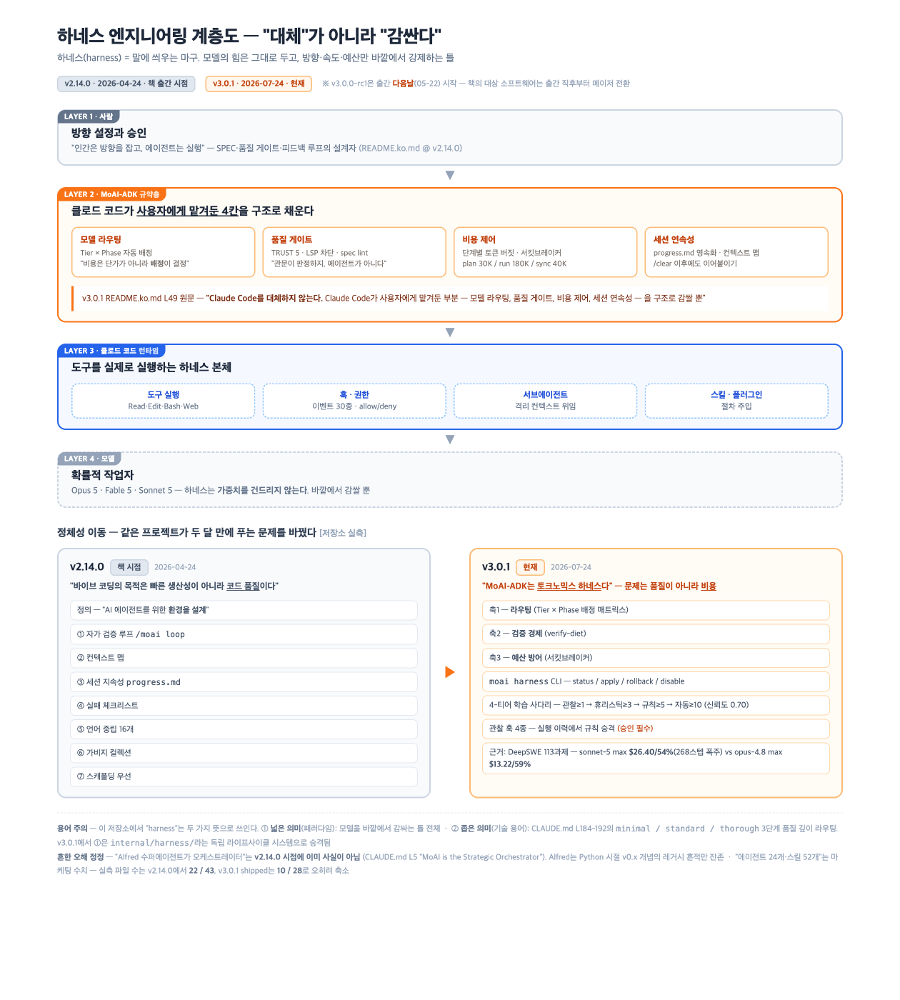
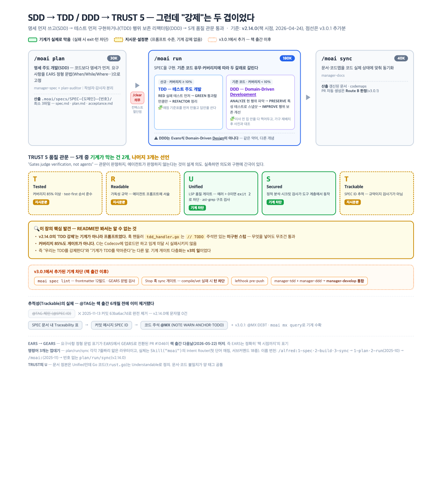
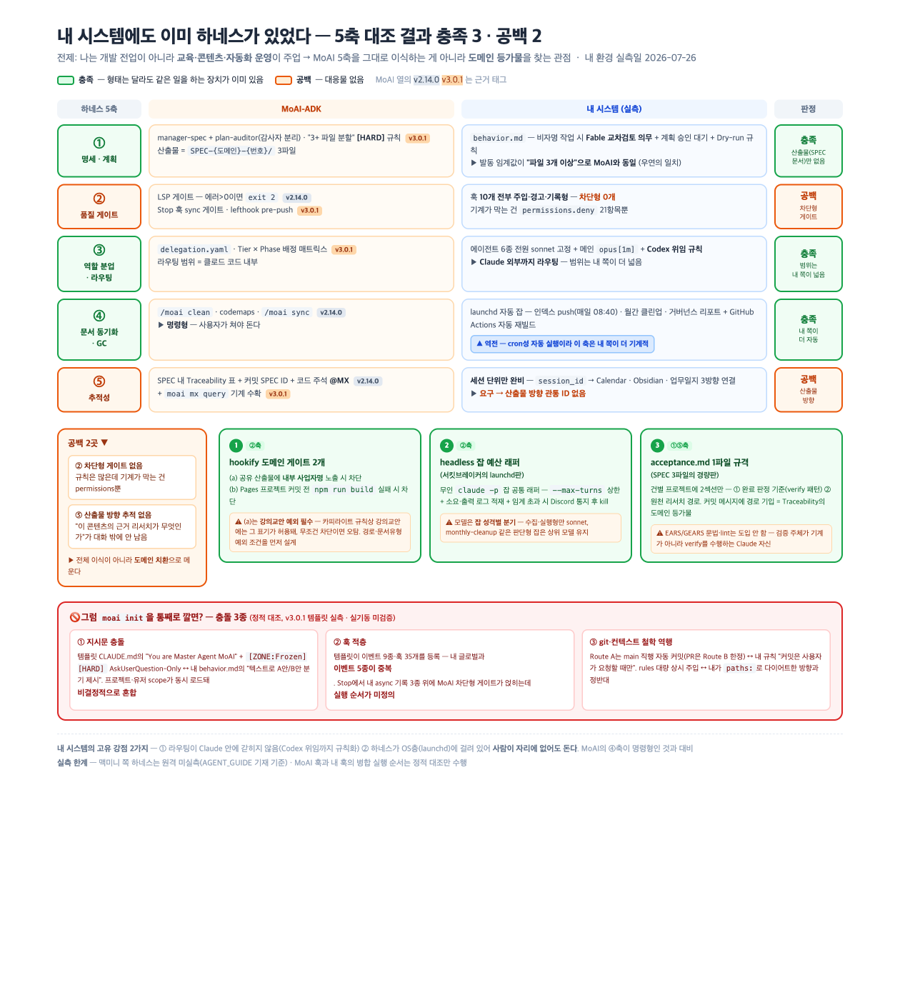

# 임정 · 8장 정리: 클로드 코드와 MoAI-ADK — 하네스 엔지니어링 (2026-07-26)

> **일러두기 — 읽기 전 필수**
> - **책 본문은 확보하지 못함.** 이 문서에 "책이 ~라고 말한다"는 서술은 없음 — 전부 저장소·공개자료 기준의 재구성.
> - 증거 등급 3단:
>   - **[목차·서지 확인]** — 출판사 소개문·부제·목차 (교보/알라딘/KPIPA 출판유통통합전산망, 확인일 2026-07-26)
>   - **[실측]** — MoAI-ADK 저장소 파일 직접 판독. 파일경로 + 태그(ref) 병기
>   - **[공개자료]** — 저자 블로그·Threads·체인지로그 등 웹 1차 소스. 확인일 2026-07-26
> - **버전 이원화가 이 정리의 뼈대**:
>   - 책 출간일 = 2026-05-21. 그 시점 MoAI-ADK 최신 태그 = **v2.14.0** (2026-04-24) → "책이 다룬 것"의 근거는 이 태그
>   - 현재 최신 = **v3.0.1** (2026-07-24). **v3.0.0-rc1이 출간 다음날(05-22) 시작** — 두 달 만에 메이저 전환 완료
>   - 즉 이 책의 대상 소프트웨어는 출간 직후부터 통째로 바뀌기 시작했음. 아래 모든 주장에 어느 태그 기준인지 명시
> - 8장 목차 = 8-1 하네스 엔지니어링과 MoAI-ADK / 8-2 설치와 초기 설정 / 8-3 아키텍처 / 8-4 개발 방법론, TDD와 DDD / 8-5 TRUST-5 품질 프레임워크 / 8-6 에이전트 생태계 [목차·서지 확인]

---

## 관통 주제 (발표 핵심 1개)

**"모델이 강해질수록 하네스는 사라지는 게 아니라 성격이 바뀐다 — '무엇을 어떤 순서로'(절차형)는 얇아지고, '어디까지·얼마에·어떤 증거로'(정책형)는 두꺼워진다."** MoAI-ADK 자신이 v2(품질 절차) → v3(토큰 경제)로 재편된 것이 그 방증.

---

## TL;DR — 질문 6개, 한 줄 답

| # | 질문 | 한 줄 답 |
|---|---|---|
| Q1 | 하네스 철학·만든 이유는? | 모델을 바깥에서 감싸 예산·품질·연속성을 강제하는 틀. 동기는 v2.14.0 "코드 품질" → v3.0.1 "토큰 비용"으로 이동 [실측] |
| Q2 | SDD·TDD·DDD가 뭔가? | 명세 먼저(SDD) → 테스트 먼저(TDD) 구현 → 기존 코드는 행위 보존 리팩터링(DDD). plan→run→sync 3단계에 매핑 [실측] |
| Q3 | 저자가 본 클로드 코드 문제는? | 단일 에이전트·환각·컨텍스트 유실·품질 검증 주체 부재·워크플로 분절 5가지 + 비용·벤더 종속 [공개자료] |
| Q4 | 그 진단, 지금도 유효한가? | 3분류 — 추적성·결정론 게이트는 유효 / 세션 기억·토큰 통제는 부분 해소 / "장기 자율작업 불가"는 사실상 무효 압력 |
| Q5 | 처방은 지금도 유효한가? | 절차 대본·검증 스캐폴딩은 공식 축소 권고(역효과 문서화) / 정책형 게이트·예산·감사는 여전히 하네스 몫 |
| Q6 | OpenCode 등과 뭐가 다른가? | MoAI는 "클로드 코드 위 규약층". 정량 게이트+비용 통제 내장은 비교군 11개 중 유일. 대신 단일 호스트 종속 + 커뮤니티 최소 |

---

## Q1. 하네스 엔지니어링 — 철학과 만든 이유

- **하네스(Harness)** = 원래 마차 말에 씌우는 마구. 여기서는 **AI 모델을 바깥에서 감싸 규칙·예산·검증을 시스템으로 강제하는 틀**
> 🧩 비유: 말(모델)의 힘은 건드리지 않고, 고삐와 마구(하네스)로 방향·속도만 바깥에서 제어하는 구조

### 정의가 버전 사이에 이동함 [실측]

| 항목 | 책 시점 v2.14.0 | 현재 v3.0.1 |
|---|---|---|
| 정의 | "코드를 직접 작성하는 대신 AI 에이전트를 위한 **환경을 설계**" (README.ko.md L114-129) | "MoAI-ADK는 **토크노믹스 하네스**다" — 예산·품질기준·세션 연속성은 "시스템이 바깥에서 강제해야" (README.ko.md L45-47) |
| 사람의 역할 | "인간은 방향을 잡고, 에이전트는 실행" — SPEC·품질 게이트·피드백 루프 설계자 | 동일 + 하네스 자체가 학습·롤백하는 1급 시스템의 관리자 |
| 구성요소 | 7개: 자가 검증 루프 `/moai loop` · 컨텍스트 맵 · 세션 지속성 progress.md · 실패 체크리스트 · 언어 중립 16개 · 가비지 컬렉션 · 스캐폴딩 우선 | `moai harness` CLI(status/apply/rollback/disable) · 4-티어 학습 사다리(관찰≥1→휴리스틱≥3→규칙≥5→자동≥10, 신뢰도 0.70) · 관찰 훅 4종 |
| 좁은 기술 용어로도 사용 | CLAUDE.md의 harness = minimal/standard/thorough 3단계 품질 깊이 라우팅 (L184-192) | 별도 라이프사이클 가진 시스템으로 승격 (internal/harness/) |

### 만든 이유 — 문제의식이 "품질"에서 "비용"으로 [실측]

- v2.14.0 표어: **"바이브 코딩의 목적은 빠른 생산성이 아니라 코드 품질이다"** (README.ko.md L38) — 풀려는 문제 = 품질
- v3.0.1: "토큰 단가가 계속 내려가는데, 정작 에이전틱 워크플로우의 실제 지출은 오른다" · "비용은 모델 단가가 아니라 **배정**이 결정한다" (L54·L57)
  - 근거로 DeepSWE 113과제 실측표 인용: sonnet-5 max $26.40/54%/268스텝 폭주 vs opus-4.8 max $13.22/59% — 비싼 배정이 더 나쁠 수 있음
- 클로드 코드와의 관계 (v3.0.1 원문, L49): "**Claude Code를 대체하지 않는다.** Claude Code가 사용자에게 맡겨둔 부분 — 모델 라우팅, 품질 게이트, 비용 제어, 세션 연속성 — 을 구조로 감쌀 뿐"
- 개인적 동기 [공개자료·저자 육성]: Threads에서 "몇달전 바이브 코딩 실패 이후 PRD 문서만 전세계 온라인 문서 거의 다 뒤져 본 것 같다" — 프롬프트 의존 실패 → 문서(명세) 우선 전환

### 자주 나오는 오해 2개 (실측으로 정정)

- **"Alfred 수퍼에이전트가 오케스트레이터"** → v2.14.0 시점 이미 아님. CLAUDE.md L5 "MoAI is the Strategic Orchestrator". Alfred는 Python 시절(v0.x) 개념의 레거시 흔적(docs-site 등)만 잔존 [실측 @ v2.14.0]
- **"에이전트 24개·스킬 52개"** → 마케팅 수치. 실측 파일 수는 v2.14.0 에이전트 22·스킬 43 (README 안에서도 24+52 vs 26+47로 자체 불일치). v3.0.1 shipped는 10·28로 오히려 축소 [실측]

> HTML 원본: [harness-layers.html](harness-layers.html) (Pages 인앱 뷰용)

---

## Q2. SDD → TDD → DDD — 방법론의 실체

### 용어부터 풀기

| 용어 | 풀어쓰기 | 이 저장소에서의 실체 |
|---|---|---|
| **SDD** (SPEC-First, 명세 주도 개발) | 명세를 먼저 쓰고 코드는 그 다음 | `.moai/specs/SPEC-{도메인}-{번호}/` 디렉토리 = 1단위, 최소 3파일(spec.md+plan.md+acceptance.md) [실측 @ v2.14.0 manager-spec.md] |
| **TDD** (테스트 주도 개발) | 실패하는 테스트 먼저 → 통과할 만큼만 구현 → 정리 (RED→GREEN→REFACTOR) | workflow-modes.md + quality.yaml(test_first_required: true) + manager-tdd 3곳에 정의 [실측 @ v2.14.0] |
| **DDD** (Domain-Driven **Development**) | **주의: Evans식 '설계(Design)'가 아님.** 기존 코드의 행위를 테스트로 스냅샷 뜬 뒤, 행위를 보존하며 구조만 개선 | ANALYZE→PRESERVE→IMPROVE. 기존 코드·커버리지 10% 미만이면 DDD, 그 외 기본 TDD [실측 @ v2.14.0 workflow-modes.md] |
| **EARS** | 요구사항을 5~6가지 정형 패턴(When/While/Where…)으로 쓰는 문법 | v2.14.0의 표기. **GEARS 전환 PR #1046이 출간 다음날(05-22) 머지** — EARS는 정확히 '책 시점까지'의 표기 [실측] |
| **TRUST 5** | 품질 5원칙: Tested(85%+)·Readable·Unified·Secured·Trackable | 문서 정본 기준. 단 Go 코드는 U를 Understandable로 정의 — 문서·코드 불일치가 양 태그 공통 [실측 trust.go] |

> 🧩 비유(SDD): 건축 시공 전에 도면·시방서를 확정하는 것 — 시공자(에이전트)가 바뀌어도 같은 건물이 나오게
> 🧩 비유(TDD): 채점 기준표를 먼저 만들고 답안을 쓰는 것
> 🧩 비유(DDD): 이사 전 집 안을 사진으로 다 찍어두고(특성 테스트), 가구 재배치 후 사진과 대조해 아무것도 깨지지 않았음을 확인

### plan → run → sync 파이프라인 [실측 @ v2.14.0]

| 단계 | 하는 일 | 담당 | 토큰 버짓 |
|---|---|---|---|
| `/moai plan` | EARS 형식 SPEC 문서 생성 | manager-spec (+plan-auditor 감사) | 30K — 완료 후 `/clear` 의무 |
| `/moai run` | SPEC을 TDD/DDD로 구현 | manager-tdd / manager-ddd | 180K |
| `/moai sync` | 문서·코드맵 동기화 | manager-docs | 40K |

- 명령 3개는 각각 7줄짜리 얇은 라우터 — 실체는 `Skill("moai")`의 Intent Router(첫 단어 매칭, 서브커맨드 **18종**) [실측]
- 이름 변천: `/alfred:1-spec·2-build·3-sync` → 2025-10 `1-plan·2-run` 개명 → 2025-11 `/moai:` 이동 → v2.14.0에선 번호 없는 `plan/run/sync` [실측 git log]
- v3.0.1 변화: 3단계·버짓은 유지, 실행 재편 — Route A(소형 작업 main 직행, PR 없음) / Route B(대형·`--pr` 시 단계별 PR), manager-tdd+ddd → manager-develop 통합 [실측]

### 핵심 발견 — "강제"의 실체는 두 겹 [실측]

| 강제 수단 | v2.14.0 (책 시점) | v3.0.1 (현재) |
|---|---|---|
| **기계가 실제로 막음** | LSP 품질 게이트(에러>0이면 exit 2 차단) · ast-grep 게이트 | + `moai spec lint`(frontmatter 12필드·GEARS 검사) · Stop 훅 sync 게이트(compile/vet 실패 시 턴 차단) · lefthook pre-push |
| **지시문·설정뿐 (기계 강제 없음)** | **TDD test-first 순서 자체** — 훅 핸들러(tdd_handler.go)가 `// TODO` 주석의 미구현 스텁, 무조건 통과 · 커버리지 85%(CI는 Codecov 업로드만, 임계 게이트 없음) | 팀 모드 AC 검증(스텁 명시) · Readable/Trackable 대부분 |

- 즉 **책 시점 MoAI의 'TDD 강제'는 기계가 아니라 프롬프트였다** — 기계 게이트 다층화는 v3의 일
> 🧩 비유(게이트 두 겹): 공항 보안검색대(기계가 막음) vs "위험물 반입 금지" 안내문(양심에 맡김) — 같은 규칙이라도 강제 층위가 다름

### 추적성 — @TAG는 책 출간 6개월 전에 이미 제거됨 [실측]

- 구 @TAG 체인(@SPEC:ID로 명세↔코드↔테스트 연결)은 Python 시절 시스템 — 2025-11-13 커밋(63ba6ac7d)으로 완전 제거, v2.14.0에 '@TAG' 문자열 0건
- v2.14.0 현행 추적성 3축: SPEC 문서 내 Traceability 표 + 커밋 메시지 SPEC ID + 코드 주석 **@MX 태그**(NOTE/WARN/ANCHOR/TODO, 세션 간 에이전트끼리 맥락·위험지대 전달)
- v3.0.1 추가: @MX:DEBT(의도적 단순화 부채) + `moai mx query`로 기계 수확

> HTML 원본: [sdd-tdd-ddd-pipeline.html](sdd-tdd-ddd-pipeline.html) (Pages 인앱 뷰용)

---

## Q3. 저자가 본 "클로드 코드 순정"의 문제 [공개자료]

### 소스 층위 주의

| 층위 | 소스 | 신뢰 취급 |
|---|---|---|
| 저자 육성 | Threads 게시물 | 1차 발언 |
| 저자 명의·AI 제작 | goos.kim 블로그 EP1~EP5 (저자 공지상 "aStory Agent가 제작") | 저자 채널이나 육성과 층위 다름 |
| 출판사 문구 | KPIPA·교보·알라딘 소개 | 마케팅 문구 |
| 행사 소개문 | 구름 테크블로그 | 주최측 정리 |

### 문제 진단 목록 (블로그 EP1 + 구름 행사 소개문 종합)

| # | 진단 | 내용 |
|---|---|---|
| 1 | 단일 에이전트 한계 | "하나의 범용 에이전트로 모든 작업을 처리" — 전문성 분산 |
| 2 | 환각(Hallucination) | 그럴듯하지만 틀린 정보 — 존재하지 않는 API 생성 사례 |
| 3 | 컨텍스트 유실 | 긴 대화에서 앞선 결정을 잊음 — 아키텍처 결정이 후반에 무시됨 |
| 4 | 품질 보증 부재 | "그 코드가 정말 괜찮은지 검증하는 주체가 명확하지 않다" |
| 5 | 워크플로 분절 | 요구사항→코드→테스트→문서→PR이 각각 분리된 단계 |
| +α | 비용·종속 (EP2) | 월 $17-100 구독, Claude 전용, 벤더 락인, 2026-01 OAuth 제3자 차단 사건 |

- 출판사 문구(KPIPA): 바이브 코딩의 한계 = "맥락 유실, 품질의 비결정성, 기존 코드 파괴"
- 원인 진단(구름): AI 협업 시 "코드의 양적 팽창이 코드의 질을 떨어뜨리는" 문제
- 참고: 에이전트 수가 소스마다 20(블로그)/24(repo 설명)/27(구름)로 제각각 — 실측(v2.14.0 파일 22개)과도 전부 다름

---

## Q4. 그 진단, 지금도 유효한가 — 3분류 [공개자료 중심]

기준선: 책 시점 클로드 코드 v2.1.120(2026-04-24) → 현재 v2.1.220(2026-07-24). npm 실배포 기준 **85~86개 버전**이 이 구간에 나옴. 그 사이 모델도 4연속 교체(Opus 4.8 → Fable 5 → Sonnet 5 → Opus 5, 전부 1M 컨텍스트).

| 분류 | 진단 | 판정 근거 |
|---|---|---|
| **① 지금도 유효** | 요구사항 추적성 (@TAG/@MX류) | 클로드 코드에 명세↔코드↔테스트 관통 추적 대응물 여전히 없음 |
| ① | 결정론적 품질 게이트 | 커버리지 임계 미달 시 차단 같은 규칙은 지금도 훅·외부 하네스로만 가능 |
| ① | 팀 공유 개발 표준 | SPEC 규격·감사자/작성자 분리는 모델 성능과 무관한 조직 규범 |
| **② 부분 해소** | 세션 기억·연속성 | 자동 메모리(책 이전 존재)+`/rewind`의 /clear 이전 복원(2.1.191)로 내장화 진행. 단 프로젝트 지식의 구조적 영속화는 여전히 하네스 몫 |
| ② | 토큰·비용 통제 | 스폰 캡·검색 캡(2.1.212)·`--max-budget-usd`(2.1.217) 내장. **단 MoAI 서킷브레이커는 '컨텍스트 임계 감시+progress.md 저장+재개 절차' 결합물이라 캡과 겹치는 건 폭주 차단 목적뿐** — 결합 부분은 여전히 하네스 몫 |
| ② | 모델 라우팅 | fallbackModel·조직 모델 정책·서브에이전트별 모델 지정 인프라는 생겼으나 '단계별 자동 배정 매트릭스'는 미내장. Opus 5가 저효율 모드에서도 강해 라우팅 이득 폭 자체가 축소 |
| **③ 사실상 무효 압력** | "순정은 장기 자율작업 불가" | `/goal`(완료까지 자율 반복, 2.1.139)+dynamic workflows(2.1.154)+서브에이전트 백그라운드 기본(2.1.198)+최신 모델 장기 지속력. 단 agent teams는 아직 실험 플래그 뒤 |
| ③ | "모델은 스스로 검증 안 하니 하네스로 강제해야" | Opus 5는 무지시 자기검증 기본. 클로드 코드가 자동 /verify·/code-review 실행을 오히려 **제거**(2.1.215), /deep-research도 수동 전용 전환(2.1.218) |
| ③ | "단계별 상세 지시가 품질을 높인다" | Anthropic 공식 가이드가 현행 최상위 모델(Fable 5) 한정 "too prescriptive는 품질 저하 — 목표·제약만 서술하라" 명시 |

- **오인 주의**: skills·plugins·hooks·서브에이전트·plan mode·auto mode·/loop·`/ultrareview`(2.1.111) 등은 **전부 책 기준 v2.1.120 이전에 존재** — "책 이후 신기능이라 진단 무효"의 논거로 쓰면 안 됨. 책 이후 변화의 본질은 신기능이 아니라 **기본값화·자동 실행 제거·백그라운드화**

---

## Q5. 처방은 지금도 유효한가 — 3분류

| 분류 | MoAI식 처방 | 판정 |
|---|---|---|
| **① 유효** | 결정론적 게이트 (spec lint·Stop 훅 차단·커버리지 임계) | 모델이 강해져도 "증거로 판정하는 관문"의 대체물은 미내장 — "Gates judge verification, not agents" [실측 v3.0.1] |
| ① | 예산·범위·권한 경계 | 공식 가이드가 Opus 5의 새 실패 모드로 범위 확장·서브에이전트 과잉 위임을 열거, **스폰 캡을 명시 권고** — 정책형 하네스 수요는 오히려 증가 |
| ① | 조직 표준으로서의 SPEC 문서 | 사람-기계 간 계약 문서는 모델 무관 |
| **② 부분 유효** | 토큰 서킷브레이커 | 폭주 차단 캡은 본체 내장과 중복화. 컨텍스트 임계+진행 영속화+재개 결합은 하네스 고유 가치로 잔존 |
| ② | Tier×Phase 모델 라우팅 | 인프라는 내장됐고 이득 폭은 줄었으나, 자동 배정 매트릭스 자체는 여전히 하네스 영역 |
| **③ 축소 권고 대상** | 단계별 절차 대본 (step-by-step 지시) | Fable 5 공식 가이드: de-prescribe — 단계 열거 대신 목표·제약만. 절차형 하네스는 품질 저하 요인으로 문서화 |
| ③ | 검증 스캐폴딩 강제 | Opus 5 공식 가이드: "검증 지시를 **삭제하라**(delete, not rewrite — 능력 저하 없음)", double-check 지시는 역효과 |

- 종합 판정: **총량 증감은 측정 불가** (본체가 정책·통제 표면을 계속 늘리는 실측과 공존). 확실한 건 **방향** — 절차형은 축소 압력, 정책형은 강화 압력
- 방증: MoAI-ADK 스스로 v3에서 라우팅·검증경제·예산방어 중심으로 재편 [실측 v3.0.1]
> 🧩 비유: 신입에겐 업무 매뉴얼(절차)을 주고, 베테랑에겐 예산 한도와 결재선(정책)을 준다 — 팀원이 유능해질수록 관리의 축이 이동

---

## Q6. 경쟁 툴과의 차이 [공개자료 + MoAI 행만 실측]

### 층위 구분이 먼저 — "런타임"과 "규약층"은 경쟁 관계가 아님

- **자체 런타임**: 모델을 직접 호출하는 도구 (OpenCode·Aider·Cline·Codex CLI·Gemini CLI)
- **규약층(하네스)**: 런타임 **위에** 얹혀 프로세스·게이트를 주입 (MoAI-ADK·Spec Kit·SuperClaude·Ruflo·BMAD)

### 비교표 요약 (스타·활성도: GitHub API 2026-07-26)

| 툴 | 층위 | 모델 종속 | 방법론 강제 | 스타·상태 |
|---|---|---|---|---|
| **MoAI-ADK** | 클로드 코드 위 규약층 | Claude 전용(v3: +GLM 워커 보조) | **강** — SPEC 3단계+TRUST 게이트+라우팅+서킷브레이커 | 1,143★ |
| Spec Kit (GitHub) | 규약층 — **30+ 에이전트 중립** | 호스트 따름 | 중 — SDD 5단계 골격, 기본 정량 게이트 없음 | 123,839★ |
| OpenCode | 자체 런타임 | 멀티(75+ 프로바이더) | 자유형 | 189,739★ (최대) |
| Cline | 자체 런타임(IDE) | 멀티(200+) | 약 — Plan/Act 모드 | 65,058★ |
| Aider | 자체 런타임(CLI) | 멀티 | 자유형 | 47,703★ · **05-22 이후 정체** |
| Roo Code | 자체 런타임 | 멀티 | 약 | **2026-05-15 서비스 종료** |
| Codex CLI / Gemini CLI | 벤더 수직 런타임 | 자사 계정·모델 | 자유형 | 101K★ / 106K★ |
| SuperClaude | 클로드 코드 위 규약층 | Claude 종속 | 중 — 커맨드·페르소나, 게이트 없음 | 23,599★ |
| Ruflo (구 claude-flow) | 메타 하네스 (Claude Code+Codex) | 호스트 2종 | 약~중 — 스웜 오케스트레이션 축 | 66,017★ |
| BMAD-METHOD | 규약층 — 모델 무관 | 무관 | 강(문서측) — 애자일 문서 파이프라인, 코드 게이트 없음 | 51,123★ |

### MoAI-ADK만의 차별점 3 [실측 v3.0.1]

| 차별점 | 내용 | 비교군 대조 |
|---|---|---|
| 정량 게이트 내장 | 커버리지 85%+ 등 임계와 실패 차단을 도구 계층에 | 비교군 11개 중 유일 (Spec Kit은 프로세스 골격만, presets로 확장은 가능) |
| 비용을 1급 설계 축으로 | 라우팅 매트릭스·서킷브레이커·verify-diet | 비용·컨텍스트 경제를 중심축으로 선언한 툴 없음. **단 v3 전면화 — 책 시점 v2.14.0엔 이 형태 없었음** |
| 하네스의 학습·롤백 루프 | 실행 이력에서 규칙 승격(승인 필수)+rollback | SuperClaude·Spec Kit은 정적 주입 |

### 불리한 점 2 [실측]

- **단일 호스트 종속**: 클로드 코드 하나뿐 (GLM은 워커 보조). Spec Kit 30+, BMAD 모델 무관과 대비 — 릴리스 주기가 클로드 코드 버전 추종에 지배돼 온 이력이 마일스톤 표에서 확인됨
- **커뮤니티 열세 + 버전 단절**: 같은 층위 최소치(SuperClaude)의 1/20. 출간 다음날 v3 전환 시작 → **책·학습자료와 실물의 불일치 비용**이 큼

---

## Q7. 내 시스템의 하네스 요소 — 5축 실측 대조

전제: 나는 개발 전업이 아니라 **교육·콘텐츠·자동화 운영**이 주업. MoAI 5축을 그대로 이식하는 게 아니라 도메인 등가물을 찾는 관점.

### 5축 실측 표 [내 환경 2026-07-26 실측 / MoAI는 태그 병기]

| 축 | MoAI-ADK | 내 시스템 | 판정 |
|---|---|---|---|
| ① 명세/계획 | manager-spec+plan-auditor, "3+ 파일 분할" [HARD] (v3.0.1 템플릿) | behavior.md Fable 교차검토(**임계값 '파일 3개 이상' 동일**)+승인 대기+Dry-run 규칙 | **충족** — 산출물(SPEC 문서)만 없음 |
| ② 품질 게이트 | v2.14.0 LSP exit 2 / v3.0.1 Stop 훅 차단·lefthook | 훅 10개 전부 주입·경고·기록형 — **차단형 0개**. 기계 차단은 permissions deny 21항목뿐 | **공백** (차단형) |
| ③ 역할 분업·라우팅 | delegation.yaml·Tier×Phase (v3.0.1) | 에이전트 6종 전원 sonnet 고정+메인 opus[1m]+Codex 위임 규칙 — **Claude 외부까지 라우팅 범위는 더 넓음** | **충족** |
| ④ 문서 동기화·GC | /moai clean·codemaps·sync (명령형 — 사용자가 쳐야 돎) | launchd 자동 잡(인덱스 push·월간 클린업·거버넌스)+GitHub Actions 재빌드 — **cron성 자동 실행이라 이 축은 내 쪽이 더 기계적** | **충족** |
| ⑤ 추적성 | Traceability 표+커밋 SPEC ID+@MX (v2.14.0) | 세션 단위만 완비(session_id→Calendar·Obsidian·업무일지). **요구→산출물 방향 관통 ID 없음** | **공백** (산출물 방향) |

### 갭 분석 표 — 없는 것과 그 필요성 판정

| 갭 | MoAI측 실물 | 내게 필요한가 [추정] |
|---|---|---|
| SPEC 문서 체계(GEARS·frontmatter 12필드·lint) | internal/spec/lint.go @ v3.0.1 | 코드용 5파일 체계는 과잉. **acceptance(수락 기준) 개념 하나만 이식 가치** — 완료 기준이 매번 대화로 재정의되는 비용 실재 |
| 차단형 게이트 | sync-phase-quality-gate.sh @ v3.0.1 | 전역은 불필요(산출물 다수가 md·HTML). 필요한 곳은 좁음: **site 빌드, 브랜드 노출** |
| 토큰 예산 방어(서킷브레이커·tokenusage) | internal/tokenusage @ v3.0.1 | **갭 중 최고 우선** — headless `claude -p` launchd 잡(무인)에는 사람의 세션 분리 판단이 개입 못 함. MoAI가 인용한 268스텝 폭주가 정확히 무인 잡 유형 |
| 하네스 학습 사다리 | 4-티어+신뢰도 0.70 @ v3.0.1 | 자동화는 불필요(rules 300줄 규모). '규칙 추가 전 관찰 횟수 세기+반증 조건 적기' **규율만 차용** |
| @MX류 코드 태그 | mx-tag-protocol.md @ v2.14.0 | 코드 태그 불필요. 내 도메인 등가물 = 콘텐츠↔리서치 소스 인용 — 관통 ID만 없음 |

### 만약 moai init을 통째로 깔면? — 충돌 3종 [정적 대조, v3.0.1 템플릿 실측]

- **지시문 충돌**: 템플릿 CLAUDE.md "You are Master Agent MoAI" + [ZONE:Frozen][HARD] AskUserQuestion-Only ↔ 내 behavior.md의 텍스트 분기 제시 — 프로젝트/유저 scope 동시 로드로 비결정적 혼합
- **훅 적층**: 템플릿이 이벤트 9종·훅 35개 등록, 내 글로벌과 이벤트 5종 중복. Stop에서 내 async 기록 3종 위에 MoAI 차단형 게이트가 얹힘 — 실행 순서 미정의
- **git·컨텍스트 철학 역행**: Route A는 main 직행 자동 커밋(PR은 Route B 한정) ↔ "커밋은 사용자가 요청할 때만" / rules 대량 상시 주입 ↔ 내가 paths:로 다이어트한 방향과 정반대

### 도입 제안 3개 (전체 이식이 아니라 도메인 치환)

| # | 제안 | 내용 | 주의점 |
|---|---|---|---|
| 1 | **hookify 도메인 게이트 2개** (②축) | (a) 공유 산출물에 내부 사업자명이 노출되면 차단 (b) Pages 프로젝트 커밋 전 빌드 실패 시 차단 | **(a)는 강의교안 예외 필수** — 카피라이트 규칙상 강의교안에는 그 표기가 허용돼, 무조건 차단이면 오탐. 경로/문서유형 예외 조건 설계 |
| 2 | **headless 잡 예산 래퍼** (②축, 서킷브레이커의 launchd판) | 무인 `claude -p` 잡 공통 래퍼: `--max-turns` 상한+소요·출력 로그 적재+임계 초과 시 Discord 통지 후 kill | 모델은 **잡 성격별 분기** — 수집·실행형만 sonnet, monthly-cleanup 같은 판단형 잡은 상위 모델 유지 (내 Token Efficiency 원칙과 충돌 방지) |
| 3 | **acceptance.md 1파일 규격** (①⑤축, SPEC의 1/5 경량판) | 건별 프로젝트에 완료 판정 기준(verify 패턴 형식)+원천 리서치 경로 2섹션. 커밋 메시지에 경로 기입 → Traceability의 도메인 등가물 | EARS 문법·lint는 도입 안 함 — 검증 주체가 기계가 아니라 verify를 수행하는 Claude 자신 |

> HTML 원본: [my-harness-vs-moai.html](my-harness-vs-moai.html) (Pages 인앱 뷰용)

---

## 이번 주 발표용 핵심 개념 1개

**선택: "'강제'의 실체 감별법 — 지시문 게이트 vs 기계 게이트"**

- 선택 이유 1: 저장소를 직접 열어야만 얻는 발견 — v2.14.0의 TDD 강제가 실은 미구현 스텁(tdd_handler.go의 `// TODO`)이고 커버리지 85%도 CI 게이트가 없다는 건 README만 봐선 알 수 없음
- 선택 이유 2: 다른 참여자와 겹칠 확률 낮음 — 하네스 개념·SDD 파이프라인은 8장 정리에서 누구나 다룰 소재, "게이트 두 겹 감별"은 실측 각도
- 선택 이유 3: 내 시스템 점검에 바로 전이됨 — 내 훅 10개도 전부 비차단이라는 발견이 같은 감별법에서 나옴. "규칙이 있다"와 "기계가 막는다"를 구분하는 습관이 이 장의 실용 수확

---

## 검증 메모

**조사 방식**: fable 서브에이전트 11개 워크플로 — 조사 6갈래 병렬(저장소 내부·방법론·저자 발언·시의성·경쟁툴·내 시스템) → 갭분석 → 적대적 검증 3갈래 → 종합. MoAI-ADK 저장소는 로컬 클론 후 `git show v2.14.0:<경로>` / `v3.0.1`로 양 시점 대조.

**High confidence (원문 대조 완료)**
- MoAI-ADK 저장소 실측 전 항목 — 파일경로+태그 병기, 교차검증에서 v2.14.0/v3.0.1 원문·라인 대조 통과 (하네스 정의, 22/43 vs 10/28 카운트, TDD 스텁, @TAG 제거 커밋, GEARS 전환 PR #1046=출간 다음날 등)
- 내 시스템 실측 전 항목 — 훅 9+1·deny 21·에이전트 6종 sonnet·launchd plist 17 등
- 경쟁 툴 스타·상태 — GitHub API 재실측에서 전 수치 ±5 이내 일치, Roo 종료·리네임 2건 확인

**교차검증에서 수정 반영된 것 (원 주장 폐기·축소)**
- 서브커맨드 19종→**18종** / "약 100릴리스"→**npm 실배포 85~86버전** / `/ultrareview`·`/code-review ultra`·deep-research를 "책 이후 신기능"으로 쓴 것 **철회**(전부 책 이전 존재 — 책 이후 변화는 자동 실행 제거·수동 전환) / "서킷브레이커류 상당 부분 대체"→**폭주 캡만 중복, 컨텍스트+재개 결합은 하네스 몫으로 축소** / "하네스 총량 축소" 단정 **삭제**(방향성만) / `/moai sync`의 PR 자동 생성은 **Route B 한정** / 알라딘 "6주 연속"→**누적 6주(연속 여부 불명)** / agent teams는 여전히 실험 플래그 뒤

**한계**
- 책 본문 미확보 — "책이 다룬 것"은 전부 v2.14.0 저장소로부터의 간접 추론. 집필 리드타임을 감안하면 책이 Python판·Alfred 체계를 다뤘을 가능성도 배제 못 함 [추정]
- 저자 블로그 EP 시리즈는 저자 공지상 AI(aStory Agent) 제작 — 육성 인용과 층위 구분 유지 필요
- v2.14.0 트리의 docs-site/는 Python판 구 문서 잔존 — 책 시점 근거로 쓰면 안 되는 함정 (루트 README와 충돌)
- 에이전트 수는 소스마다 20/24/26/27로 불일치 — 실측 파일 수(22)만 기준으로 삼음

**확인 못 한 것**
- 책이 @TAG(구시스템, 출간 6개월 전 제거)와 @MX(현행) 중 무엇을 설명하는지 — 책 실물로만 판정 가능
- v3.0.0-rc1~rc12 중간 단계별 변화 (양끝 비교만 수행)
- MoAI 훅과 내 훅의 병합 실행 순서 — 실기동 미검증, 정적 대조만
- 맥미니 쪽 하네스 — 원격 미실측, AGENT_GUIDE 기재 기준
