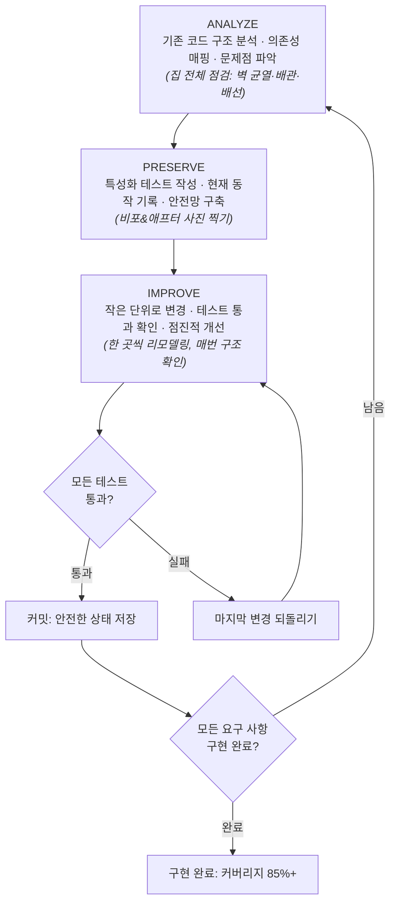

# 8회 — CHAPTER 08 클로드 코드와 MoAI-ADK

- 범위: 278~286쪽 (DDD 설계 원칙 · TRUST-5 품질 프레임워크 중심)
- 읽은 날짜: 2026-07-26
- 한 줄 요약: **DDD는 "기존 동작을 부수지 않으면서 개선하는" 과정의 방법론이고, TRUST-5는 그 과정의 결과물이 통과해야 하는 기계 판정 가능한 종료 조건이다.** 둘 다 품질 판단을 LLM의 재량에서 떼어내 결정론적 장치로 옮긴다.

---

## 1. DDD — 기존 코드를 안전하게 개선하는 방법론 (278~280쪽)

### 용어 주의부터

이 책의 DDD = **Domain-Driven Development** (MoAI-ADK 방법론, 기존 코드의 분석·보존·개선).
에릭 에반스의 DDD(Domain-Driven **Design**, 비즈니스 도메인의 전략적 설계)와 **다른 개념**이다. 여기서 "도메인"은 현재 코드가 속한 영역을 가리킨다.

### 왜 필요한가

AI에 기존 프로젝트 수정을 맡기면 **요청한 부분만 고치는 게 아니라 다른 코드까지 변경하는 위험**이 존재한다. 이 위험을 제거하는 방법론이 DDD다. 핵심 철학: **"기존 동작을 부수지 않으면서 개선한다"**. 잘못된 접근의 전형 = 전체 코드를 한 번에 다 바꾸는 것.

### ANALYZE → PRESERVE → IMPROVE 사이클 (그림 8-6, 집 리모델링 비유)

- 매 IMPROVE에서 테스트가 실패하면 **마지막 변경만 되돌리면 된다** — '작은 단계'의 힘.
- 사이클 단위 = 요구 사항. 하나 끝나면 다음 요구 사항을 위해 다시 ANALYZE로.

### 특성화 테스트(Characterization Test) — DDD의 심장

| | 일반 테스트 | 특성화 테스트 |
|---|---|---|
| 질문 | "이것이 **올바르게** 동작하는가?" | "이것이 **현재 어떻게** 동작하는가?" |
| 성격 | 옳고 그름 판단 | 사실 기록 (버그가 있어도 그 동작을 그대로 기록) |
| 역할 | 정확성 검증 | 리팩터링·기능 확장 시 기존 동작 보존 안전망 |

- **버그 수정은 IMPROVE 단계에서 의도적으로** 수행할 일이지, PRESERVE 단계에서 임의로 고칠 일이 아니다. 판단과 기록을 단계로 분리한다.
- 특성화 테스트라는 안전망이 있기에, 변경으로 기존 동작이 달라지면 테스트가 즉시 경고한다.

### TDD와의 관계 (284쪽)

두 방법론 모두 **테스트를 코드보다 우선**하는 원칙을 공유하되 대상이 다르다:

- **TDD** = '아직 존재하지 않는 코드'의 **기대 동작**을 테스트 (RED에서 테스트 먼저 → GREEN에서 통과 코드)
- **DDD** = '이미 존재하는 코드'의 **현재 동작**을 테스트 (PRESERVE에서 캡처)

---

## 2. TRUST-5 품질 프레임워크 (283~286쪽)

모든 코드에 적용되며, **TRUST-5 품질 게이트를 통과해야만 구현이 완료된 것으로 인정**된다(건물 완공 검사 비유). AI가 생성한 코드든 개발자가 직접 작성한 코드든 **예외 없이** 통과해야 한다. 단순 체크리스트가 아니라 **`/moai run` 검증 파이프라인에 자동화된 게이트로 통합**되어, 다섯 원칙을 순차적으로 검증한다.

| # | 원칙 | 질문 | 구체 기준 |
|---|---|---|---|
| 1 | **T**ested | 테스트로 검증되었는가 | 전체 커버리지 **85%+** (DDD 모드는 커밋당 최소 80%), 단위 테스트 + **LSP 타입 오류·진단 0개** |
| 2 | **R**eadable | 다른 개발자가 이해할 수 있는가 | ① 명명 규칙: `calc(d, r)` ❌ → `calculate_discounted_price(original_price, discount_rate)` ✅ ② **린트 오류 0개**, 주석은 '무엇'이 아닌 **'왜'** |
| 3 | **U**nified | 프로젝트 전체에서 일관적인가 | 포매터로 스타일 기계적 통일(파이썬 ruff/black, JS prettier), 에러 처리 패턴 통일(예외 던지기 vs 에러 코드 반환 혼용 금지), **LSP 경고 10개 미만** |
| 4 | **S**ecured | 보안 취약점이 없는가 | **OWASP Top 10** 기본 요건(SQL 인젝션·XSS·CSRF 방지): 파라미터화된 쿼리, bcrypt 해싱, 시크릿 하드코딩 절대 금지(환경 변수), **LSP 보안 경고 0개**, bandit·semgrep 정적 분석 |
| 5 | **T**rackable | 변경 이력이 추적 가능한가 | **Conventional Commits**(`feat:` `fix:` `refactor:` `security:` — CHANGELOG 자동 생성·시맨틱 버저닝), GitHub 이슈 번호 연동, **LSP 진단 이력**으로 회귀 감지 |

### 숫자 기준에 담긴 설계 의도

- **왜 85%이지 100%가 아닌가**: 그 이상부터는 품질 향상 효과 대비 비용이 너무 크다. 85%는 핵심 로직과 대부분의 특수 케이스를 검증하면서도 현실적으로 유지 가능한 수준.
- **왜 경고는 '10개 미만'인가**: 경고가 쌓이면 진짜 중요한 경고를 놓칠 위험이 커지기 때문 (신호 대 잡음).
- **왜 LSP 0개인가**: 타입 시스템이 잡는 오류는 런타임에서 치명적 버그로 이어질 수 있기 때문.
- Readable의 근거: 코드는 작성하는 시간보다 읽히는 시간이 훨씬 길다. 6개월 후 자기 자신조차 이해 못 할 코드는 기술 부채.

### LSP 품질 게이트 — TRUST-5의 집행 메커니즘 (286쪽)

- 다섯 원칙을 **자동으로 검증하는 핵심 메커니즘**이 LSP(Language Server Protocol) 품질 게이트다. IDE에서 빨간 밑줄로 오류를 표시해 주는 바로 그 시스템을 게이트로 쓴다.
- LSP 진단 이력(Diagnostic History)은 `quality.yaml`의 `lsp_state_tracking` 설정에 의해 **`phase_start` / `post_transformation` / `pre_sync` 세 시점**에서 자동 캡처 → 특정 시점에 어떤 오류가 있었고 언제 해결됐는지 기록하여 **회귀(Regression) 감지**.

---

## 3. 🔗 두 축을 연결해서 — 내가(클로드) 도출한 것

### ① DDD와 TRUST-5는 별개 장치가 아니라 "과정 ↔ 종료 조건" 한 쌍이다

그림 8-6의 "커밋: 안전한 상태 저장"이 바로 TRUST-5 게이트가 닫히는 지점이다. DDD의 PRESERVE가 만든 특성화 테스트 안전망이 Tested(85%/커밋당 80%)의 **분모를 채우고**, IMPROVE의 "작은 단위 변경"이 Trackable의 **커밋 단위와 1:1로 대응**한다. 방법론 없이 게이트만 있으면 통과 직전에 몰아서 테스트를 쓰게 되고, 게이트 없이 방법론만 있으면 사이클이 어디서 끝나는지 아무도 판정 못 한다.

### ② 둘의 공통 설계 원리: "판단을 미루고, 사실을 먼저 고정한다"

- 특성화 테스트: 옳고 그름을 판단하지 않고 **현재 동작이라는 사실**을 스냅숏으로 고정 (판단은 IMPROVE로 유예)
- LSP 진단 이력 3시점 캡처: 좋다/나쁘다가 아니라 **그 시점의 진단 상태라는 사실**을 고정 (회귀 판정은 비교로)

둘 다 같은 패턴이다 — **기준선(baseline)을 먼저 기록해야 "달라졌다"를 기계가 감지할 수 있다**. 6회에서 정리한 "세션은 사라지고 파일에 적힌 것만 남는다"와 동형: 코드 세계에서도 기록되지 않은 동작은 보호받지 못한다.

### ③ 7회 훅 프레임으로 보면: "차단(deny)인가, 요청(prompt)인가"를 물어야 한다

7회에서 배운 핵심 — 훅의 가치는 **LLM 판단과 무관하게 반드시 실행되는 결정론**이었다. TRUST-5의 기준들을 이 잣대로 나누면 값이 다르다:

| TRUST-5 기준 | 집행 방식 | 성격 |
|---|---|---|
| LSP 오류/경고/보안 진단 (T·U·S) | 언어 서버가 기계 판정 | **진짜 게이트** (훅의 deny에 해당) |
| 커버리지 85% (T) | 측정은 기계, 강제는 파이프라인 구성에 달림 | 구성 따라 게이트일 수도, 선언일 수도 |
| 명명·주석 품질 (R), 커밋 메시지 의미 (T) | 결국 LLM/사람 판단 | **요청** (prompt에 해당) |

### ④ AI 시대에 DDD가 뜨는 이유: 특성화 테스트는 AI 변경의 폭발 반경(blast radius) 감지기다

인간의 실패 모드는 '요청받은 부분을 잘못 고치는 것'이지만, AI의 대표 실패 모드는 **'요청 안 한 부분까지 고치는 것'**이다(278쪽이 명시하는 위험). 일반 테스트는 전자를, 특성화 테스트는 후자를 잡는다. 내 환경 대응물: OMC verifier 훅(PostToolUse), ponytail의 "비자명한 로직엔 실행 가능한 체크 하나" 원칙 — 모두 "변경 전 기준선 고정 → 변경 후 비교"의 변주다.

### ⑤ 숫자 기준의 진짜 의미: 품질 판단의 LLM 의존도 낮추기

"좋은 코드인가?"는 LLM에게 물으면 매번 답이 달라지지만, "커버리지 ≥85%, LSP 오류 =0, 경고 <10"은 **결정론적으로 판정 가능**하다. TRUST-5의 기준이 죄다 숫자인 것은 우연이 아니라, 품질 판정을 LLM 재량에서 기계 판정으로 옮기는 **하네스 엔지니어링**의 설계 선택이다. DDD가 '변경의 안전'을 테스트라는 기계 판정에 맡기듯, TRUST-5는 '완료의 정의'를 숫자라는 기계 판정에 맡긴다.

---

## 의문 / 더 파볼 것

- 커버리지 85%(전체) vs 80%(DDD 커밋당)의 이중 기준 — 커밋당 기준이 낮은 이유는 레거시 출발점 때문일 텐데, 그럼 85%로 수렴하는 시점은 언제로 판정하나?
- `quality.yaml`의 `lsp_state_tracking` 3시점(phase_start/post_transformation/pre_sync)은 각각 DDD 사이클의 어느 단계에 대응하나? (ANALYZE 진입/IMPROVE 직후/커밋 직전으로 추정 — 원문 확인 필요)
- 내 환경에서 TRUST-5식 게이트 흉내: TaskCompleted 훅(종료 코드 2로 완료 차단) + 커버리지 스크립트로 "게이트 통과 전 완료 금지"를 재현할 수 있을 듯 — 7회 노트의 TaskCompleted 예제가 그대로 재료.

## 다음 챕터로 넘기는 메모

- 사진 292~295쪽(에이전트 선택 의사결정 트리: Explore/expert 8종/manager 6종/manager-strategy, 프론트매터 11필드 표 8-6)은 이번 범위에서 제외 — 4회 서브에이전트 노트(프론트매터 16필드 정리)와 겹치는 부분이 많아, 합쳐서 볼 때 "책 4장(클로드 코드 원생) vs 8장(MoAI-ADK 래핑)" 비교로 정리하면 효율적.
- DDD의 PRESERVE ↔ 6회의 "파일에 써라" ↔ 7회의 훅 결정론 — 세 챕터가 전부 "LLM 재량을 줄이고 기록·자동화로 대체한다"는 한 방향을 가리킨다.
